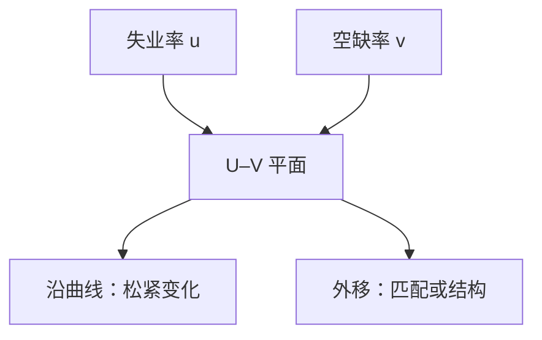

# 贝弗里奇曲线

失业与空缺可以同时很高：那不是分母又改了，而是匹配变差，或岗位创造与破坏的结构换了。

<footer>—— 据 Beveridge 充分就业讨论中的 U–V 对照；现代匹配写法见 Pissarides</footer>

[上一课](/econ/labor-participation)把 $u$ 的分母钉成劳动力，并说明参与退出可以使 $u$「改善」而就业人口比不动。本课的缺口不是再拆非劳动力，而是：劳动力**内部**还缺另一侧账户——空缺 $v$。同一失业率，可以配很少的空缺（需求松），也可以配很多空缺（匹配差）。Beveridge 的 U–V 图把这句话画出来；搜寻匹配的微观是后课。

## 问题

参与课已经禁止只用 $u$ 当松弛。空缺率 $v$（空岗相对劳动力或相对就业）是厂商侧的松弛。经验上 $u$ 与 $v$ 沿一条向下倾斜的曲线反向运动：扩张时 $u$ 降、$v$ 升，沿曲线走；危机后整条曲线外移，则同样 $v$ 对应更高的 $u$。缺口是把这条曲线当成账户与匹配效率的对照，而不是重讲 $u^*$ 是否加速通胀。

索洛下一单元把 $L$ 当充分就业投入。本课先说明：观测到的 $u$ 要和 $v$ 一起读，才能判断「人没工作」是岗位不够还是对不上。

沿曲线走：市场松紧 $\theta=v/u$ 在变。曲线外移：给定松紧，匹配更差，或产业、地区、技能的错配上升。

## 方法

在 $(u,v)$ 平面上，向下倾斜的轨迹叫贝弗里奇曲线。匹配函数 $m(u,v)$（后课 DMP 才写成均衡）给出：失业流出率随 $v$ 上升而上升，故稳态 $u$ 与 $v$ 反向。岗位破坏上升或匹配效率下降，使曲线外移。 tightness $\theta=v/u$ 是沿射线的坐标：同一 $\theta$ 上离原点越远，匹配越差。

空缺数据来自岗位调查或招聘广告，口径比失业调查更噪。本课不调和各国问卷，只要求：引用 $u$ 的周期含义时看 $v$ 是否同步。参与率变动仍可以污染分母——上一课的警告没有取消。

### 不是菲利普斯的另一张图

菲利普斯把 $u$ 接到工资或价格通胀。贝弗里奇把 $u$ 接到 $v$。二者可以同时恶化（滞胀加匹配崩溃），但机制不同。不要用 U–V 外移去「证明」$u^*$ 升了，除非你已经把匹配效率写进自然率；那是定义，不是识别。

### 空缺不是「招工广告条数」

$v$ 的分母可以是劳动力或就业，各国岗位调查覆盖的行业不同。本课用比率读形状：沿曲线还是外移，不把某一口径的水平写成自然空缺率。

招聘强度与空缺存量也不同：广告可以很多，真实未填岗位很少。宏观对照用存量 $v$ 与 $u$ 配对，流量留给 DMP 的匹配函数。

## 机制

厂商少招人：$v$ 下降，寻职者更难匹配，$u$ 上升——沿曲线向高 $u$、低 $v$ 走，像需求衰退。若岗位仍在、人仍在找，但产业或地区对不上，$m(u,v)$ 的效率参数下降，曲线外移：高 $u$ 与高 $v$ 并存。复苏初期 $v$ 往往比 $u$ 先动（岗位先贴出来），曲线看起来顺时针转一圈——这是流量时序，不必立刻宣布匹配永久变差。

泄气工人退出劳动力时，$u$ 的分母缩小，U–V 图上的 $u$ 会显得比就业损失更「好看」。读图时仍要并列就业人口比。本课不估计匹配函数的弹性；Pissarides 的均衡失业把 $v$ 内生化，是搜寻课的对象。

岗位破坏与创造可以同时升高：再配置旺盛时 $u$、$v$ 都升，曲线外移不必是匹配技术坏了，也可以是结构转换加快。把每一次外移都写成「匹配效率崩溃」，会把创造性破坏读成劳动力市场失灵。增长主干里的熊彼特破坏，在这里只留下流量痕迹，本课不把残差 $A$ 搬进 U–V。

空缺可以是「已有岗位未补」或「计划招聘」。口径一变，曲线水平就跳。宏观主干用它分沿曲线与外移，不把某一季的点当成自然率。

## 边界

本课不把招聘广告写成限价簿上的订单流。也不用 U–V 外移替代发展核算里的 $A$。效率工资与 DMP 会各自给出均衡失业，曲线只是观测到的 $(u,v)$ 轨迹。CIP 与外汇不在此图里。

空缺调查覆盖不全时，曲线水平会跳，外移可以是测量。宏观主干仍用它分沿曲线与外移，是因为政策讨论需要同时看见人与岗，不是因为点估计稳定。自然率 $u^*$ 可以随匹配效率变；本课只提供观测对照，不把某一季的外移写进 $u^*$。

后课默认：松弛至少看 $u$、$v$ 与参与；沿曲线与外移要分开说。增长主干从下一课起在充分就业路径上写资本；那里的 $L$ 默认自然参与与可持续的匹配，不是调查 $u=0$。

## 小结

- 参与课钉了 $u$ 的分母；本课补空缺 $v$。
- 沿贝弗里奇曲线走的是松紧；外移的是匹配或结构。
- 高 $u$ 配高 $v$ 不是需求松的充分统计。
- 流量时序可以转圈，不必立刻改写 $u^*$。
- 出处：Beveridge 的充分就业讨论；匹配解释见 Pissarides 的均衡失业传统。
