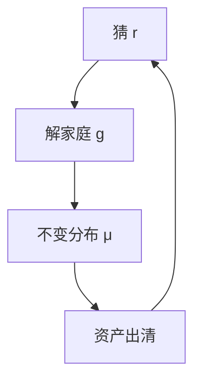

# Bewley–Huggett–Aiyagari

劳动收入不可完全保险时，家庭用无风险资产自保；均衡利率使资产需求等于外生供给（或资本）。

<footer>—— Bewley；Huggett, The Risk-Free Rate in Heterogeneous-Agent Incomplete-Insurance Economies, JEDC 1993；Aiyagari, Uninsured Idiosyncratic Risk and Aggregate Saving, QJE 1994</footer>

[上一课](/econ/narrative-hf-identification)把加总冲击识别到能画 IRF 为止。IRF 背后仍是代表性欧拉。本课缺口是**关掉完全保险**：特异收入风险 + 借贷约束 ⇒ 财富分布成为均衡对象。不重做 SVAR，不把 Krusell–Smith 的总量冲击提前写完。

## 问题

代表性 Ramsey 的 $\beta(1+r)=1$ 钉死稳态利率。Huggett：只有债券、净供给为零或外生，异质禀赋与约束下，预防性需求把 $r$ 压到时间偏好之下。Aiyagari：资产是生产性资本，特异风险提高总储蓄，稳态 $K$ 高于完全保险经济。Bewley 传统提供装置。缺口不是再讲预防性储蓄的 $u'''$，而是：不完全市场一般均衡把分布 $\mu(a,z)$ 与价格一起解。

Huggett, *JEDC* 1993。Aiyagari, *QJE* 109(3), 1994, 659–684。Imrohoroglu 同期有失业自保。本课是稳态，总量确定。

## 方法

个人状态 $(a,z)$，$z$ 为收入马尔可夫。政策 $a'=g(a,z;r)$ 由贝尔曼（本课程第一课的算子）加 $a'\ge\underline a$。不变分布 $\mu$ 满足 $\mu=T_g\mu$。出清：$\int a'\,d\mu=A$（债券）或 $=\int k\,d\mu$（资本）。算法：猜 $r$，解家庭，更新总量，直到出清。这是 VFI 加分布迭代，不是新理论。

加总消费仍较平滑：特异风险在截面抵消。总量矩可以看起来像代表性模型，微观 MPC 与财富基尼不行——后课逐条拆。

## 机制

机制是自保需求抬高资产价格（压低 $r$）或抬高 $K$。约束附近的人欧拉变不等式，MPC 高；富人接近完全市场欧拉，MPC 低。加总欧拉不是某个 $u'(C)$，而是财富加权的一阶条件混合。代表性 DSGE 的贝叶斯估计吃不到这个混合，除非显式异质。

没有总量冲击时，宏观时间序列是平的。周期要靠外生总量 $Z_t$——下一课 Krusell–Smith：分布成为总量状态。

稳态财富分布往往比数据更薄的右尾，因为收入过程不够持久、没有收益异质或创业。帕累托尾是再后课。

## 边界

本课无总量风险、无名义刚性、无政府。HANK 把 NK 价格粘性接进来，不是本课。也不估计收入过程的全部计量（Guvenen、Kaplan 等后用）。劳动供给内生、离散选择、耐久品，都是同一装置的扩充。

后课默认：不完全市场稳态 = 家庭贝尔曼 + 不变分布 + 资产出清；$r\lt \rho$ 可来自预防性。下一课：加上总量冲击，分布如何被「近似」成有限状态。

## 小结

- Huggett/Aiyagari：不可保风险 + 约束 ⇒ 分布与 $r$（或 $K$）联立。
- 加总可平滑，微观 MPC 已异质。
- 稳态、无总量冲击。
- 出处：Huggett, *JEDC* 1993；Aiyagari, *QJE* 1994。
