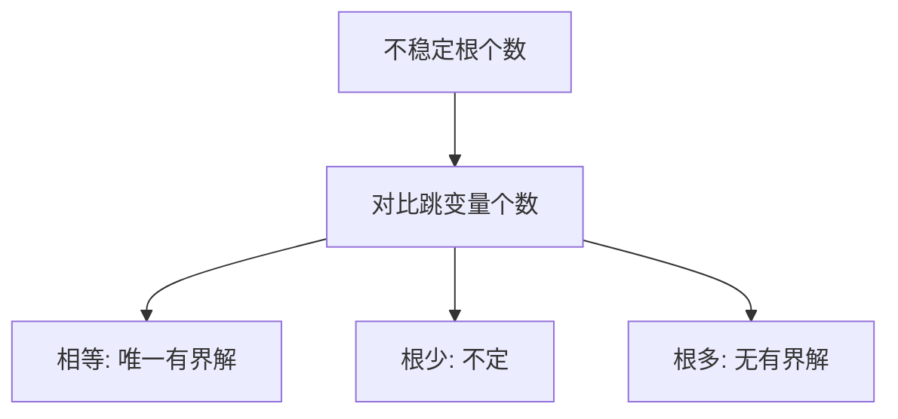

# Blanchard–Kahn 条件

跳变量的个数必须等于不稳定根的个数，有界理性预期解才唯一。

<footer>—— Blanchard and Kahn, The Solution of Linear Difference Models under Rational Expectations, Econometrica 1980</footer>

[上一课](/econ/log-linearization)交出线性 RE 系统。本课缺口是：**何时有唯一有界解**。根的计数替代显式横截，把爆炸路径丢掉。不重做对数线性的泰勒步骤。

## 问题

写成

$$
\mathbb{E}_t Y_{t+1}=A Y_t+B\varepsilon_{t+1},
$$

$Y$ 含预定与非预定（跳）变量。Blanchard–Kahn：不稳定特征值（模大于一）的个数等于跳变量个数时，存在唯一有界解；不稳定根太少则不定（太阳黑子可乘进来）；太多则无有界解。缺口是把「TVC 关掉爆炸」变成可检查的矩阵条件，而不是再写一条极限公式。

Sims 的 QZ 分解、Klein 的广义Schur，是 BK 在奇异系统上的数值实现。Uhlig 的未定系数是同一几何的代数写法。本课讲计数，不讲软件。

## 方法

把预定变量的初值当给定，跳变量的初值由「不能走不稳定流形」钉死。政策规则（泰勒系数、财政规则）进 $A$，从而改根。利率规则对通胀反应不足，常出现不定——Woodford 的决定性讨论是 BK 在 NK 里的应用，本课只留接口，不重写 NK 推导。太阳黑子：不稳定根不足时，外生鞅可以进解，波动不必来自基本面冲击。

确定性 Ramsey 的鞍点：一维资本（预定）加一维消费（跳），一个稳定根一个不稳定根，正是 BK 的 $1=1$。随机线性化是同一张相图加噪声。

## 机制

机制是有界性当横截的线性替身。理性预期把未来跳变量写成今天信息的函数；若不把不稳定方向的载荷设为零，期望路径会爆。政策通过改 $A$ 的特征值「创造」足够的不稳定根——看起来像把系统变不稳定，其实是给预期一个锚，让唯一有界路径存在。这与 Kydland–Prescott 的承诺不是同一句话，但都在说：规则改变方程，从而改变解的集合。

不定不是「模型没写完」的同义反复：它是均衡多重。估计时若落在不定区，似然没有定义好的映射，后课贝叶斯会踩这个坑。

Blanchard and Kahn, *Econometrica* 48(5), 1980, 1305–1311。连续时间对应是鞍点稳定的特征值符号计数。

## 边界

本课不处理非线性局部不定、ZLB 下的分段线性、或全局太阳黑子。高阶扰动仍绕着同一确定性稳态，BK 的一阶解是中心。投影法可以走全局，不依赖本课计数，但大型 NK 仍以 BK 为默认。

后课默认：线性 DSGE 先查 BK；唯一解才能谈 IRF 与估计。下一课：在 BK 的一阶之外，扰动如何收回风险。

## 小结

- BK：不稳定根个数 = 跳变量个数 ⇒ 唯一有界线性 RE 解。
- 根少则不定，根多则无有界解。
- 政策规则通过改特征值决定解是否唯一。
- 出处：Blanchard and Kahn, *Econometrica* 1980。
