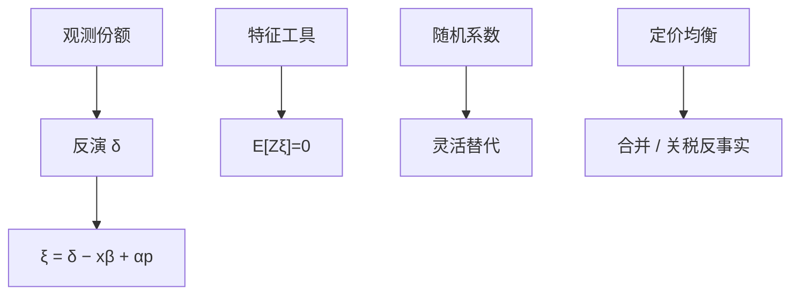

# BLP 需求估计

差异产品的价格与未观测质量一起走，logit 的价格系数有偏；用产品特征的工具和市场层份额，把随机系数需求钉在均衡上，反事实才是合并与关税，而不只是又一次回归。

<footer>—— Berry, Levinsohn and Pakes, Automobile Price in Market Equilibrium, Econometrica 1995</footer>

[上一课](/econ/discrete-choice)在外生 $x$ 下写出 logit 份额与 IIA。本课缺口是产业组织的现场：价格内生、产品差异、市场均衡。生产函数下一课换供给边的技术；本课钉 BLP 需求。

## 问题

汽车、谷物、电信套餐：产品 $j$ 在市场 $t$ 的份额 $s_{jt}$ 来自随机系数效用

$$
u_{ijt}=x_{jt}\beta_i-\alpha_i p_{jt}+\xi_{jt}+\varepsilon_{ijt},
$$

$\xi_{jt}$ 是厂商与消费者看见、计量者看不见的质量，与 $p_{jt}$ 相关。简单 logit 把 $\xi$ 扔进误差，价格弹性偏向零（贵的车 $\xi$ 也高）。Berry 的反演：观测份额 ↔ 平均效用 $\delta_{jt}$，于是 $\xi_{jt}=\delta_{jt}-x_{jt}\beta+\alpha p_{jt}$ 可进矩。BLP：$\beta_i$ 随机，份额无闭式，用模拟；工具是其他产品的特征（成本侧排除：对手特征经竞争进价格，不进本国 $\xi$——假设要辩护）。缺口是：估到的是需求系统，反事实（合并、关税、新产品）要与定价均衡一起解。

Berry 1994 先给纯 logit 反演 $\delta=\ln s-\ln s_0$。BLP 1995 加随机系数破 IIA，用收缩映射解 $\delta$。供给边常配 Bertrand 加边际成本，不是本课必须估全，但反事实价格必须有一个供给规则。

## 方法

GMM：$\mathbb{E}[Z\xi]=0$。收缩映射在给定参数下从份额解 $\delta$，抽 $\xi$，进矩。随机系数分布（往往对价格、对特征的正态）决定替代：相近 $x$ 的产品替代更强，红蓝公交缓解。弱工具：特征工具可以弱，第一阶段是价格对 $Z$，诊断同 IV 课。数值：收缩不收敛、模拟噪声、网格，都是实践，不是新识别。

与[潜在结果](/econ/potential-outcomes)：合并是从未观测的 $d$，LATE 没有对照。BLP 用需求+供给填表。识别失败（工具进 $\xi$、随机系数几乎不识别）时，反事实是外推，要报告。

## 机制

机制是两条。需求：随机系数让边际消费者的构成随价格变，弹性不是常数。供给：多产品 Bertrand 把交叉弹性送进加成。关税改到岸成本，均衡价格与份额一起动，不同于把价格当回归元的约化形式。IIA logit 的交叉弹性只跟份额成比例，合并模拟会系统错。

与贸易后课：同一套需求可接到进口品种；本课先停在 IO 市场定义（城市×年），不把中国冲击写成 BLP。

Nevo 谷物、Petrin 厢型车是应用原型。工具故事（Waldorf 成本、对手特征）每篇都要重写，不能复制粘贴「BLP 工具」。

## 边界

本课不估拍卖。不把收缩映射写成一定全局收缩的数学课。供给若是谈判或数量竞争，反事实换均衡概念。下一课生产函数：对象是 $Q=F(K,L)$ 的技术，不是产品份额。微观需求与宏观 CES 贸易弹性不是自动同一个数。

后课默认：内生价格的差异产品用反演+工具；随机系数管替代；反事实要供给规则。不要用简单 logit 弹性去做合并模拟。排除（对手特征不进 $\xi$）必须讲机制。

## 小结

- $\xi$ 与价格相关 ⇒ 简单 logit 弹性偏零。
- 份额反演给出 $\xi$，GMM 用特征工具。
- 随机系数打破 IIA，替代由特征距离驱动。
- 政策反事实在需求+定价均衡上重解。
- 出处：Berry, *Rand* 1994；Berry, Levinsohn and Pakes, *Econometrica* 1995。
