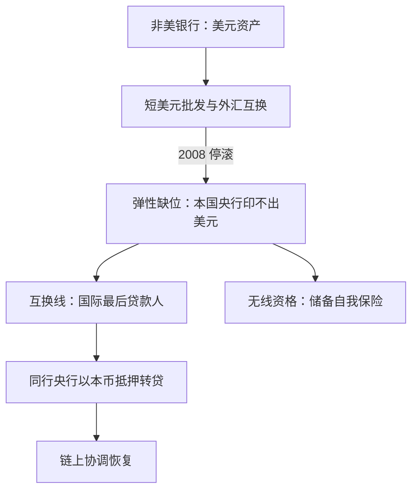
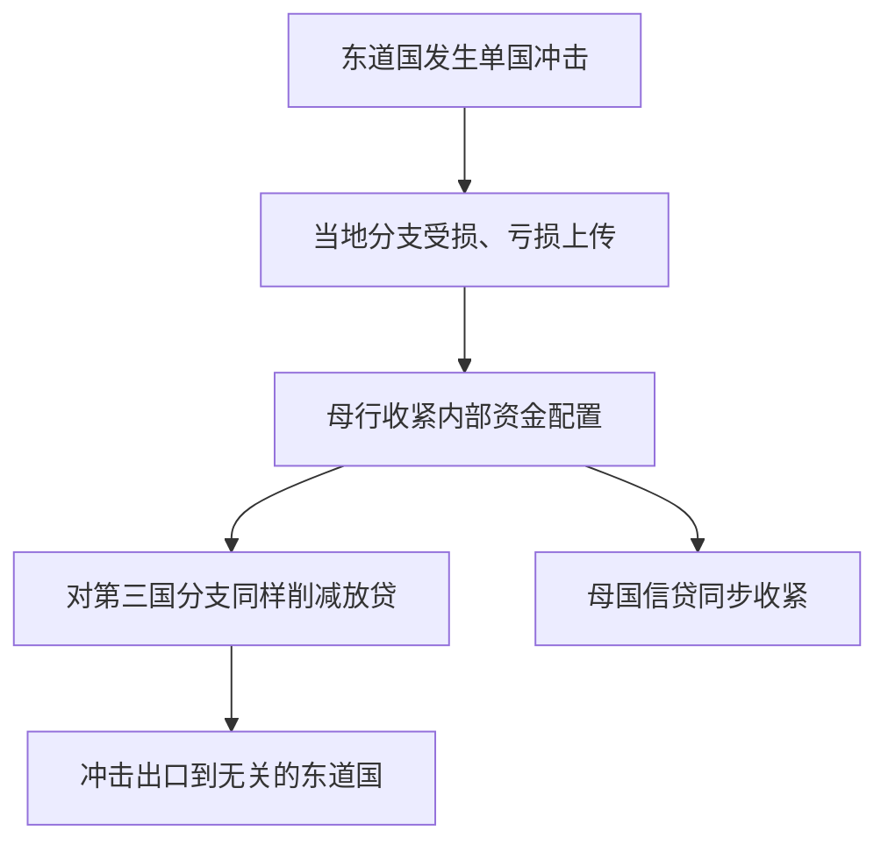

# 国际银行与跨境中介

银行早在国家之前就把资产负债表铺到了国境之外，最后贷款人却住在国境之内——这个错位是国际银行一切问题的母题。

<footer>—— 据 McGuire–von Peter 2012、Cetorelli–Goldberg 2012 整理</footer>

[上一课](/econ/bm-lender-of-last-resort)把最后贷款人写成协调装置，并给出一条规则：弹性沿可跑负债的分布走。但负债的分布不分国界：非美银行持有天量美元资产、靠短美元批发滚动，而本国央行印不出美元。主干课的 [互换线](/econ/dollar-swap-lines)钉过互换线的机制与资格政治；本课补结构：全球银行怎么配置资产负债表、冲击怎么沿银行内部的资金线出口、监管与处置的管辖权错位在哪里，以及上一课的规则在跨境条件下断在哪一步。后课默认已经读完本课。

## 问题

2008 年的挤兑不只发生在美国机构：欧洲银行靠外汇互换与短期批发滚动美元账本，市场关闭后它们是同一场协调博弈的玩家，却在美联储的贴现窗口之外。为什么跨境中介放大而非分散了系统性：期限错配叠上**币种错配**，且后者的弹性工具天然缺位——没有一个世界央行发行美元版的 outside money（[美元主导](/econ/dollar-dominance)钉过计价、中介与官方地板的捆绑；本课只管银行表内，不重写货币体系）。

术语翻译：「币种错配」是资产与负债的计价货币对不上——资产端持美元抵押债、负债端靠短期美元滚动；一旦美元融资停滚，本国央行帮不上忙，因为它只印本币。

### 两个解剖

**结构解剖**：全球银行以内部资本市场运转——Cetorelli–Goldberg 2012：母行向海外分支配置资金，危机时收紧回收；单国冲击于是沿银行内部的资金线出口到东道国，货币政策的国际传导写成资产负债表操作，而不是汇率。**杠杆解剖**：Adrian–Shin 的杠杆顺周期——资产涨、杠杆目标推动再加杠杆；Shin 2012 的「银行过剩」：核心欧洲银行借短美元、投美国证券化——跨境信贷的量由杠杆目标而非储蓄缺口决定。这与 [全球金融周期](/econ/global-financial-cycle)相接而层次不同：Rey 的口径是总量与价格的共动，这里是银行表内的微结构。

美联储互换线存量 2008 年 12 月峰值约 5830 亿美元；2020 年重启后对五大央行常设、其余应急——跨境弹性从应急件变成常设件。

## 方法

把跨境问题的坐标写成三行。**谁持有**：集团的资本与流动性放在哪个格子里——放在总部，东道国看到的是「壳」；放在分支，母国失去对风险的控制点。**押什么**：美元缺口用什么滚——外汇互换市场有期限上限，长缺口只能靠不断短滚，可跑性按第一课的定义成立。**谁接住**：home 与 host 的监管分工、处置没有国际法院——三难（金融稳定、银行一体化、国家自主）是定性框架，三者取二。读任何一家国际银行，先找这三行各自的落点，再谈系统性。

数字实例：一家欧洲银行持 1000 亿美元资产、只有 600 亿稳定负债，缺口 400 亿只能滚动；外汇互换市场期限通常不过 3 个月，等于每年要把这 400 亿续 4 次以上——每一次续不上，都是一场小型挤兑。

## 机制

互换线是上一课 LOLR 的跨境移植：美联储对合格同行央行承诺大额美元互换，同行以本币抵押转贷本国银行——协调装置的形状不变（移动阈值、删坏均衡），只是 outside money 的发行被外包给双边协议。资格不均意味着有些链上的协调问题无解：拿不到互换线的银行只能自我保险，靠积累储备度日，而储备积累本身有全球失衡的代价——[原罪](/econ/original-sin)的家族问题在银行层重现：本币借不到外币长债，缺口只能靠短期外币滚动。常设化是本轮的净变化：从应急件到常设件，正是「装置跟着负债搬家」这条单线在国境上的最后一格；缺口没有消失，只是被制度覆盖的部分变大了。

## 边界

不重讲互换线的账务与资格细节（主干已钉）；主权财政面不展开——[欧洲主权债务危机](/econ/eurozone-debt-crisis)与[东亚危机](/econ/east-asian-crisis)已钉银行—主权孪生回路，本课在银行侧；[资本管制](/econ/capital-controls)的楔子打在边界上，对集团内部套利只是部分闸，不重复。度量有一个坑：跨境债权的 BIS 数据有国籍与驻地两种口径，混用会放大或缩小敞口——用数字前先对口径。处置与恢复计划只点名：它属于处置制度的工程，不属于本课的理论。

直觉类比：金融稳定、银行一体化、国家自主像三条凳子腿只够坐两个人——危机时东道国想先保本地储户（国家自主），母国想先保集团（一体化），系统性稳定反而没有谁独占负责。

## 小结

- 国际银行的母题：表在多国、LOLR 在一国；币种错配叠期限错配。
- 全球银行用内部资本市场搬运流动性，冲击沿资金线出口（Cetorelli–Goldberg 2012）。
- 跨境信贷的量由杠杆目标驱动，不是储蓄缺口（Adrian–Shin；Shin 2012）。
- 互换线把协调装置外包给双边协议；资格不均是常态而非例外。
- 监管与处置的管辖权错位是三难：稳定、一体化、国家自主取二。
- 出处：McGuire–von Peter 2012；Cetorelli–Goldberg 2012；Shin 2012；Rey 2013。
