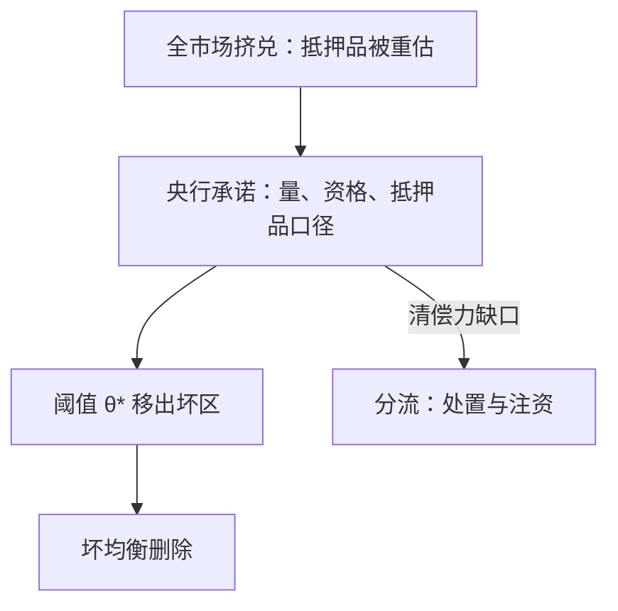
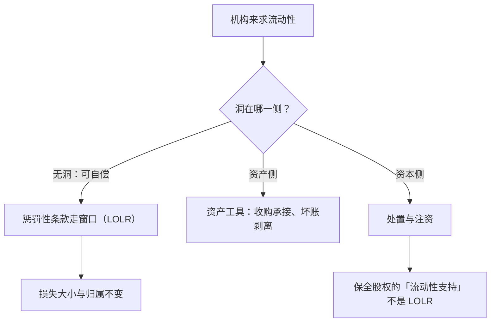

# 最后贷款人

最后贷款人卖的不是钱，是协调：把「别人也会被接住」从谣言变成资产负债表上的事实。

<footer>—— 据 Bagehot 1873、Rochet–Vives 2004 整理</footer>

[上一课](/econ/bm-shadow-deep)把期限转换搬出表内，链条每一环都可在坏状态停滚。主干课的 [最后贷款人](/econ/lender-of-last-resort)钉过 Bagehot 三原则与 inside/outside money 的兑换；本课补现代问题：当挤兑是协调博弈（第一课）、负债散布在影子链上（上一课），「区分流动性与清偿力」在事中还剩多少操作含义，弹性应当伸到哪里、以什么形状伸过去。后课默认已经读完本课。

## 问题

Bagehot 的处方有清晰对象：1873 年票据市场上可辨认的「好票据」。现代链上，挤兑是全市场的：抵押品被重估，而「好抵押」的认定标准本身基于市场价——市值下跌使好抵押变少，流动性不足与资不抵债在事中互相制造，处方的前提被它要治的病吃掉。缺口因此是双重的：理论上，最后贷款人什么时候能删掉坏均衡、什么时候只是在给损失融资；工程上，窗口该开给谁、押什么、按什么价押。

### 写成协调装置

把 LOLR 写进第一课的阈值结构（Rochet–Vives 2004）：央行的大额流动性承诺改变「跑」与「留」的收益比较，等价于把挤兑阈值 $\theta^*$ 向坏侧移出支撑——坏均衡不再有坐标。这解释了一个反复出现的经验：**无限量承诺比实际借出多少重要**。承诺是阈值移动，放款只是移动之后的结果；[欧元区危机](/econ/eurozone-crisis)里「央行明确 LOLR 压坏均衡」的机制证据，在这里拿到博弈论地基。

美联储危机便利的存量在 2008 年末达到约 1.5 万亿美元量级（据美联储公开数据整理）：窗口的形状随可跑负债的分布变化，不是常数。

## 方法

形状的三步演化，每步对应负债形状的一次变化。①**零售存款时代**：贴现窗口对银行，Bagehot 处方原样适用——自由放款、惩罚利率、好抵押。②**批发抵押品时代**：可跑的债换成回购与商业票据，窗口跟着开到交易商与非银——2008 年的 PDCF、TSLF、CPFF 一族；抵押品资格与折扣成为主要杠杆。③**市值断裂时代**：市场价与清偿力脱钩，2023 年的 BTFP 以**面值**估值抵押品——把「好抵押」的口径从市场价切到面值，直接回应「事中分不清流动性与清偿力」的断裂。三条之外还有一对永恒取舍：建设性模糊保纪律、伤协调；清晰承诺强协调、把事前道德风险写进价格。第二课的激励与第一课的阈值在这对取舍里定价，没有免费档。

数字实例：设挤兑阈值为基本面低于 0.4 时人人开跑；央行「随时无限量」的确定性承诺把阈值推到 0.25，多数机构退出跑区——哪怕最终实际只放出 800 亿，起作用的也是那 1 万亿量级的承诺本身。

## 机制

LOLR 是流动性不是资本——第二课的分工在救助场上兑现：它把 outside money 换进来、止住停滚，不改变损失的大小与归属。分流规则随之写定：能以惩罚性条款自偿的走窗口；洞在资产侧的走资产工具（收购承接、坏账剥离）；洞在资本侧的走处置与注资——保全股权的「流动性支持」不是 LOLR（[too-big-to-fail](/econ/too-big-to-fail) 的口径）。弹性必须沿可跑负债的分布走：只在存款机构开窗，就是把协调问题留给影子链——2008 年的便利家族正是窗口沿链条上移的过程，2020 年 3 月的抢现与 2023 年的存款跑是同一原理在不同负债上重演。污名是工程约束：机构怕被看见进窗口，协调功能打折——这是窗口之外另造便利的直接理由。

术语翻译：「污名」指机构不敢进窗口，怕市场把进门读成「我有问题」的信号，股价与融资立刻遭殃；所以危机中常另设新便利、换名字换规则，让机构进门时不被直接对号入座。

## 边界

不重讲贴现窗口与地板系统（主干已钉，[央行资产负债表](/econ/central-bank-balance-sheet)管负债侧工具）；国际维度——非美银行的美元缺口与互换线——留给下一课；道德风险只作参数，不做二元判断。阈值移动的幅度与成本也没有免费午餐：承诺越硬，事后被读成「救助」的概率越高；承诺越软，协调失败的代价越高。这条权衡在民主问责下怎么定价，是政治经济问题，本课只给结构。

直觉类比：建设性模糊像老师不宣布是否点名——学生（银行）不敢赌、自留更多缓冲，但真出事时协调也慢半拍；清晰承诺像宣布永远点名，协调变快、纪律没了，道德风险被写进事前价格。

## 小结

- LOLR 的机制角色是协调装置：大额承诺移动阈值，坏均衡出支撑。
- 三步演化：贴现窗口、交易商与非银便利、面值口径的抵押品政策；窗口沿可跑负债的分布走。
- 流动性支持不改损失归属：清偿力缺口走处置与注资，混淆两者是 TBTF 的起点。
- 建设性模糊与清晰承诺在纪律与协调间定价，没有免费档。
- 污名使事中窗口打折，便利家族是它的工程补丁。
- 出处：Bagehot 1873；Rochet–Vives 2004；Diamond–Dybvig 1983 的政策含义；美联储便利文件。
