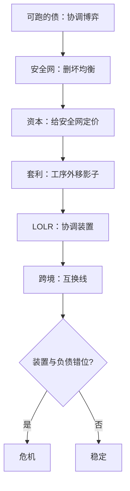

# 银行深化收束

五课是同一条问题的五次换名：哪里有可跑的短债，哪里就需要删坏均衡的装置；装置跟不上负债的搬家，危机就发生在中间地带。

<footer>—— 据 Diamond–Dybvig 1983、Gorton–Metrick 2012 整理</footer>

[上一课](/econ/bm-international-banking)把弹性装置推到国境线上，本课程到此收束。六课连起来是一条单线：现代挤兑理论（[银行挤兑的现代理论](/econ/bm-modern-runs)）把可跑的债收成有参数的协调博弈；监管资本（[监管资本的理论](/econ/bm-regulatory-capital)）给安全网定价、给监督押金；影子银行（[影子银行的深化](/econ/bm-shadow-deep)）把转换工序沿监管价格搬出表内，用无知的均衡造「安全」；最后贷款人（[最后贷款人](/econ/bm-lender-of-last-resort)）以协调装置的形状把弹性沿负债分布重铺；国际银行（[国际银行与跨境中介](/econ/bm-international-banking)）处理弹性出不了国境的最后一段。本课程到此收束。

## 问题

六课共有的失效模式只有一类：**装置与负债的错位**——用零售时代的贴现窗口接批发挤兑、用表内资本约束去管表外转换、用国内弹性去接美元链。与其配对的度量坑也只有一条：把「叫银行的机构」当系统性边界，而可跑的债从不理会牌照。所以收束课不写新机制，只把这条单线压成可操作的清单。

## 方法

方法是给收束配一套可操作的定位协议：任何一段银行危机的叙述，先过三张清单——负债、装置、错位——把「可跑的债在哪、删坏均衡的装置在哪、两者落差在哪」逐项填出，再谈机制是哪一条。清单不产出参数，产出坐标：填不满的格子，就是这段叙述欠着的证据。

### 三张清单

把任何一段银行危机的叙述放上三张清单定位。**负债清单**：谁是可跑的债（可随时停止、先到先得或续命依赖、状态不可完全验证），量级多大、滚动日历在哪、分布在有保险还是无保险的持有者手里。**装置清单**：删坏均衡的候选——保险、缓建、资本、最后贷款人承诺、互换线——各自的阈值效应与激励代价是什么，谁在哪个位置有权开窗。**错位清单**：负债在哪、装置在哪；表内与表外、境内与境外的落差就是危机的坐标。三张清单与[公司金融深化收束](/econ/cf-map)的三张同构：先定位，再谈机制是哪一条。

## 机制

框架的生成力从文献骨架上看最清楚，六课各钉一根柱子：Diamond–Dybvig 1983 给可跑债的原型；Calomiris–Kahn 1991 与 Goldstein–Pauzner 2005 给纪律与唯一化；Holmström–Tirole 1997 给资本作为押金；Gorton–Metrick 2012 与 Dang 等 2017 给影子链的价格记法与设计论；Bagehot 1873 与 Rochet–Vives 2004 给弹性装置；McGuire–von Peter 2012 与 Cetorelli–Goldberg 2012 给跨境结构。未竟问题四件：其一，非银的系统性度量——2020 年 3 月的抢现与 2022 年的 LDI 说明可跑的债搬到市场端后，装置的资格清单还在追赶；其二，存款搬家的速度——[数字货币的理论](/econ/cbdc)里的挤兑通道与第一课 SVB 的口径相连；其三，资本与流动性的联合定价，巴塞尔把两者并列，交互仍靠规则拼装；其四，国际最后贷款人的常设化与政治约束。

骨架横跨 1873–2017：装置理论先于危机形态一个多世纪，每次危机都把装置的适用清单往前推一格——读新文献，先找它拆的是哪根柱子的哪块假设。

## 边界

收束不等于问题解决：本课程给的是坐标（负债、装置、错位），不是参数。理论侧留了缺口：协调阈值与宏观波动的一般均衡耦合——Gertler–Kiyotaki 一族只点名；银行间网络的传染只以[银行间传染](/econ/bank-contagion)为界，没有展开。与主干分工也要交代：主干课钉模型与制度事实（[why-intermediaries](/econ/why-intermediaries)、[银行危机史](/econ/banking-crises-history)），本课程补理论化与装置的选址逻辑。下一课程「合同理论与机制设计」从银行的合同问题转向一般的合同与机制——银行是它的第一个应用场，不是终点。

## 小结

- 单线五步：可跑的债、安全网与资本的定价、工序外移、弹性沿负债重铺、弹性出关。
- 共同失效模式：装置与负债错位；牌照边界不是系统性边界。
- 三张清单：负债、装置、错位，用于定位任何银行危机的叙述。
- 文献骨架六根柱子，从 Diamond–Dybvig 1983 到 Cetorelli–Goldberg 2012。
- 出处口径：各课所引为准——Diamond–Dybvig 1983；Holmström–Tirole 1997；Gorton–Metrick 2012；Rochet–Vives 2004；McGuire–von Peter 2012；Cetorelli–Goldberg 2012。
