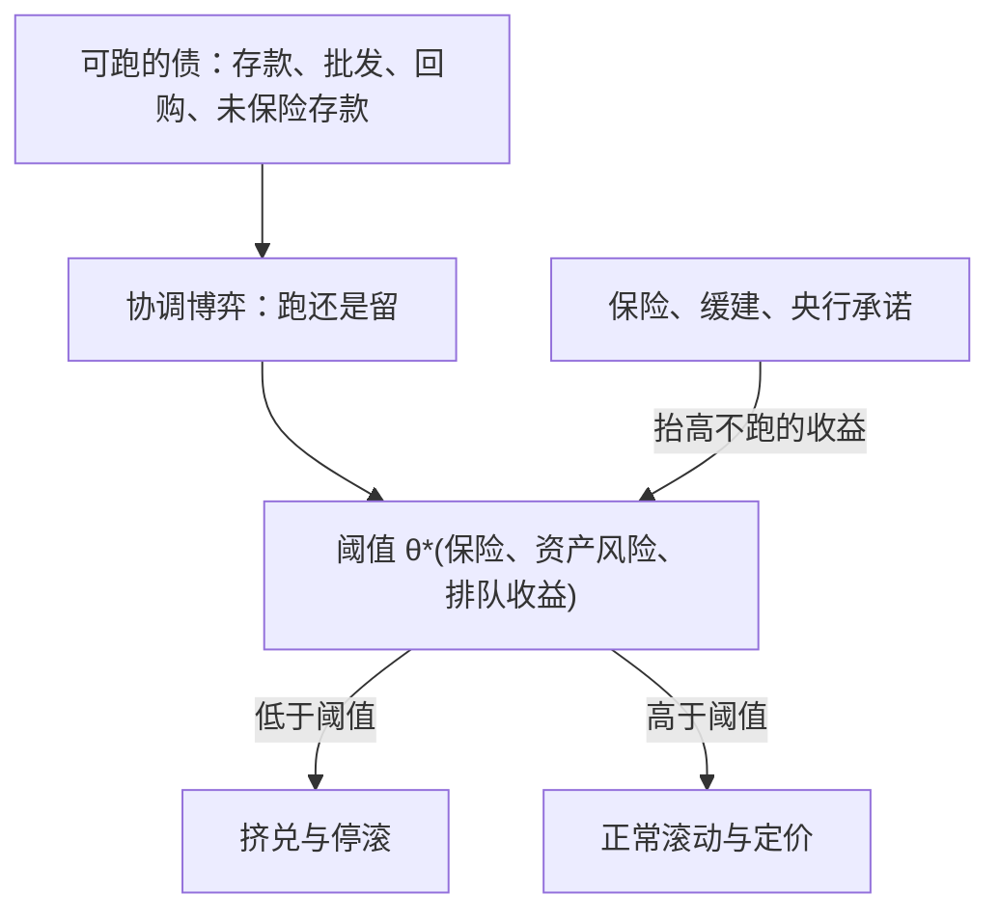

# 银行挤兑的现代理论

挤兑不是群众的非理性，而是一个协调博弈的第二个均衡；现代金融改变的不是这个博弈，而是可跑的债换了几种名字。

<footer>—— 据 Diamond–Dybvig 1983、Goldstein–Pauzner 2005 整理</footer>

[上一课](/econ/cf-map)把公司金融深化收在三张清单上，并在边界里把银行的理论——挤兑、监管资本、救助决策——明确交给下一课程。本课开「银行与中介深化」。主干课的 [Diamond–Dybvig](/econ/diamond-dybvig) 钉过活期合同与序贯服务，[影子挤兑](/econ/shadow-run)钉过 haircut 这套挤兑的价格记法；缺口是把两类现象收成同一个理论对象：**可跑的负债**。什么结构使一项债「可跑」、协调在什么条件下被基本面锁定、均衡怎么删，是本课程后五课共用的地基。之后依次过监管资本、影子银行、最后贷款人与国际银行。后课默认已经读完本课。

## 问题

Diamond–Dybvig 给了原型：序贯服务下，同一份活期合同同时支持正常提款与挤兑两个均衡。原型留下三个缺口。其一，多重均衡太「便宜」：模型说挤兑可能，说不了多可能、何时触发。其二，跑的对象早已不限于存款：批发、回购、未保险存款在 2008 与 2023 年轮番出演，大多没有序贯服务条款，为什么同样会跑。其三，政策要动「删掉坏均衡」的旋钮，得先知道哪个旋钮移动协调的边界。

### 可跑性的三个合同特征

把可跑的债拆开，共同点是三条：**可随时停止**（活期可提、回购可拒续、票据可不再滚）；**先到先得或续命依赖**（排队者拿残值，或下一笔钱不到今天就无法运营）；**对资产状态不能完全验证**（或验证成本在坏状态下集体爆表）。三条凑齐，持有者的收益表就是协调博弈：预期别人跑，留下就排在队尾，跑是最优反应——与银行资产当下好坏无关。Calomiris–Kahn 1991 还给出这条结构的另一面：跑的权利本身是纪律，存款人事后的惩罚威胁替代了昂贵的持续监督。

2023 年 3 月 SVB：未保险存款占九成上下，单日流出约 420 亿美元、约占存款四分之一。手机银行与社交媒体改变的是协调速度，不是博弈结构。

## 方法

现代理论给原型补两件装置。**全局博弈**（Morris–Shin 1998 的装置，Goldstein–Pauzner 2005 装回活期合同）：把「人人知道人人知道」换成带噪声的信号 $x_i=\theta+\sigma\varepsilon_i$；噪声足够小时，多重均衡收敛为唯一的阈值规则——基本面 $\theta \lt \theta^*$ 挤兑、$\theta \gt \theta^*$ 不挤，$\theta^*$ 由保险覆盖、资产风险、排队收益共同决定。多重均衡没有被否认，而是被参数化：挤兑从「可能发生」变成「随参数可比较静态」。**展期风险**（He–Xiong 2012）：把离散提款换成连续滚动的短债，即便资产现金流完全可验证，每期展期失败的可能也使信用利差含一块展期溢价——批发债没有序贯服务条款照样可跑，因为可跑性靠「续命依赖」就够，不靠排队。

## 机制

阈值规则让政策的比较静态有了落点。存款保险把一部分持有者移出「要跑的人」，留下的收益上升，$\theta^*$ 下移；资产风险上升使坏状态更近，$\theta^*$ 上移——Goldstein–Pauzner 由此得到「资产风险越高、挤兑概率越高」的可检验含义。缓建与保险删均衡的机理在此统一：都抬高了留下来的收益，把坏均衡移出均衡集，而不是给银行送资本（[存款保险](/econ/deposit-insurance) 的口径）。展期风险解释影子链上「无声的挤兑」：没有恐慌的画面，只有利差与 haircut 的跳升——[影子挤兑](/econ/shadow-run)里 Gorton–Metrick 的记法，正是阈值移动的价格表现；而 SVB 的单日四百多亿说明，阈值没变，抵达速度变了。

## 边界

本课不重讲 Diamond–Dybvig 的推导，不写跨行传染——[银行间传染](/econ/bank-contagion)的 Allen–Gale 网络是另一个装置，管挤兑怎么沿边传播；本课在单家银行内锁死协调，两者可叠加、不可互替。全局博弈的适用也要交代：它假设信号噪声足够小、行为对他人预期足够敏感，给的是比较静态而非时点预测；当「预测哪一天跑」的工具是用错了地方。监管资本、影子链与救助装置留给后面三课，本课只负责一件事：把可跑的债写成有参数的协调博弈。

## 小结

- 可跑的债 = 可随时停止 + 先到先得或续命依赖 + 状态不可完全验证；存款、批发、回购同构。
- 全局博弈把多重均衡参数化：$\theta \lt \theta^*$ 挤兑，$\theta^*$ 随保险与资产风险可比较静态。
- 展期风险是挤兑的连续版本：不需要序贯服务，每期的续命依赖就够。
- 保险与缓建删坏均衡、不加资本；跑的权利本身是纪律（Calomiris–Kahn 1991）。
- 协调速度内生于技术：手机与社交网络改速度，不改结构。
- 出处：Diamond–Dybvig 1983；Morris–Shin 1998；Goldstein–Pauzner 2005；He–Xiong 2012。
