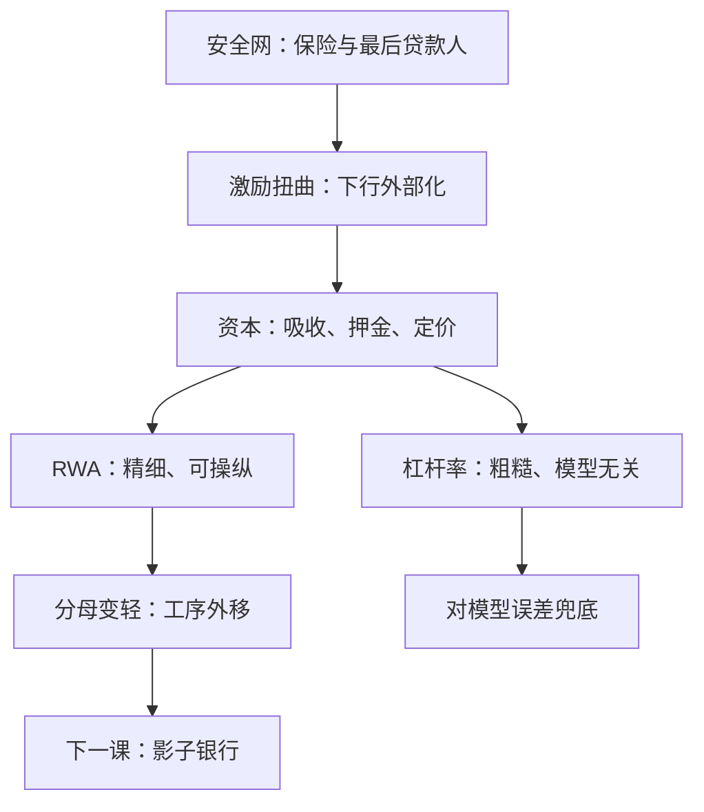
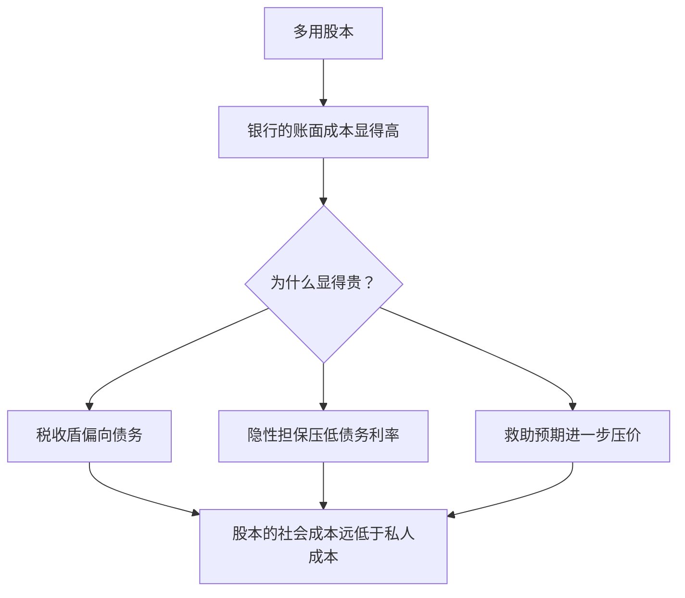

# 监管资本的理论

资本是给安全网定价的方式：保险与最后贷款人把挤兑从价格里拿走，资本把亏损的顺序写回合同里。

<footer>—— 据 Holmström–Tirole 1997、Admati–Hellwig 2013 整理</footer>

[上一课](/econ/bm-modern-runs)把可跑的债写成有参数的协调博弈，并留下一个缺口：保险与暂停兑付删掉坏均衡之后，激励问题原样留在场内——被保护的人不再看门。主干课的 [巴塞尔资本](/econ/basel-capital)钉过框架：分子吸收损失、分母是风险加权资产、杠杆率与流动性指标做后兜；[存款保险](/econ/deposit-insurance)钉过平坦保费等于送出看跌。本课补「理论」二字：资本为什么是恰当的监管工具、要求多少、分母选什么，以及这些选择的代价如何被套利接走。后课默认已经读完本课。

## 问题

无关性视角会说：MM 之后资本结构不该影响银行的资产决策，监管资本多此一举。这个论证漏掉的正是上一课的地基：银行负债侧挂着保险与最后贷款人，损失的下尾被外部化给保险基金与纳税人，股东保留上行——资产替代不再由股东自己买单。于是资本的问题分解为三个角色：**吸收**（把亏损顺序写回合同：先吃股权、后动保险基金）；**激励**（让有人替公众看门）；**定价**（安全网的补贴随杠杆上升，资本是对看跌的收费）。三个角色不是并列的三句话，而是同一张资产负债表排序的三种读法。

术语翻译：「资产替代」指股东拿别人的保险去赌——下行亏的是保险基金与纳税人，上行赚的是自己。MM 世界里股东得自己买单，所以没事；安全网一挂，赌性就出来，资本要求就是把账单写回股东头上。

### 为什么是股本，而不是更准的保险费

事后的风险定价保费需要逐笔计量风险，误差大且滞后；事前的资本要求把约束交还市场的破产威胁——亏损先落到股东头上，股东在事前就有动机管住资产选择。Holmström–Tirole 1997 给了中介版的论证：监督努力不可验证时，外部人只肯把钱交给有自有资金在场的银行——资本是「尽力监督」的可置信押金，没有它，中介连市场的钱都融不到。资本要求因此有两重身份：对监管者是吸收垫，对市场是信用凭证。

Admati–Hellwig 2013 引的历史对照：19 世纪银行股本占比常达两位数；现代百分之几的安全垫，是存款保险与救助网络换来的。评价资本要求的基准是安全网的补贴，不是历史习惯。

## 方法

监管的形状之争在分母上。**风险加权（RWA）**精细：安全资产低权重、风险资产高权重，但权重出自模型——内部评级给了银行自由度，「把资产在分母上做轻」是协调博弈之外的第二种可操纵结构。**杠杆率**粗糙但模型无关：不看权重，直接对总资产设下限，为模型误差兜底；两者是误差类型的对偶，不是孰优孰劣。第三种形状来自 Kashyap–Rajan–Stein 2008 的**资本保险**：事前交保费、预设的坏状态里兑现成股本——把吸收写成保险合同，绕开事中融资的顺周期。三种工具共享同一个约束：度量误差与套利空间的权衡，谁也没有免费档。

数字实例：同样 100 亿资产，风险权重 20% 时 RWA 为 20 亿，8% 的要求只需 1.6 亿股本；若把这批资产「做」成 10% 权重，要求立刻降到 0.8 亿——分母上省下的全是真金白银的股本，这正是操纵的动机。

## 机制

「股本贵」的论证要拆开看。Admati–Hellwig 的要点：股本的**社会**成本远低于银行的**私人**成本——税收盾偏向债务、隐性担保压低债务利率、大机构预期的救助兜底进一步压价；用私人成本反推「资本要求伤经济」，是把补贴当成了成本。要求多高则没有最优点可写：资本越高，吸收与押金越厚；但合规成本推得过高，中介就搬出表内做同样的期限转换而不背资本——这正是下一课的入口，工具的价格在此显形。资本也是主干课定性过的内生货币的数量阀：阀拧的是外部化的下尾，拧得太松，第一课的阈值与激励同时恶化。

## 边界

本课不重讲巴塞尔三版的技术清单，也不展开 2023 年的账面达标悖论——HTM 浮亏与「资本比率达标」并存，说明监管口径与市场口径会分裂，这里只点名。顺周期缓冲的规则设计与影子套利、救助，都只留接口。还有一条要划清：资本充足不是挤兑免疫——第一课的阈值里资本只是移动 $\theta^*$ 的一个参数；把「资本够了」当成对协调问题的答案，是 2008 年前最贵的误读。

常见误区：把「资本充足」当挤兑免疫。资本只是移动阈值 $\theta^*$ 的一个参数，协调博弈还在原地；2008 年前不少机构比率达标照样停滚——够不够要对着可跑的债算，不是对着比率算。

## 小结

- 资本三职：吸收损失、给监督押金、给安全网定价；保险替代不了任何一职。
- MM 不是资本无关的理由：外部化的下尾才是监管对象。
- RWA 精细但可操纵，杠杆率粗糙但模型无关；资本保险把吸收写成合同。
- 股本的社会成本不等于私人成本；补贴常被算成了成本。
- 资本要求的影子价格是工序外移：工具的价格在影子课上兑现。
- 出处：Holmström–Tirole 1997；Admati–Hellwig 2013；Kashyap–Rajan–Stein 2008；Freixas–Rochet《Microeconomics of Banking》。
