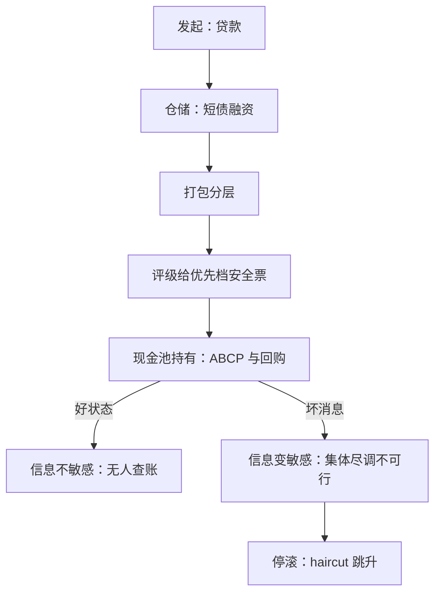

# 影子银行的深化

影子银行不是没有银行的银行，而是把银行的资产负债表拆成一条流水线：每一环都在做期限转换，却没有一环叫银行。

<footer>—— 据 Pozsar 等 2010、Gennaioli–Shleifer–Vishny 2013 整理</footer>

[上一课](/econ/bm-regulatory-capital)把资本写成安全网的定价，也暴露出它的影子价格：分母上被做轻的资产、表外承接转换的管道。主干课的 [影子挤兑](/econ/shadow-run)与 [回购与货基](/econ/repo-mmf)钉过影子链怎么跑——haircut 跳升、停滚、破净；本课补「深化」：影子链的**生产函数**——「安全」债怎么被制造出来、信息不敏感为什么是设计目标而非运气、上一课的工具价格如何决定期限转换搬到哪里。后课默认已经读完本课。

## 问题

机构现金池每天滚动千亿量级的短期债，不可能逐笔尽调底层资产——若「安全」依赖尽职调查，这个市场根本转不起来。缺口是解释：影子债在好状态下为什么可以不动脑子地持有。Dang–Gorton–Holmström（与 Ordoñez）的回答是**无知的均衡**：债务被设计成信息不敏感——别人都不知道坏消息，你也没有激励去查；无人查账，债就像货币一样易手。这不是信息不对称的失灵，而是制造「类货币」的工艺；坏消息一旦到达，不敏感变敏感，集体尽调不可行，市场冻结——与第一课的协调阈值是同一机制换了记号。

### 流水线的解剖

影子链五道工序：**发起**（贷款，风险留在这里）、**仓储**（短债融资持有资产）、**打包分层**（拆成优先、夹层、劣后）、**评级**（给优先档开安全票）、**持有**（现金池用 ABCP 与回购接走优先档）。分层是关键：优先档在好状态几乎无风险。Gennaioli–Shleifer–Vishny 2013 补上需求侧：投资者忽略尾部时，创新者把新债造成「安全」并赚到溢价——安全是均衡的产物，不是谎言；忽略被打破，需求消失、价格跳变，杠杆只是放大器。抵押与保证金是影子的资本：回购的超额抵押在功能上等于资本金，只是不进 RWA、多数不在安全网内。上一课的接口在此闭合：分母价格与表外边界共同决定工序的选址——套利不是轶事，是选址变量。

Pozsar 等（纽约联储工作人员报告）估计危机前美国影子体系约 20 万亿美元，与表内体系同量级——「影子」不是边缘，是另一半。

## 方法

读影子链先找三个量。一是**哪一环做转换**：错配不在贷款，在仓储与优先档的滚动之间。二是**信息敏感性押在什么上**：抵押品的价值与评级的假设各盖住多少坏状态。三是**谁在末端持币**：货基、司库、主权基金握着存款保险覆盖不了的量级，要大额、短期、可滚动且「不必想」的工具——影子债以更高收益供给同样的心理便利。三条读全，任何一环的抵押品被重估，上游仓储融资与下游评级假设同时断裂——Gorton–Metrick 2012 的 haircut 序列就是全链条的系统性保证金跳动。为什么要「神秘」：透明诱发个别审查，而个别审查在协调博弈里是传染的种子——影子债因此结构性模糊，监管者事前看不见：不是没人看，是被设计成不值得看。

## 机制

把本课与前两课焊在一起：第一课说可跑的债不限于存款，本课说转换工序也不限于表内——资本要求改变两者的相对价格，中介在合同与牌照的缝隙里重排工序：资产移出表、转换照做，资本与保险却不再覆盖。影子链的边界永远跟着资本要求走：要求收紧，工序再搬一格。所以治理从来不是「取缔」，而是把安全网的收费口径搬过去——哪一样接住，哪一环的无知均衡就失去燃料。

## 边界

本课不重讲挤兑机制与便利工具（[影子挤兑](/econ/shadow-run)、[回购与货基](/econ/repo-mmf) 已钉）；不写保证金螺旋——[融资与市场流动性](/econ/market-funding-liquidity)的 Brunnermeier–Pedersen 是做市侧的另一条通道；评级激励的实证细节不展开。还有一条口径要划清：设计论不是共谋论——无知的均衡在好状态是帕累托改进，坏状态的脆弱性是它的价格；写成道德剧会错过结构（与 [银行危机史](/econ/banking-crises-history) 一致）。救助怎么沿链开窗口，是下一课的事。

## 小结

- 影子链是拆开的银行：发起、仓储、分层、评级、现金池，各环转换、无一叫银行。
- 安全债的设计目标是信息不敏感：无知的均衡；坏消息到达即集体尽调不可行。
- haircut 是影子的资本；分母价格决定工序的表内外选址。
- 忽略尾部时创新能造「安全」，忽略被打破时需求消失、价格跳变。
- 治理是把安全网的收费口径搬过去，不是取缔。
- 出处：Pozsar 等 2010/2012；Dang–Gorton–Holmström–Ordoñez 2017；Gennaioli–Shleifer–Vishny 2013；Gorton–Metrick 2012。
