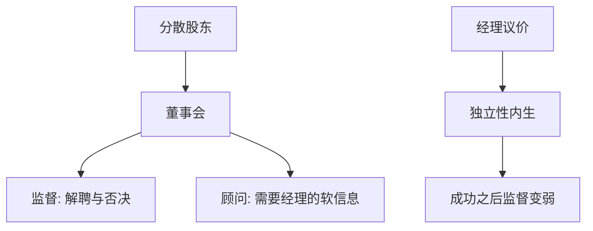

# 董事会与监督

    
董事会是股东的法定代理人，职责是聘经理、批重大决策、在危机里接手；它不是日常经营，监督强度取决于独立性、信息与谁真正选出董事。

    <footer>—— Hermalin and Weisbach, Endogenously Chosen Boards of Directors, American Economic Review 1998；Adams, Hermalin and Weisbach, The Role of Boards of Directors in Corporate Governance, Journal of Economic Literature 2010</footer>

[上一课](/econ/creditor-coordination-empty-creditor)收束债权侧协调。主干[控制权](/econ/control-rights)已把剩余权威定义为所有权。本课缺口是股权侧的常设机构：董事会如何监督经理，以及董事会本身被经理俘获的内生性。不重写 Aghion–Bolton 的状态转移，不把薪酬合同提前。

## 问题

分散股东无法日日监测，把权威委给董事会。Hermalin–Weisbach：董事会独立性是内生的——表现好的经理讨价还价，董事会变弱，监督下降。Adams–Hermalin–Weisbach 综述：董事会同时顾问与监督，两者冲突（经理不愿向严监督者透露软信息）。缺口是：治理进阶从「谁有剩余控制权」推进到「这项权利如何被一个委员会行使」，以及独立性不是外生合规指标。

Tirole：监督是信息生产，与银行监测同构，对象换成经理的私人收益与努力。董事会比债权人更早介入，不必等到违约。

## 方法

功能：选聘/解聘 CEO、批准并购与资本结构、审计与合规。独立性：与经理无雇佣与家庭关系，降低俘获，也降低行业专用信息。双层结构（监事会/董事会）改变信息流，本课不做法系比较——那是 LLSV 课。交错董事会是反收购课的装置，这里只标：它同时保护监督者任期与经理壕沟。

内生：需要监督最强时（业绩差），经理对董事选任的影响力可能仍在，除非股权集中或控制权市场威胁。下一课薪酬、再下一课激进股东，是替代与互补的监督。

与债权：契约与银行是硬信息与违约触发；董事会管不可验证的战略。两者都弱时，靠接管市场（后课 Grossman–Hart）。

## 机制

机制是多层代理。股东→董事→经理。每一层都有信息与激励问题。董事要声誉与未来席位，可能讨好经理（谁提名）或讨好激进股东。独立性规则改变提名池，不自动改变目标函数。Hermalin–Weisbach 的要点：把独立性当因果变量做回归，会碰到内生——差公司才换独董，或强 CEO 不让换。

与 Jensen FCF：监督弱则现金浪费；董事会应决定派息与杠杆纪律。失败则把工作留给债务与收购。

### 不是「独董比例越高越好」

顾问功能需要知情。全独立且无行业知识的董事会，监督变成会计合规，战略捕获为零。最优不是角点。规模过大则搭便车，过小则技能不足。

本课对象是监督机制，不是交易所上市规则清单。合规可以是最低约束，经济学在内生议价。

## 边界

不要把本课写成董事责任判例。下一课：激励合同如何把可验证产出与薪酬挂钩，补董事会不可日日看见的努力。再后是外部股东压力。

后课默认：董事会是常设监督，独立性内生于经理议价；顾问与监督冲突。债权监督在违约之前较弱。治理单元从此按「谁说了算」递进。

## 小结

- 董事会代股东聘经理、否决重大决策；独立性内生于议价，不是外生常量。
- 监督与顾问冲突：严监测减少软信息。
- 与银行/契约监督分工：不可验证的战略靠董事会，可验证的靠债。
- 出处：Hermalin and Weisbach, *AER* 1998；Adams, Hermalin and Weisbach, *JEL* 2010。
