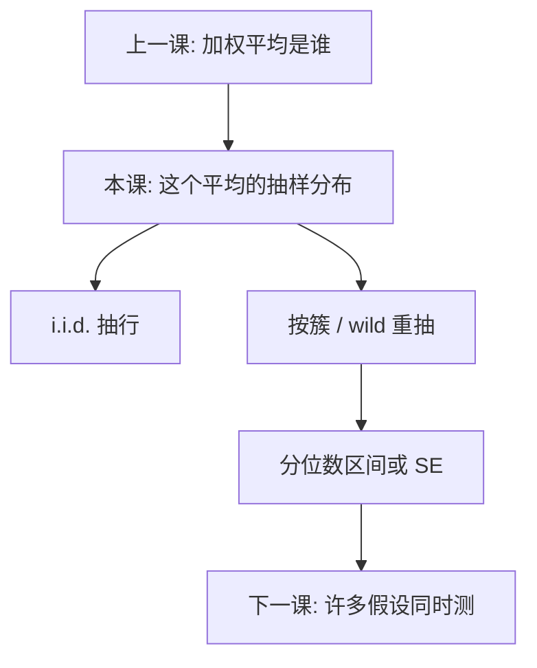

# Bootstrap

用样本的经验分布去模拟 $\hat\theta$ 再抽一次会落在哪；它给出非线性统计量与少簇推断的可行近似，不是第二套数据，更不是把偏误洗掉。

<footer>—— Efron, Bootstrap Methods: Another Look at the Jackknife, Annals of Statistics 1979；Cameron, Gelbach and Miller 的 wild cluster bootstrap；对照 Angrist and Pischke</footer>

[上一课](/econ/heterogeneous-effects)声明：OLS、IV、DiD 在 $\tau_i$ 异质时估的是不同加权平均，IV 对准编译器 LATE 而不是 ATE。本课不重写单调性与 MTE。缺口是精度：这些加权平均的抽样分布，在 $n$ 小、簇少、统计量非光滑时，不必接近正态。解析三明治可以不存在或名义水平很差。Bootstrap 用重抽样逼近 $\hat\theta$ 的分布。后课[多重检验](/econ/multiple-testing-econ)管许多假设同时测；本课管**单个**（或少数几个）参数的推断引擎。

## 问题

渐近口号是 $\sqrt{n}(\hat\theta-\theta)\Rightarrow N(0,V)$，于是 $t$ 与 CI。异质加权、中位数、GMM 的 $J$、少簇的 DiD，都可以让这句话在有限样本里很差。[聚类标准误](/econ/clustered-se)已经警告 $G$ 小时 CRVE 偏乐观。缺口是：若不相信正态，用样本自己当总体的插件估计，重复「再抽一次同样大小的样本」。Efron 的非参数 bootstrap：从 $F_n$ 有放回抽 $n$ 次，得 $\hat\theta^{(b)}$，$b=1,\ldots,B$，用经验分位数建区间。

关键限制：数据生成过程里的依赖，必须写进重抽方案。i.i.d. 行可以抽行；聚类数据抽行等于拆掉簇——名义水平可以比不用 bootstrap 更坏。

### 重抽样不是第二套识别

Bootstrap 的随机性来自你已经观察到的样本，不是新的实验。$\mathbb{E}[u\mid X]\neq 0$ 时，每一次 $\hat\theta^{(b)}$ 都在同一个偏误周围抖动，区间可以很窄地盖住错误的目标。它修的是「给定估计量，不确定性有多大」，不修「估计量对准谁」。与上一课分工：先声明 LATE 还是 ATT，再谈这个数的抽样分布。

匹配课已警告：离散最近邻上朴素 bootstrap 可以不一致。Abadie–Imbens 要渐近修正。装置与数据的依赖结构必须匹配，不能「一律 boot, reps(500)」。

## 方法

常用三种。(1) Pairs：成对抽 $(y_i,x_i)$，对异方差自然。(2) 残差 / wild：保留 $X$，用 Rademacher 权重乘 $\hat u$（或整簇 $\hat u_g$），适合回归与少簇。(3) 块 bootstrap：时间序列按块抽，块长敏感。聚类：以 $G$ 个簇为单位有放回抽 $G$ 次，每次带走该簇全部行。百分位区间取 $\{\hat\theta^{(b)}\}$ 的 $\alpha/2$ 与 $1-\alpha/2$ 分位；BCa 再修偏误与偏度。

与三明治并列报告是应用惯例：两者接近，心里踏实；差很远，先查依赖结构与弱识别，而不是只改 $B$。

$B$ 太小，分位数本身很吵；推断要稳，$B$ 常用几百到几千。计算成本不是把识别外包给计算机。

## 机制

插件逻辑：$F_n$ 是 $F$ 的估计，在 $F_n$ 上重复估计量的映射，逼近该映射在 $F$ 上的抽样分布。对光滑 M-估计，bootstrap SE 与三明治渐近等价，本课的增量主要在非光滑与少簇。Wild cluster 保留簇内相关形状，只随机翻转符号，因此在 $G$ 很小时 size 往往优于「簇得分当正态」。弱工具时，bootstrap 可以复制有限样本偏误——区间会围绕偏的中心，这是诚实的，不是 bug；它提醒你点估计本身不可信。

Cameron–Gelbach–Miller（2008）把 wild cluster 接到少簇推断。它与本课是同一装置：重抽必须尊重「独立单位是簇」。

## 边界

强依赖、单位根、参数在边界（如方差为零）时，朴素 bootstrap 可以不一致，要子抽样或改统计量。本课不推一致性的全部技术条件。多重假设时，对每个系数单独 bootstrap 不控制族错误率——下一课 Holm 与 BH。量化栏对收益率序列另有块长惯例，本课不搬，以免进交易执行。

后课默认：异质加权平均的推断，截面可 pairs，聚类用 cluster 或 wild，并与稳健 SE 对照。不要用 bootstrap 替代排除约束或平行趋势。

## 小结

- Bootstrap 用 $F_n$ 模拟 $\hat\theta$ 的抽样分布，不提供新实验。
- 依赖结构必须写进方案：簇抽簇，序列抽块。
- 少簇时 wild cluster 常优于正态 CRVE。
- 它不修正外生失败，只修正有限样本覆盖。
- 多假设的错误率留给下一课。
- 出处：Efron, *Annals of Statistics* 1979；Cameron, Gelbach and Miller, *ReStat* 2008；Cameron and Trivedi；Angrist and Pischke。
