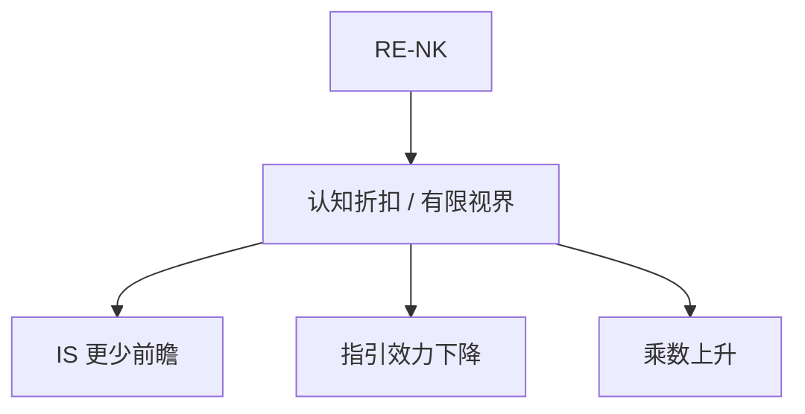

# 有限理性 NK

把认知折扣、层级或稀疏最大化写进 NK，决定性、乘数与前瞻指引的效力都改；RE-NK 是认知成本为零的特例。

<footer>—— Gabaix, A Behavioral New Keynesian Model, AER 2020；Woodford, Monetary Policy Analysis when Planning Horizons are Finite</footer>

[上一课](/econ/inflation-anchoring)把长期信念当可破状态。本单元需要一个收束：不必每次单列粘性信息或诊断性，而是**一整类**偏离 RE 的 NK。本课缺口是 Gabaix 的认知折扣（及相关有限视界）如何改 IS 与菲利普斯。不重写锚定测量。

## 问题

RE-NK：IS 完全前瞻，指引极强，BK 对泰勒原理敏感。Gabaix：人对未来的注意打认知折扣 $m\lt 1$，有效上把 $\mathbb{E}_t x_{t+1}$ 换成 $m\mathbb{E}_t x_{t+1}$ 一类项。结果：IS 更少前瞻、财政乘数变大、指引变弱、决定性区域变化。Woodford 的有限计划视界是姐妹。缺口是给本单元一个可塞进 SW 的参数化，而不是再列五种摩擦的并集。

Gabaix, *AER* 110(8), 2020, 2271–2327。Woodford 有限视界。Angeletos and Lian 的不完全信息 NK。Farhi and Werning 的有限理性与乘数。

## 方法

在对数线性 NK 里替换预期算子，重算 BK 与 IRF。校准：$m$ 对调查修订、对指引公告效应、对财政乘数。与 HANK 对照：有限理性 RANK 用认知折扣模仿「不那么欧拉」；HANK 用约束。两者都抬乘数，政策含义（给谁支票 vs 如何说话）不同，不要合成一个 $m$。

学习、粘性信息、疏忽、诊断性都可以视为某种有效 $m$ 或额外状态；本课是方便的一参数门，不是宣布其它课作废。

## 机制

机制是未来项在一阶条件里的权重下降。等价于更高的有效折扣或更短的计划。ZLB 的自我拉出更难（预期收入不够前瞻），财政相对货币更强。锚定：若认知折扣也打在长期，目标制的锚更弱，除非把 $\pi^*$ 写成单独、更凸显的状态（与疏忽的凸显一致）。

时间不一致：有限理性的私人部门改变承诺的价值，最优规则要重算，本课不求 Ramsey。

本课仍是宏观 NK，不是心理学实验。$m$ 没有唯一微观测量，必须用本单元的调查矩约束。

## 边界

本课不把行为 NK 写成交易策略。不进限价簿。金融摩擦（下一单元）是另一套放大，不要用 $m$ 替代抵押约束。预期单元结束：后课默认可以在 RE、学习、信息摩擦、认知折扣中显式选择，并报告调查矩。

## 小结

- 行为 NK：认知折扣降低前瞻性，改乘数、指引与决定性。
- 与 HANK 都抬乘数，机制不同。
- 是本单元的一参数收束，不取消分列的信息与偏差模型。
- 出处：Gabaix, *AER* 2020；Woodford 有限视界。
