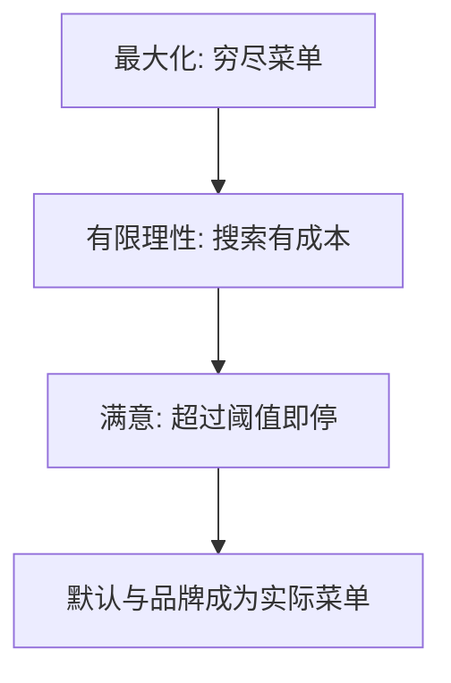

# 有限理性与满意

棋盘上的树大到无法穷尽；人停止在「够好」，而不是在最大值——计算约束与偏好约束不是同一件事。

<footer>—— Simon, A Behavioral Model of Rational Choice, QJE 1955；Simon, Rational Choice and the Structure of the Environment, Psychological Review, 1956</footer>

[上一课](/econ/heuristics-biases)把偏差写成捷径的影子。本课缺口是理由：Simon 的有限理性把搜索与满意当成对计算约束的响应，而不是对 $v$ 的改写。不把三条启发式再列一遍。

## 问题

[偏好](/econ/preference-choice)的理性是完备传递，最大化是有了表示之后的算法。Simon（1955）指出：菜单若是搜索来的，算法本身进模型。人设定抱负水平，找到第一个超过阈值的选项就停——满意（satisficing）。环境结构（1956）决定启发式是否有效：线索与结果若相关，简单规则可以逼近最优。缺口是把「算不算得完」从偏好里拆出来，而不是重写效用表示。

家庭金融：比较十几只目标日期基金的费用与滑道，满意表现为选默认或选熟悉品牌。这与素养不足叠加：抱负水平可能设错。

有限理性不是「非理性」。它保留目标，限制程序。前景理论改目标（得失、加权）；Simon 改程序（搜索何时停）。

## 方法

把决策写成搜索过程：抽一个选项、评价、与阈值比较、停止或继续。阈值可随搜索失败下调。成本–收益停止规则是其理性版本：边际搜索成本等于期望改进。本课不估计搜索成本。与承诺装置不同：满意是当期算力，承诺是跨期自我。

## 机制

机制是程序。完备性在未搜索到的选项上根本没有被调用——不是循环偏好，是菜单未被构造完。这解释框架与默认：架构决定先看到谁，满意就停在谁。助推课将利用这一点。与欧拉的关系：欧拉假定内部解已经找到；有限理性家庭可能停在近似规则（固定储蓄率），看起来像 Campbell–Mankiw 的 $\lambda$，来源却是计算而非信贷。

Simon 的环境结构是关键：线索与支付若稳定相关，满意可以接近最优，偏差在实验室的抽象菜单上才刺眼。默认之所以强，因为搜索从默认开始，阈值在第一项就可能被满足。这与现时偏差的金蛋不同：金蛋改未来可行集，满意改当期停点。助推课同时用两者。不把交易所匹配引擎的搜索写成家庭满意。

## 边界

若搜索成本为零且阈值调到最大值，满意退回最大化。实验室的「偏差」有些在高激励下减弱，符合成本说；有些不减弱，更像前景理论。本课不把所有行为证据收编进 Simon。也不把算法交易的优化器写成家庭满意。

后课默认：社会偏好改的是目标里有没有别人的支付，不是搜索停得太早。

菜单若是搜索来的，完备性在未搜到的选项上未被调用——不是循环，是菜单没构造完。

默认强，因为搜索从默认开始，阈值在第一项就可能满足。

搜索成本为零且阈值调到最大时，满意退回最大化；本课不把所有偏差收编进 Simon。

## 小结

- 有限理性把搜索与停止写进模型；满意是阈值停止。
- 与前景理论分工：一个改程序，一个改评价。
- 默认之所以强，因为满意停在先看到的选项。
- 满意改当期停点，金蛋改未来可行集。
- 高激励下部分偏差减弱，符合成本说。
- 出处：Simon, *QJE* 1955；Simon, *Psychological Review* 1956。
