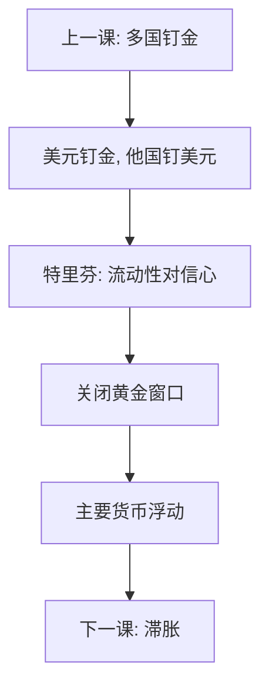

# 布雷顿森林与崩溃

美元钉黄金、他国钉美元，把金本位的枷锁改写成金汇兑。特里芬困境是：世界要美元流动性，美国就必须赤字；赤字一久，黄金兑换承诺就不可信。

<footer>—— Triffin, Gold and the Dollar Crisis, 1960；Eichengreen, Globalizing Capital 与 Bretton Woods 研究；Bordo 布雷顿森林史学；对照上一课金本位</footer>

[上一课](/econ/gold-standard-depression)用金平价解释通缩如何全球同步。本课缺口是战后重建：不再让各国直接钉金，而让美元居中。固定汇率加资本管制，换来一段时间的贸易扩张与政策空间。崩溃不是「某年某月的会议失败」，而是兑换承诺与美元供给之间的不一致被资本流动揭开。后课滞胀把崩溃后的浮动接到石油与预期。

## 问题

设计：美元 35 美元兑一盎司黄金，其他货币钉美元，可调平价，IMF 提供短期融资，资本账户未完全开放。相对经典金本位，国内 $M$ 有一层缓冲，但仍要保卫美元平价。特里芬：世界储备需求增长快于美国黄金，只能靠美国对外负债提供美元；负债累积则兑换不可信。1960 年代美元过剩、黄金外流、双边黄金池与双价，都是同一承诺的裂缝。1971 关闭黄金窗口、1973 主要货币浮动，是裂缝走到头。缺口不是背史密森协议条款，而是：**金汇兑把金约束集中在一个中心国；中心国的财政与经常账户一旦与兑换冲突，外围只能选升值、管制或脱钩。**

### 布雷顿森林不是固定汇率的黄金时代

资本管制压住三角的一角，才让固定汇率与国内目标短暂共存。把这段读成「固定汇率天生稳定」，会漏掉管制与美国黄金库存。可调平价在政治上很少及时下调，于是危机以不连续跳平价或脱钩出现，而不是平滑调整。与金本位对照：那里是多中心金约束；这里是单中心美元约束。通缩输出换成了通胀输出的种子——下一课滞胀。

Eichengreen 把布雷顿森林放进长期资本全球化：管制使系统可运转，金融开放使特里芬提前到期。Bordo 区分可调整钉住的理论与实际僵硬。

## 方法

机制对照三句。(1) 与金本位：仍是固定平价，但黄金只约束美元。(2) 特里芬：流动性 vs 信心不可兼得。(3) 资本账户逐步开放后，信心问题变成可交易的（黄金市场、远期）。政策实验：关闭黄金窗口后，美元贬值、石油以美元计价的价格冲击接踵而至——时序相关，因果要下一课的供给冲击与货币政策一起读。官方互换与双边黄金保证是同一承诺的补丁，补丁用尽才关闭窗口。

不要把 IMF 份额谈判当崩溃原因；融资是缓冲，承诺不一致才是核。可调平价若真按基本面及时调整，特里芬仍在——中心黄金库存赶不上美元负债——但危机会以一连串小贬值出现，而不是 1971 的硬关闭。政治上的平价僵硬把裂缝攒成一次断裂。补丁耗尽才关闭窗口，不是会议突然失败。

## 机制

机制是中心国资产负债表。世界要安全的美元资产，美国就必须做净负债国；同时承诺按固定价兑黄金，等于空头黄金。资本管制延长空头的寿命；欧洲美元市场与私人资本把它缩短。一旦私人不再相信 35 美元平价，官方黄金池也无法无限做市。浮动后，三角回到「独立 $M$ + 资本流动」，汇率吸收冲击——但独立 $M$ 立刻面对如何定锚，下一课是大通胀。

与主权可持续对照：美国当时的「债」包括对外美元负债加黄金兑换期权。阈值同样不是某一个黄金库存吨数，而是承诺是否还被相信。资本管制是推迟到期的工具，不是取消特里芬：欧洲美元市场一旦做大，私人可以绕开官方渠道给承诺定价，官方黄金池的做市深度就显得不够。

Triffin 1960 的诊断先于崩溃十年。事后看，他抓对了流动性–信心冲突，没有预测具体月日——史课要机制，不要神谕。

## 边界

本课不写外汇交易执行，不进限价簿，不把每次高峰会列成年表。石油、工会、菲利普斯曲线预期转到下一课。后课默认：布雷顿森林是金汇兑加管制的折中；它的崩溃是特里芬承诺失败，不是「固定汇率理念失败」的抽象课。金本位的通缩枷锁与布雷顿的信心枷锁，是同一金属的两种松紧。SDR 与替代账户是事后补丁，改的是储备形态，没有取消中心国兑换承诺的算术。

## 小结

- 金汇兑把金约束集中到美元兑换承诺。
- 特里芬：美元流动性与黄金信心冲突。
- 资本管制推迟、金融开放加速崩溃。
- 关闭黄金窗口后，定锚问题交给滞胀课。
- 平价政治僵硬把特里芬裂缝攒成一次断裂，而不是一连串小调整。
- 出处：Triffin 1960；Eichengreen；Bordo。
