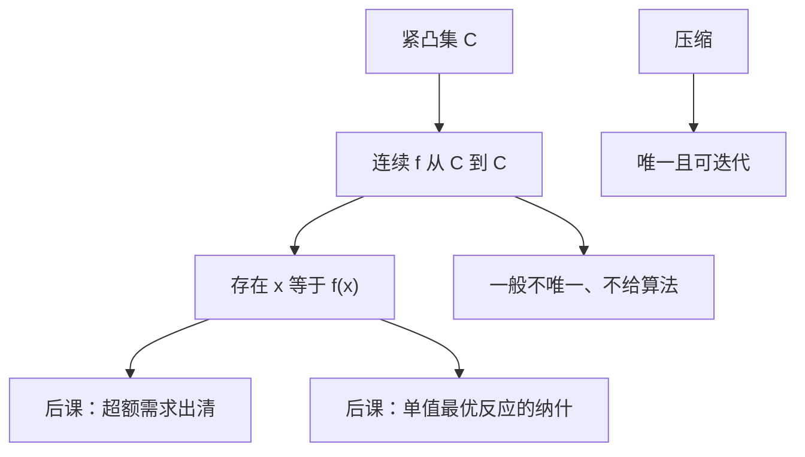

# Brouwer 不动点

紧凸集上的连续自映射必有一点留在原地；超额需求归一化之后，出清是这样一点。

<footer>—— 据 Debreu, Theory of Value, 1959；Mas-Colell, Whinston and Green 第 17 章与数学附录整理</footer>

上一课[压缩映射](/econ/contraction-mapping)给出唯一不动点与算法。超额需求、最优反应（单值时）通常只有连续性与紧凸值域，没有 $\beta\lt 1$。缺口是存在性，不是唯一、不是迭代。Brouwer：紧凸 $C\subset\mathbb{R}^n$，$f:C\to C$ 连续，则存在 $x=f(x)$。Kakutani 把 $f$ 换成对应，下一课再补。

## 问题

单纯形 $\Delta^{n-1}=\{p\ge 0:\sum p_i=1\}$ 紧凸。把超额需求 $z(p)$ 改造成 $f(p)\propto p+\max\{z(p),0\}$ 一类的连续自映射（Walras 定律帮助像仍在单纯形上），不动点满足 $z(p^*)\le 0$ 且对 $p_i^*\gt 0$ 有 $z_i=0$。这是[存在性与不动点](/econ/ge-existence)的骨架。本课不把 Debreu 的论证写完，只把 Brouwer 的假设与结论钉死：连续、紧、凸、自映射，四件缺一不可。

博弈里纯策略最优反应若单值连续，纳什就是 Brouwer。最优反应多半集值，要 Kakutani；有限博弈混合策略单纯形上的期望收益对混合概率线性，最佳反应凸值上半连续，那是后两课。本课先承认：单值连续已经够用 Brouwer。

### 有不动点不是可算出来

Brouwer 是纯存在。没有模 $\beta$，Picard $x_{n+1}=f(x_n)$ 可以旋转不收敛（圆周旋转没有不动点——但圆周不是凸的；凸里也可以有很糟的连续映射让朴素迭代失败）。计算一般均衡要 Scarf 算法、同伦，不在主干。不要把「存在」读成「市场会走到」。试错稳定性是[唯一性与试错](/econ/uniqueness-tatonnement)的缺口。

凸不能丢：把圆环当定义域，旋转映射连续、紧，没有不动点。紧不能丢：$\mathbb{R}$ 上 $f(x)=x+1$ 连续无不动点。

## 方法

有限维陈述足够主干。证明可以走：维数 1 是介值定理；$n$ 维用单纯逼近或度理论，本课不证。要用时检查：(i) 定义域紧凸；(ii) $f$ 连续；(iii) $f$ 把定义域送进自身。价格单纯形上构造 $f$ 时，(iii) 最容易写错：没有 Walras 定律或免费处置，像可能飞出 $\Delta$。

唯一性要另加：总替代、毛替代、对角占优一类条件。SMD 定理说超额需求在正则条件下几乎任意，Brouwer 管存在，不管漂亮。后课[Sonnenschein–Mantel–Debreu](/econ/smd-excess-demand)会讲这条边界；本课不要把存在说成「均衡很好」。

## 机制

连续像不能「整块挪开」而不留下定点：否则可以把像与点之间的射线反推到边界，造出边界上无不动点的连续自映射，与低维事实矛盾。凸保证射线留在集合内；紧保证极限点还在。经济学翻译：价格在单纯形上连续调整规则若总把价格送到单纯形，就至少有一个「不再需要调整」的点。规则不必是真实的市场过程，只是存在性证明里的辅助映射。

与压缩的分工：折扣动态规划要唯一值函数、要算法，走 Banach；均衡与纳什常常多解，先走 Brouwer/Kakutani 保住非空，再另文讨论选择与稳定。

无穷维要 Schauder：紧凸、连续、像相对紧。宏观函数空间上的均衡有时走这条；主干有限商品仍用 Brouwer。

## 边界

不在本课证 Brouwer，不写代数拓扑。不把不动点等同于瓦尔拉斯均衡的全部假设（偏好连续凸、生产凸、生存性都还在微观主干）。下一课把连续函数换成上半连续凸值对应——需求集值时必须换。

后课默认：单纯形上的连续自映射有不动点；单值连续最优反应有纳什；超额需求的存在性证明会构造这样一个 $f$。

## 小结

- 紧凸上连续自映射必有不动点；缺紧、缺凸、缺连续都会反例。
- 存在不是唯一，也不是算法，更不是动态收敛。
- 均衡存在把超额需求改造成单纯形上的 $f$。
- 压缩更强：唯一加 Picard；Brouwer 更贴均衡。
- 下一课：[Kakutani 不动点](/econ/kakutani-fixed-point)。
- 出处：Debreu, *Theory of Value*；MWG 第 17 章。
