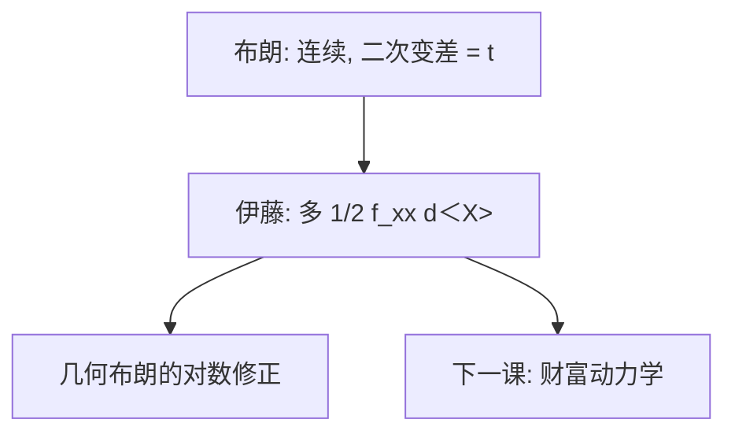

# 布朗运动与伊藤引理

路径连续、二次变差按时间线性积累时，一阶泰勒不够：微分必须带上 $\frac12\sigma^2$ 的那一项。

<footer>—— 据 Itô；对照 Merton 连续时间金融对引理的用法</footer>

[上一课](/econ/demand-system-asset-pricing)仍在离散份额与特征。本单元换装置：连续时间。缺口是把后文组合与均衡要用的微积分钉死——布朗运动与伊藤引理——而不先写最优。摩擦课序的约束先关掉，以便把随机积分写干净。不是随机过程教科书，只留资产定价用到的那一刀。

## 问题

离散多期的财富是和；连续极限里，收益有漂移与扩散。标准布朗 $B_t$ 路径连续、几乎处处不可微，二次变差 $\langle B\rangle_t=t$。于是复合函数 $f(t,X)$ 在 $X$ 为伊藤过程时，

$$
\mathrm{d}f=f_t\,\mathrm{d}t+f_x\,\mathrm{d}X+\tfrac12 f_{xx}\,\mathrm{d}\langle X\rangle.
$$

漏掉最后一项，财富与价格的动力学全错——Black–Scholes 的偏微、Merton 的预算，都靠它。缺口不是证明维纳过程存在，而是：后课默认读者会用二次变差记账。

布朗是工作噪声源。跳跃会加一个泊松积分，伊藤公式多出跳项；不完全市场后课再提。本课先无跳。

## 方法

伊藤过程 $\mathrm{d}X=\mu\,\mathrm{d}t+\sigma\,\mathrm{d}B$。乘法：$X$ 为价格时，$\mathrm{d}X/X$ 的积分是几何布朗，对数要减 $\tfrac12\sigma^2$。这解释「平均回报」与「对数均值」差一项，后面组合的目标函数必须说清楚用哪一个。随机积分 $\int\theta\,\mathrm{d}B$ 是局部鞅（再加可积则鞅），对应 FTAP 在连续时间的「对冲增益」。动态完备课已经口头说过一个布朗配一个风险资产；本课把「一个」落实为维数。

不要把 $\sigma\,\mathrm{d}B$ 写成限价簿的瞬时冲击。扩散是均衡或外生价格过程的理想化；$\lambda$ 是信息租金。装置不同。

## 机制

机制是二次变差的确定性积累。高频的小冲击平方起来变成 $\sigma^2\mathrm{d}t$，对凹函数（效用、对数价格）产生 Jensen 项。风险厌恶在连续时间里通过这一项进入，而不必先写离散的方差。Girsanov 改漂移、不改 $\sigma$，故对冲仍用 $\sigma$——这是后文 BS 作为复制的伏笔：复制看波动，不管 $\mathbb{P}$ 下的 $\mu$。

与等价鞅测度：在 $\mathbb{Q}$ 下漂移被扭到 $r$，伊藤公式照用。本课在 $\mathbb{P}$ 下先会写微分。

Itô 公式对凸函数给出严格的 Jensen 修正。Jensen 在离散课已有；连续时间把它变成微分方程的系数。

## 边界

本课不讲测度论条件、不证明存在。下一课把引理接到预算：消费与组合如何驱动财富过程。没有预算，伊藤只是微积分。

后课默认：价格与财富用伊藤过程；微分含二次变差项；一个布朗是一个独立风险源。跳跃另说。

## 小结

- 布朗路径连续但二次变差为 $t$；伊藤引理多 $\frac12 f_{xx}$。
- 几何布朗的对数均值减 $\tfrac12\sigma^2$；随机积分是对冲增益。
- 扩散不是盘口冲击，是连续时间装置。
- 出处：Itô 公式；Merton 连续时间金融的用法。
