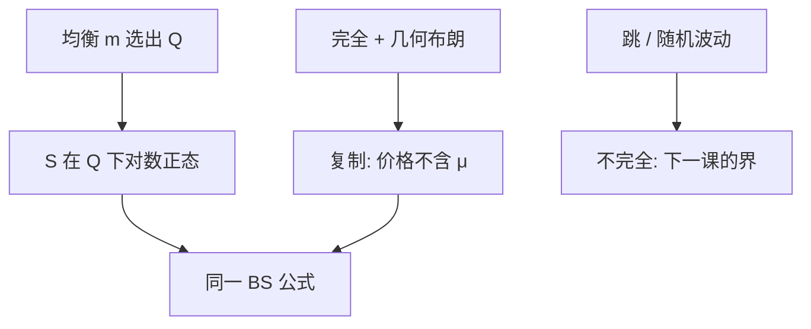

# Black–Scholes 作为均衡结果

复制给出与偏好无关的期权价格；同一公式也可以从均衡核推出——当核使股票在 $\mathbb{Q}$ 下成为漂移为 $r$ 的几何布朗。

<footer>—— Black and Scholes, The Pricing of Options and Corporate Liabilities, Journal of Political Economy, 1973；对照 Rubinstein, Econometrica 1976</footer>

[上一课](/econ/cir-general-equilibrium)用均衡核给债券定价。本课缺口是期权：Black–Scholes 首先是**复制**（完全市场、几何布朗），价格不含 $\mu$；它也可以是**均衡**（Rubinstein 等），当代表性 $m$ 恰好与对数正态相容。不把公式当成交易手册，不估计隐含波动率曲面——曲面是量化栏。

## 问题

动态完备：股票 $+$ 债券、一个布朗、连续交易，欧式期权可复制。复制成本满足 BS PDE，边界为支付。Girsanov 把 $\mu$ 扭掉，价格是 $\mathrm{E}^{\mathbb{Q}}[\mathrm{e}^{-rT}(S_T-K)^+]$。这是 FTAP，不需要 $u$。均衡问题：何种经济使 $S$ 真是几何布朗、使 $\mathbb{Q}$ 存在且波动为常数？Rubinstein（1976）：离散时间、加总 CRRA、总财富对数正态，得到类似公式。连续时间里，Lucas 树加合适的果实过程也可以对齐。缺口是分层：复制价是无套利价；均衡说明这个无套利价能在某个出清里被选出来，且 $\sigma$ 从哪来。

与信息：若知情交易让 $\sigma$ 变成 Kyle 的 $\lambda$ 过程，几何布朗失败，BS 不是均衡对象。本课公共信息、对称、扩散常数。

Black and Scholes, *JPE* 81(3), 1973。Merton 同年把公式放到连续时间套利语言。Rubinstein, *Econometrica* 1976，是加总均衡路线。

## 方法

复制路线：预算课的 $\theta$ 选成对冲比率 $\Delta=P_S$，财富跟踪期权，初始财富即价格。均衡路线：$m$ 给出 $\mathbb{Q}$，$S$ 在 $\mathbb{Q}$ 下的分布若是对数正态（漂移 $r$），积分得出同一公式。两条路在完全市场重合。不完全（跳、随机波动）复制失败，均衡仍可给一个价格（选出一个 $m$），或只给区间——下一课。

不要把 $\Delta$ 对冲写成「每个 tick 再平衡」。连续是理想；价差下精确复制不可能，Constantinides 后课。本课零成本。

## 机制

复制的机制是张成：期权的扩散暴露用股票对冲掉，剩余是无风险，必须赚 $r$，否则套利。均衡的机制是 $m$ 倾斜 $\mathbb{P}$ 到 $\mathbb{Q}$：风险厌恶改变的是 $\mu$ 与 $r$ 的差（股权溢价），不改变复制需要的 $\sigma$。所以偏好进入股票的超额，不进入已复制期权相对股票的价格——这正是 BS 令人吃惊之处。CIR 对债券也是 $\mathbb{Q}$–期望；债券支付确定，期权支付非线性，但对偶相同。

公司负债：BS 原文把股权当看涨。那是对资本结构的或有要求权语言，接 MM 的切片，不是本课展开。点到：同一公式，支付换成 $\max(V-D,0)$。

Breeden–Litzenberger：期权价格对 $K$ 的二阶导恢复风险中性密度。那是从价格读 $q$，测量偏量化；理论上确认 BS 对应对数正态 $\mathbb{Q}$。

## 边界

隐含波动率微笑表示几何布朗被拒绝，不是 FTAP 被拒绝——市场仍可能无套利，只是 $\mathbb{Q}$ 下不是对数正态。下一课不完全：没有唯一 $\mathbb{Q}$ 时，期权落在超复制与次复制之间。BS 是完全端的点。

后课默认：BS 是完全市场复制价，也可由相容均衡选出。价格不含 $\mu$，含 $r$ 与 $\sigma$。不是交易规程，不是波动率曲面实证。

## 小结

- 完全 + 几何布朗：期权可复制，价格是 $\mathbb{Q}$–期望，与 $u$ 无关。
- 均衡给出使该 $\mathbb{Q}$ 出现的 $m$；溢价在股票里，不在已复制的相对价格里。
- 跳与随机波动破坏精确复制。
- 出处：Black and Scholes, *JPE* 1973；Rubinstein, *Econometrica* 1976。
