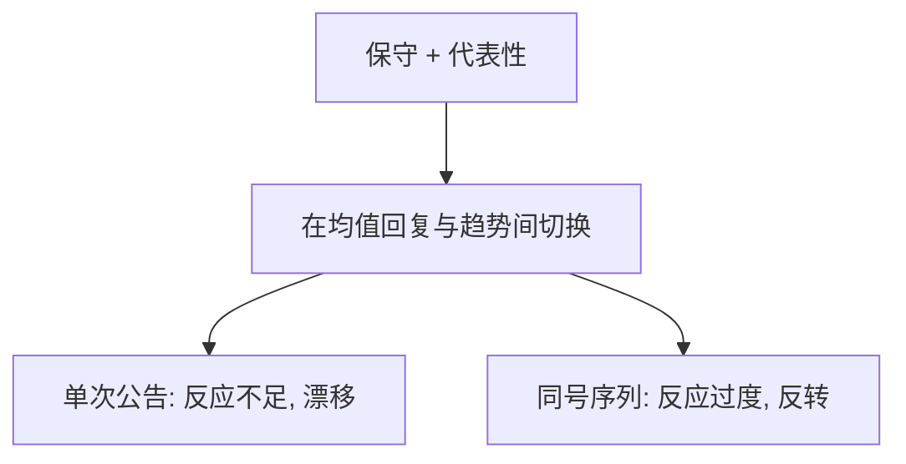

# BSV 情绪模型

同一条盈余流，人有时当均值回复、有时当趋势；保守与代表性轮流上场，价格先反应不足再反应过度。

<footer>—— Barberis, Shleifer and Vishny, A Model of Investor Sentiment, Journal of Financial Economics, 1998</footer>

[上一课](/econ/limits-to-arbitrage)说明错定价可以活。本课缺口是方向与动态：盈余公告后的漂移（反应不足）与长期反转（反应过度）如何来自同一套判断。零件来自[信念更新](/econ/belief-updating-biases)，此处放进价格。

## 问题

盈余的真实过程是随机游走（或弱自相关）。投资者不知道，在两个错误模型间切换：模型 M1 均值回复，模型 M2 趋势。看到延续，代表性启发式提高 M2 的后验；看到反转，提高 M1。保守主义让他们对单次公告调整不足。结果：公告后价格慢慢走完该走的（漂移），一串同号盈余后价格走过头（过度），随后反转。缺口是把启发式写成过滤问题，而不是再写 SV 的赎回。

BSV 的投资者是代表性的行为主体，不是噪声的随机需求。情绪在此是对体制的错误信念，可预测。

## 方法

离散盈余 $\pm$，隐马尔可夫式的错误模型切换，价格等于行为主体的贴现期望。套利者不进入或进入有限（承接 SV）。预测：短期动量/PEAD，长期反转，与盈余序列的路径依赖。本课不估计公告窗口。量化栏的事件研究是测量，本课是机制。

## 机制

机制是错误的体制学习。真实无体制，人以为有。似然在短样本里被代表性夸大，单次新息又被保守压住——两个偏差的时间尺度不同，于是同一模型先不足后过度。这与 DSSW 外生噪声不同：这里错定价的符号可由盈余路径预测。套利限制决定预测能否被交易吃掉。

与 [EMH](/econ/emh) 联合假说：用 CAPM 调过的 alpha 可以来自错误期望，也可以来自错误 $m$。BSV 明确走期望侧。

真实过程若是随机游走，最优是忽略「趋势还是回复」的叙事。行为主体没有这条知识，用代表性把短序列当成体制证据，又用保守把单次公告的似然乘得不够。两个偏差的频率不同：一次公告 → 漂移；一串同号 → 走过头。套利者若受 SV 约束，预测可以有价格。本课不把 PEAD 的估计窗口写进来，那是测量；机制是错误过滤。

## 边界

真实盈余过程若本就有体制切换，部分「过度」可以是理性学习。BSV 选择随机游走当对照，为的是把偏差衬出来。本课不声称现场盈余是随机游走。DHS 用过度自信讲另一条不足–过度的路，下一课对照，不在此合并。

后课默认：投资者情绪可以是对序列的错误体制信念；过度自信模型改的是信号精度，不是体制切换。

真实若是随机游走，最优是忽略趋势叙事；行为主体在两个错误体制间切换。

一次公告偏保守故漂移，一串同号偏代表性故走过头。方向来自盈余路径。

现场盈余不必真是随机游走；该假设是为了把偏差衬出来。

## 小结

- BSV：保守造成漂移，代表性造成长期过度与反转。
- 方向来自盈余路径，存活来自上一课的套利限制。
- 不重写启发式定义，只把它放进价格。
- 情绪在此是对体制的错误信念，可预测。
- PEAD 窗口是测量，本课只给过滤机制。
- 出处：Barberis, Shleifer and Vishny, *JFE* 1998。
