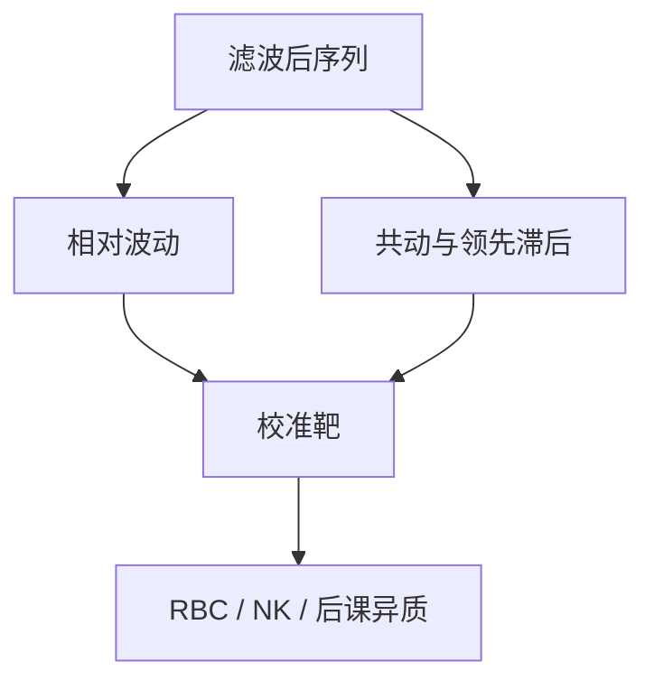

# 商业周期事实

消费比产出平滑，投资更剧烈，工时与产出共动，实际工资弱共动——这些是模型要复制的共动，不是冲击的名字。

<footer>—— Burns and Mitchell 的周期年表；Kydland and Prescott 的矩表；Stock and Watson, Business Cycle Fluctuations in U.S. Macroeconomic Time Series, Handbook of Macroeconomics</footer>

[上一课](/econ/hp-filter-cycles)声明周期是滤波后的对象。本课缺口是**事实清单**：共动与相对波动，作为校准靶与模型分类器。不重讲 λ，不把事实写成 SVAR 冲击。

## 问题

战后美国（及其它发达经济）HP 后的典型图景：$\sigma(c)\lt \sigma(y)\lt \sigma(i)$；工时强顺周期；劳动生产率顺周期但弱于产出；通胀与产出的共动随样本变；名义利率顺周期较弱。Kydland–Prescott 用技术冲击的 RBC 去对其中若干条，劳动波动与生产率往往是短板。NK 加入需求与粘性后，另一些矩改善，另一些（通胀持续性）靠指数化或习惯。缺口是把「要匹配的是共动」钉住，而不是从零讲什么是衰退。

Stock and Watson, *Handbook of Macroeconomics* 第 1 卷。Chari, Kehoe and McGrattan 的「Wedges」把事实改写成效率、劳动、投资、需求四个楔，是诊断而不是命名冲击。

## 方法

报告：相对标准差、同期相关、自相关、与产出的领先滞后。国际：产出共动、净出口逆周期，是开放经济后课的靶，本课只点名。大稳定（Great Moderation）改变σ的水平，相对矩较稳——样本要声明。新兴市场：消费往往比产出更波动，校准不能照搬美国表。

事实不识别冲击：同一套共动可被技术、需求、金融多种结构生成。下一课 SVAR 才问「若施加识别，脉冲长什么样」。

## 机制

机制是加总账户加行为。消费平滑来自欧拉（完全市场下更强）；投资剧烈来自 $q$ 与调整、或来自冲击本身；工时共动要求劳动供给弹性或需求侧拉动。工资弱共动曾被当成黏性证据，也可来自组合的劳动质量或自选择。把单一矩当成单一理论的判决，会输给下一张表。

代表性模型匹配加总矩，可以与微观 MPC、财富分布同时失败——那是下一单元的入口，本课先把加总事实当公共靶。

Burns and Mitchell, NBER。现代矩表是它们的二阶矩后代，失去了「转折点年表」的非线性味道；Hamilton 与 Harding–Pagan 的转折点是另一刀。

## 边界

本课不估计冲击、不画识别 IRF。不把金融危机的杠杆事实提前写成 KM 模型。也不做资产定价周期（股权溢价、回报可预测已在别的课程）。发展中国家与战争样本另表。

后课默认：说到商业周期事实，指声明滤波与样本后的相对波动与共动。下一课：从共动走到结构性冲击，需要识别假设。

## 小结

- 周期事实是相对波动与共动，不是冲击标签。
- 消费平滑、投资剧烈、工时顺周期是基准靶。
- 多样结构可复制同一张表，故事实不够识别。
- 出处：Kydland–Prescott 矩表；Stock and Watson, *Handbook of Macroeconomics*。
