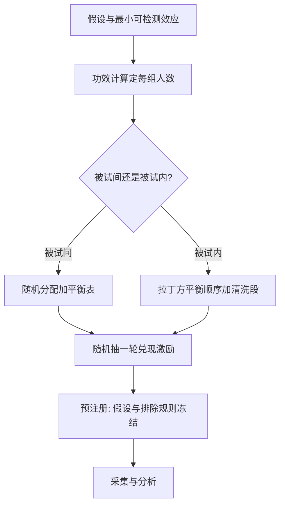
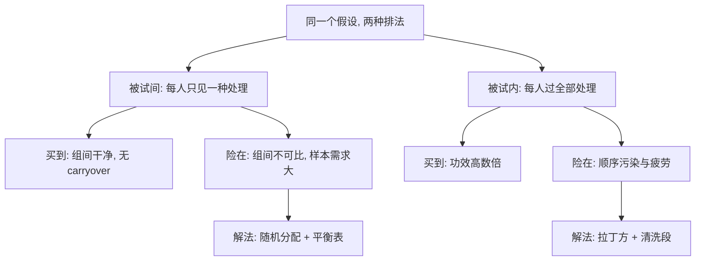

# 实验设计

实验的特权是把机制单独拎出来；代价是每一个想要的结果都能被协议造出来。设计规范不是美德清单，是防止自己骗自己的工程。

<footer>—— 据 Smith, American Economic Review, 1982 及现行预注册惯例整理</footer>

[上一课](/econ/bx-social-preferences)把「拒绝免费的钱」参数化成 $\alpha$、$\beta$ 与意图维度。风险、时间、社会三块行为区域到此过完，本单元转到方法：这些数字是怎么测出来的，又怎么防止测错。[实验经济学方法](/econ/experimental-methods)已在主干钉了两条底线：诱导价值隔离机制，支付过小就退化成廉价交谈。本课在其上补一个完整的设计协议——处理结构、随机化、激励、功效、预注册五步，目标是把「防假阳性」从品德要求变成流程。后课默认已经读完本课。

## 问题

行为实验的效应量普遍不大，而协议自由度极大：题目顺序、报酬方式、被试池、实验者在场，每一项都能移动结果。同一个假设换个顺序就能翻转符号——这既是威胁，也是证据：[框架效应](/econ/framing-effects)本身就是这样被测出来的。缺口落在方法层：一个结论要站住，必须先钉死协议的哪些自由度、报告哪些检查，再谈效应。

## 方法

五步协议。(1) 处理结构：被试间（每人只见一种处理，组间干净，无 carryover）还是被试内（每人过全部处理，功效高数倍，但要拉丁方平衡顺序、加清洗段）。风险题与公平题混排是典型事故：损失框定污染随后的公平判断。(2) 随机化：被试间随机分配生成可比组并报平衡表；被试内随机化顺序与题目呈现。(3) 激励协议：真实激励为默认；风险与时间偏好用「多题作答、随机抽一轮兑现」，把财富效应压到只发生一次；假设性问答只许出现在预实验。(4) 功效：先定最小可检测效应与检验水平，反推每组样本量——行为实验常见效应量在 $d\approx0.3$–$0.5$ 一带，80% 功效下每组需几十到上百人。(5) 预注册：假设、排除规则、多重比较修正，在看数据之前冻结。

数字实例：效应量 $d=0.4$、80% 功效、5% 显著水平下，被试间设计每组约需 100 人；被试内设计让同一批人自己当对照，个体噪声互相抵消，几十人往往就够。「功效高数倍」不是修辞，是预算表上的样本量差。

## 机制

随机化为什么足够：它把被试特征的组间差变成均值零的噪声，处理效应的期望因此干净——这套逻辑下一课被原样搬进田野，交换的只是控制度与真实度。随机抽一轮兑现为什么必要：每题都真付时，被试把整场实验当一个组合去对冲，背景风险污染风险态度——协议正是照主干提示的房子钱账户设计的。诱导价值的样板是拍卖实验：[共同价值与赢家诅咒](/econ/winner-curse)的过度叫价与[全支付拍卖](/econ/all-pay-auction)的过度竞价，都因价值被诱导、机制被隔离而可定量——没有诱导价值，分不清偏离是偏好还是困惑。策略方法（对每种可能的对手行动都表态）用策略推理的污染换数据密度，直接反应保纯度但样本需求翻倍——选哪一端要写进论文。不这么做会错在哪：不报功效与排除规则的设计，显著结果里混着研究者的自由度——「挖到显著为止」能把任意参数测出来。

「多题作答、随机抽一轮兑现」之所以激励相容：每题在期望意义下都是独立小赌局，诚实报告仍是占优策略，而财富效应只发生一次——风险与时间偏好的测量把它当默认。

直觉类比：随机化像洗牌后再发牌——牌技（被试特征）还在，但拿到哪手牌纯靠运气，组间只剩运气差且均值上互相抵消；于是组间差异就能归给「发到了哪手牌」（处理），而不是谁坐庄。

这张图回答的是：设计选择的交换发生在哪。被试间买「纯度」付「样本量」，被试内买「功效」付「顺序风险」；两种风险的解法（平衡表与拉丁方）都是流程件，不是事后补救——这也是五步协议必须先于数据采集的原因。

## 边界

五步协议只管内部有效。实验室之外剩三重折扣，留给下一课：被试池（学生与 WEIRD 样本）、情境（低额与去情境化博弈）、选择集（简化决策树）。欺骗被试是经济学实验的行业禁令：破坏诱导价值的信任前提，代价由此后所有实验分摊。协议本身也是研究对象——前两课的「协议伪影」清单就是设计协议的负样本库。后课默认：拿到任何行为参数，先问五步走到哪一步，再谈数字。

常见误区：把「显著」当「测对了」。题目顺序、报酬方式、实验者在场都能搬动结果；不预注册排除规则，研究者总能在某个子样本里挖出显著——p 值再小，也只证明了自由度存在。

## 小结

- 五步协议：处理结构、随机化、激励、功效、预注册；顺序不能换。
- 被试内功效高但要拉丁方与清洗段；被试间干净但吃样本。
- 随机抽一轮兑现隔离财富效应；假设性问答只进预实验。
- 效应量决定样本量；不报功效的显著结果是自由度的产物。
- 内部有效之外的三重折扣——被试、情境、选择集——由现场实验接手。
- 出处：Smith, *AER* 1976、1982；预注册与功效报告按现行实验经济学惯例整理。
