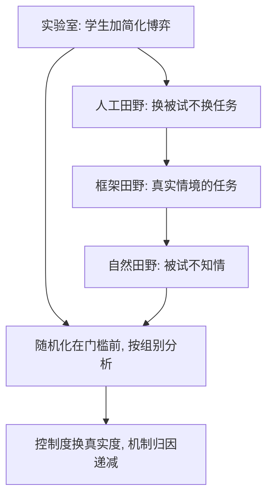

# 现场实验

实验室买控制，田野买环境；现场实验把同一套随机化搬到真实决策的门口，付款方式是控制度的让步。

<footer>—— 据 Harrison and List, Journal of Economic Literature, 2004；DellaVigna, Journal of Economic Literature, 2009 整理</footer>

[上一课](/econ/bx-experiment-design)把实验室协议钉成五步：处理结构、随机化、激励、功效、预注册；随机化的逻辑在黑板与田野是同一套。本课把装置搬出实验室。缺口有二：行为参数离开学生被试池与简化博弈之后还剩多少，以及现场不可控时随机化的纯度怎么保。后课默认已经读完本课。

## 问题

实验室有三重折扣：被试（学生）、情境（低额与假设性）、选择集（简化树）。这不是洁癖问题，是外推折价：默认选项的力量在实验室框架效应里只是影子，在退休储蓄里是几十个百分点的参与率；歧视在问卷里测态度，在简历投递里测回电。把随机化带进现场，会撞上实验室没有的三个敌人：选择进入（被试决定是否参与处理）、流失（处理中途退出）、溢出（控制组模仿处理组）。任何一个不设防，估计就带上同号偏——选择进入让 volunteer bias 伪装成效应，流失让最不配合的人从分母里消失，溢出把处理组的效果稀释进对照。

## 方法

Harrison–List 的谱系按三个维度切：被试是否学生、任务是否真实情境、被试是否知情。人工田野实验换被试不换任务；框架田野实验保留真实情境的任务；自然田野实验里被试不知道自己在实验中。设计沿用上一课五步，现场另加两条纪律。其一，随机化在门槛之前做，分析按随机化组别走（intent-to-treat）：拒绝入组与中途流失都计入原组，选择进入才不会伪装成效应；想谈「参与者身上的效应」，要另配工具变量并报第一阶段强度。其二，知情度与真实度做交换：越自然，情境污染越全，机制归因越弱——谱系不是荣誉阶梯，是控制力对真实度的价目表。

## 机制

现场实验的机制角色是给实验室参数做压力测试。401(k) 自动加入：默认从 opt-in 改成 opt-out，参与率从不足五成跳到八成以上——默认同时改切换成本与参考点，量级远超实验室的框架效应。简历审计：随机在简历上放白人或黑人名字，白人名字的面试回电率高约五成——态度测量给不出这个数。DellaVigna 2009 的整理口径可以当换算表用：方向大体保住，量级普遍缩水；例外是现时偏差与默认效应（现场量级可观）与风险态度（实验室参数到现场最不稳）。对外端口是政策评估：同一套随机化，问题从「机制是否存在」换成「政策效应多大」，功效、成本、合规率从技术细节升为约束。不这么做会错在哪：只用实验室参数给政策定价，默认效应的量级会错开一个数量级；只用现场黑箱结果，换一个环境就失效——机制没被测过。

Harrison–List 的分类学按「被试、任务、知情」三维切，同一项研究的落点可以移动：同一份简历审计，对投递者知情是框架田野，对雇主不知情是自然田野。报告里写清三个维度，读者才能给结论标价。

## 边界

自然田野不知道机制，人工田野环境不真，两端各有用途、不互替。溢出在社交网络里最难防：一人改默认，全家模仿——处理溢出要把随机化单位提到溢出边界之上，功效随之下降。被试不知情涉及伦理：豁免知情同意要有独立审批，不能由研究者自裁。准实验（DiD、断点）与本课的分工是「研究者是否控制随机化」；政策数据上的准实验评估不属本课范围。后课默认：引用行为参数，先问它在谱系哪一格；上政策之前，先过现场再谈量级。

## 小结

- 谱系三维：被试、任务、知情；从实验室到自然田野，控制度与真实度此消彼长。
- 现场两条纪律：随机化在门槛前，按组别分析（ITT）；谈参与者效应须另配工具变量。
- 换算表：方向大体保住，量级普遍缩水；默认与现时偏差例外地大，风险态度最不稳。
- 401(k) 默认与简历审计是两个量级参照：几十个百分点的参与率与五成的回电差。
- 选择进入、流失、溢出是现场三敌人；协议要先设防，再采集。
- 出处：Harrison and List, *JEL* 2004；DellaVigna, *JEL* 2009；Madrian and Shea, *QJE* 2001；Bertrand and Mullainathan, *AER* 2004。
