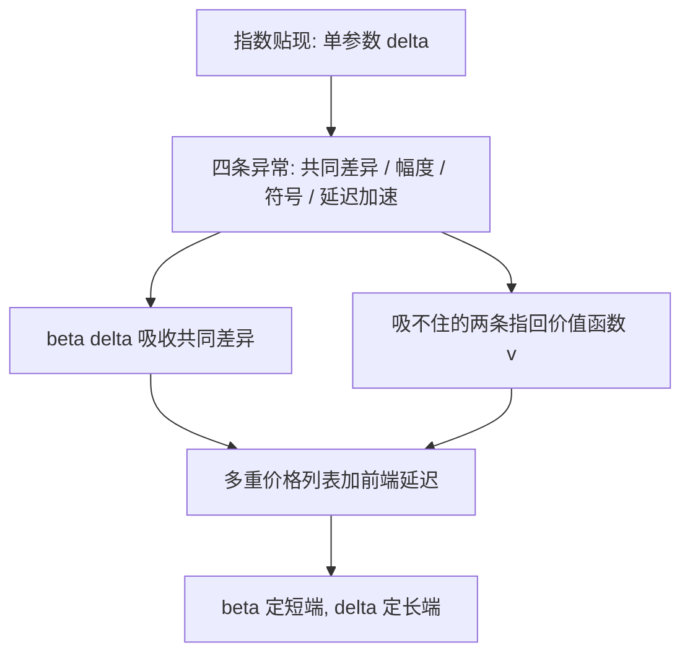

# 跨期选择的异常

「现在」在贴现函数里不是一个时刻，是一处断点：跨过它的那一段间隔，被额外抽了一次折扣。

<footer>—— 据 Thaler, Economics Letters, 1981；Laibson, Quarterly Journal of Economics, 1997 整理</footer>

[上一课](/econ/bx-prospect-deep)把风险侧的权重从分离概率改成累积秩依赖，损失厌恶拿到参数 $\lambda$。本课把同一套「先分异常、再配表示」的做法搬到时间侧。[双曲贴现与现时偏差](/econ/hyperbolic-present-bias)已在主干钉了定义层：指数贴现的相对权重不随起点变，准双曲 $\beta$–$\delta$ 让「现在」额外打折，幼稚与老练自我的策略不同。本课补数据层：哪些异常是贴现函数的形状，哪些是测量协议的伪影，$\beta$–$\delta$ 能吸收几条，吸不住的几条又指回上一课的 $v$。后课默认已经读完本课。

## 问题

指数贴现 $u(c_t)+\delta^{\tau}u(c_{t+\tau})$ 只有一个自由参数，预言隐含贴现率只跟间隔 $\tau$ 有关，与起点、金额、符号无关。四条异常各击一处。(1) 共同差异效应：「今天的 100 对一周后的 110」多数选今天，「一年后的 100 对一年零一周后的 110」多数选后者——同一个 $\tau$，两种问法的隐含贴现率相差几个数量级。(2) 幅度效应：金额放大，隐含贴现率下降。(3) 符号效应：损失侧的隐含贴现率低于收益侧。(4) 延迟—加速不对称：把好结果提前所愿付的代价，小于把同样结果推迟所要求的补偿。缺口不是宣布「人不理性」，而是这四条能否被一个两参数表示同时收编。

## 方法

准双曲表示：$U^t=u(c_t)+\beta\sum_{\tau\ge1}\delta^{\tau}u(c_{t+\tau})$。它天然吸收共同差异效应：$\beta\lt1$ 只作用于跨越「现在」的那段间隔，未来两点之间的相对权重仍由 $\delta$ 支配——断点正好落在「今天对以后」上。幅度与符号效应它吸不住：金额与符号改变的是效用函数的曲率与斜率，不是贴现结构。接法是把上一课的 $v$ 装进跨期效用：收益凹、损失侧平缓且斜率大 $\lambda$ 倍，符号效应与延迟—加速不对称在损失编码一侧拿到公共解释——「把坏结果提前」是损失域里的选择，用的是更平的 $v$。风险侧与时间侧共用一套价值函数，这是本课程把两课排在一起的机制理由。

测量协议决定 $\beta$ 的高低。多重价格列表固定远端金额、扫近端找切换点，换远端再扫；前端延迟把两个选项都推到「至少一周之后」，剥离「立刻」的特别吸引力。不剥离时，现时偏差混着立即兑现的交易成本与兴奋，$\beta$ 被系统性高估。

Thaler 1981 的问卷里，「现在拿 15 美元」与「一年后拿 60 美元」中位无差异，隐含年贴现率约 300%；同一调查里期限越长，隐含贴现率越低。共同差异与幅度效应在同一次调查里同时显形——异常是期限结构，不是孤例。

## 机制

$\beta$ 与 $\delta$ 的辨识分工：是否跨越「现在」动 $\beta$，长端水平动 $\delta$；只有含前端延迟变异的设计能把两者分开。自我博弈的机制层主干已写：今天的自我给未来自我留一个 $\beta$ 折扣，老练自我为此买[承诺装置](/econ/commitment-devices)，幼稚自我把拖延推到最后一刻。异常数据给这个博弈加刻度：跨「现在」的选择反转幅度决定 $\beta$，对承诺装置的支付意愿是 $\beta$ 的显式上界估计。不这么做会错在哪：用单一期限问卷估出一个「贴现率」再外推全部期限，等于把函数形状当成水平读数；拿它给储蓄政策定价，方向与量级同时错。

## 边界

指数贴现仍在长期利率、增长与资产定价里当默认，本课只标换件位置：行为证据集中在消费选择的短端。用[承诺装置](/econ/commitment-devices)反推 $\beta$ 要防两个混淆：流动性约束会假性抬高 $\beta$——想提前消费也拿不到现金；假想问卷会高估承诺意愿。也不把政策的时间不一致与个人现时偏差写进同一个方程，主干已划下那一刀。后课默认：谈现时偏差指 $\beta$–$\delta$ 加测量协议；遇到新异常，先判「函数形状」还是「协议伪影」，再谈模型。

## 小结

- 共同差异效应被 $\beta$ 吸收：折扣断点正好落在「现在对以后」上。
- 幅度、符号与延迟—加速不对称 $\beta$–$\delta$ 吸不住，指回收益凹、损失平的价值函数。
- 辨识分工：是否跨「现在」动 $\beta$，长端水平动 $\delta$；前端延迟是分离两者的关键协议。
- 无前端延迟的假想问卷系统性高估现时偏差。
- 指数贴现在长端仍是默认，$\beta$–$\delta$ 是短端换件。
- 出处：Thaler, *Economics Letters* 1981；Laibson, *QJE* 1997；O'Donoghue and Rabin, *AER* 1999；Frederick, Loewenstein and O'Donoghue, *JEL* 2002。
