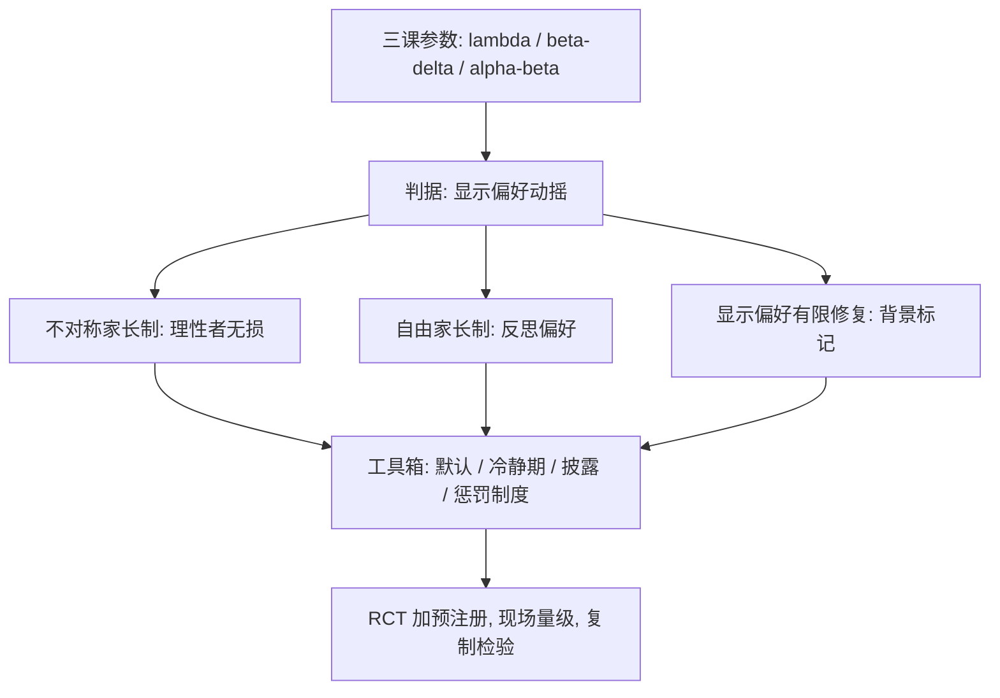

# 行为公共政策与收束

当偏好随参考点、期限与情境漂移，「尊重当事人自己的愿望」从公理变成待估问题——行为政策的第一道设计题不是工具，是福利判据。

<footer>—— 据 Camerer, Issacharoff, Loewenstein, O'Donoghue and Rabin, University of Pennsylvania Law Review, 2003；Thaler and Sunstein, Nudge, 2008 整理</footer>

[上一课](/econ/bx-field-experiments)把随机化搬进真实决策的门口：默认与现时偏差在现场保住方向并放大量级，风险态度最不稳。本课程到此收束。回看路线：风险侧由[前景理论的深化](/econ/bx-prospect-deep)给出 $\lambda$ 与累积加权；时间侧由[跨期选择的异常](/econ/bx-intertemporal-anomalies)给出 $\beta$–$\delta$ 与测量协议；社会侧由[社会偏好](/econ/bx-social-preferences)给出 $\alpha$、$\beta$ 与跨文化变异；[实验设计](/econ/bx-experiment-design)给了防自欺的五步协议；[现场实验](/econ/bx-field-experiments)给了谱系与换算表。收束课不引入新模型，只问五课参数上政策时最先撞上的那道题：判据。

## 问题

传统福利分析以显示偏好为判据：选择即福利。三课参数同时动摇它。现时偏差的人「想存」却拖到明天，两个自我各有显示偏好，选哪个？框架下翻转的选择没有唯一答案，损失厌恶使 WTP 与 WTA 分叉，消费者剩余不再单值；$\alpha$、$\beta$ 的分布意味着「效率」的支付向量本身被公平重估。缺口于是先于工具：判据不定，任何助推都能被同时指控为解放与操纵——争论的从来不是证据，是「以谁的偏好为准」。

## 方法

三个判据口径，门槛递增。(1) 不对称家长制：只纠「对完全理性者无损、对偏差者有救」的错——冷静期、永远可以退出；它不依赖「哪种偏好才对」，争议最小，是行为政策的底线装置。(2) 自由家长制：判据「as judged by themselves」，以当事人的反思偏好为准；工具是不禁止选项、只改默认与架构——退休储蓄与器官捐献的默认即此。(3) 显示偏好的有限修复：给每个选择附一个「背景合理性」标记，只在被标记扭曲的场合否定显示偏好——它最接近标准福利经济学，工程上最难。证据标准横跨三个口径：干预上用 RCT 加预注册（上一课五步的重演），量级外推必过现场谱系，复制失败的工具退出工具箱。

## 机制

默认为什么是最强工具：它同时动两处——切换成本（架构）与参考点：放弃默认被编码为损失，权重 $\lambda\gt1$；第一课的 $\lambda$ 与上一课的现场量级在这里会合。同一逻辑给出它的边界：默认的量级依赖参考点人群，跨人群不可平移。判据与证据为什么不能互相替代：有判据无实验，好判据也配错量级——把学生问卷的 $\beta$ 直接代入政策弹性，会同时错方向与幅度；有实验无判据，RCT 只能告诉你「有效」，不能告诉你「该不该」。收束回地图：五课参数各挂一个政策端口——$\lambda$ 管默认与披露框架，$\beta$ 管自动储蓄与承诺制度，$\alpha$、$\beta$（社会侧）管惩罚制度与再分配的接受度，五步协议管证据质量，谱系表管外推折价。本课程的账：这套装备的产出是一张「参数—判据—工具」的对照表，不是一份直接施工的图纸。

「as judged by themselves」自己留了口子：成瘾与冷热状态差的场合，冷状态的「自己」代言不了热状态——判据退回不对称家长制，只设冷静期，不替人选——三个口径门槛递增的用处正在于此：上层失灵退回下层。

## 边界

本课程没有覆盖的三块：学习与信念更新、情绪与生理基础、行为参数的一般均衡反馈——补贴储蓄改变利率与资产价格时，局部参数不再是参数。行为政策的公信力系于复制：大规模推广中效应量缩水的工具要按证据标准退出，而不是按叙事留下——助推的大规模 meta 分析已见缩水。公平的福利地位本课刻意悬置：$\alpha$、$\beta$ 说了人们在乎公平，没说政策应当在乎——那是规范经济学的题。后课默认：任何行为政策提案，先报判据口径与证据等级，再谈工具。

## 小结

- 显示偏好在三课参数下不再是充分统计：判据先于工具。
- 三个口径门槛递增：不对称家长制、自由家长制、显示偏好有限修复；上层失灵退回下层。
- 默认的强度来自切换成本加参考点的损失编码；量级随人群不可平移。
- 判据与证据不可互替：一个管该不该，一个管配多少。
- 工具箱按参数挂端口、按复制检验退出；产出是对照表，不是图纸。
- 出处：Camerer, Issacharoff, Loewenstein, O'Donoghue and Rabin, *U. Penn. Law Review* 2003；Thaler and Sunstein, *Nudge* 2008；Bernheim and Rangel, *QJE* 2009；DellaVigna, *JEL* 2009。
