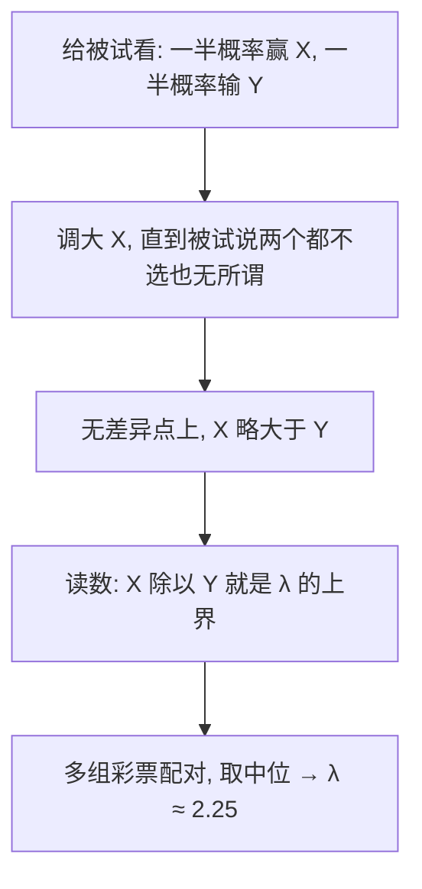
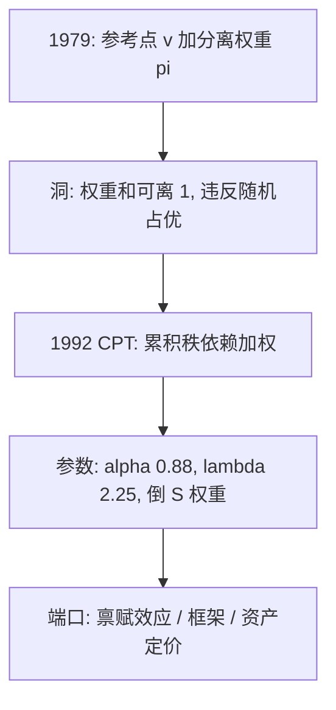

# 前景理论的深化

把概率权重从「每个结果各自扭曲」改成「按累积分布扭曲」，编辑阶段就可以从模型里退休；损失厌恶不是修辞，是一个可以估出来的常数。

<footer>—— 据 Tversky and Kahneman, Journal of Risk and Uncertainty, 1992 整理</footer>

[上一课](/econ/ct-map)把合同与机制收束成一张约束表：三摩擦一骨架，信息租金的四种形态，包络把支付钉死，并把「行为」列为地图的未绘区域。本课开「行为与实验深化」的第一课，回到[前景理论](/econ/prospect-theory)：那里钉了 1979 年的替代表示——参考点上的价值函数 $v$ 加概率权重 $\pi$，反射效应解释买彩票与买保险并存。缺口有三：1979 版的分离权重会违反一阶随机占优；$\lambda$ 与权重函数当时只钉了「存在」，没有参数；参考点从哪来没有被钉住。本课补前两个，第三个留给边界。后课默认已经读完本课。

## 问题

1979 版对每个结果独立加权：$V=\sum_i \pi(p_i)\,v(x_i)$。这个形式有一个数学洞：各 $\pi(p_i)$ 之和可以偏离 $1$，于是把概率从劣结果挪向优结果，总价值反而可能下降——被支配的彩票可能被偏好，即违反一阶随机占优。这不是边缘案例：结果一多，占优违例极容易撞上。缺口也堵不住：$\pi$ 挂在单个概率上，看不见结果在彩票里的秩，编辑阶段的补救（合并同结果、删被支配项）是分析者手工，不是模型。1992 年的累积前景理论（CPT）把权重改挂到累积分布上，编辑阶段删除。

直觉类比：分离加权像给每个奖项单独定汇率，奖项之间互不知情；秩依赖像先按好坏排好座次，再对整条累积分布统一换汇——于是给优胜者加筹码，总分只会加不会减，占优违例从根上消失。

## 方法

先按参考点把结果分成得与失两段，增益侧从最优结果向次优累积概率，损失侧从最劣结果累积，累积值经两个单调权重函数变换后相邻相减，得到每个结果的权重。增益侧、结果从优到劣排序时：

$$V=\sum_i v(x_i)\Big[w^+\Big(\sum_{j\le i} p_j\Big)-w^+\Big(\sum_{j\lt i} p_j\Big)\Big]$$

价值函数与权重取参数形：$v(x)=x^{\alpha}$（得），$v(x)=-\lambda(-x)^{\beta}$（失），权重函数呈倒 S：小概率被高估、中大概率被低估。1992 年的估计给出 $\alpha=\beta\approx0.88$、$\lambda\approx2.25$。函数形式的用途不是拟合艺术品，而是让「损失厌恶多大」「小概率被高估多少」变成能带进别的模型的数。

$\lambda\approx2.25$、$\alpha=\beta\approx0.88$ 来自 1992 年论文对 25 名被试多组无差异彩票的估计；后续人群研究的 $\lambda$ 大多落在 1.5 到 2.5 之间。把 2.25 当普适常数代入模型是最常见的误用——它是中位估计，不是物理常数。

数字实例：$\lambda=2.25$ 意味着丢 1000 元的痛，大约要 2250 元的赢利才扯得平。这就是为什么「捡到 100 元的开心」明显小于「丢了 100 元的懊恼」——差距不是错觉，是价值函数两侧斜率的比例。

这张图回答的是：「损失厌恶多大」这个数是怎么从人身上读出来的。把同一张彩票押到得失两侧，让被试自己报出扯平点——λ 因此是一个行为量测，不是从效用函数里推出来的假设，这是它比「人是损失厌恶的」这种定性说法值钱的地方。

## 机制

秩依赖为什么消灭占优违例：最优结果的权重恰是 $w^+(p_{\max})$，占优改进（概率从劣结果向优结果挪动）严格改变累积和的分布，而 $w$ 单调，于是被改进彩票的价值不降——一阶随机占优被保序。倒 S 权重接住确定性效应与四重模式：小概率处 $w(p)\gt p$，买保险；中大概率处 $w(p)\lt p$，对确定性打折——1979 年靠假设的现象，现在变成权重函数端点斜率的性质。损失厌恶 $\lambda$ 的测法是把同一张彩票在得失两侧配对：被试在「一半概率赢 $X$、一半概率输 $Y$」上无差异，比值 $X/Y$ 即 $\lambda$ 的上界（无差异要求 $X^{\alpha}=\lambda Y^{\beta}$，$\alpha=\beta\lt1$ 时 $\lambda=(X/Y)^{\alpha}\lt X/Y$）。它让[禀赋效应](/econ/endowment-effect)与[框架效应](/econ/framing-effects)两个主干现象共享一个参数：放弃禀赋被编码为损失，权重是获得的 $\lambda$ 倍。不这么做会错在哪：在期望效用框架里分别「修正」WTP 与 WTA 的缺口，会把同一个参数的现象当成两种市场失灵各修一遍。

## 边界

本课不写参考点的内生化：参考点取现状、期望还是历史峰谷，会改变 $\lambda$ 的含义（「house money」效应即参考点漂移的证据），记账口径归[心理账户](/econ/mental-accounting)，这里不重算。CPT 假设概率客观已知，主观信念的扭曲先于加权——把信念偏差与权重偏差混在一起是双重计数。[阿莱悖论](/econ/allais-independence)提出的独立性违例，CPT 的回应是：独立性只在同一累积秩内保留，跨秩不保。应用端口：资产定价的专用重写见[前景理论资产定价](/econ/prospect-theory-asset-pricing)。后课默认：谈损失厌恶指 $\lambda$，谈概率扭曲指累积加权，用参考点之前必须先声明它的定法。

常见误区：把「买保险」解释成精明的风险管理。CPT 的读法是：小概率被倒 S 权重放大，$w(0.001)$ 可以远大于 $0.001$——人不是算错了期望，而是给「极小但确实可能」的灾难单独加了码；同一机制在收益侧就是买彩票。

## 小结

- 1979 版的分离权重会违反一阶随机占优；CPT 把权重挂到累积分布上，编辑阶段删除。
- 秩依赖保序：占优改进不再可能降低价值，权重单调性即占优安全。
- 参数形 $x^{0.88}$ 与 $\lambda\approx2.25$ 把「损失厌恶多大」变成可带入的数，但 $\lambda$ 是中位估计，不是常数。
- 倒 S 权重把确定性效应与四重模式从假设变成加权函数端点斜率。
- 参考点内生化未解决；用它之前必须先声明定法。
- 出处：Kahneman and Tversky, *Econometrica* 1979；Tversky and Kahneman, *Journal of Risk and Uncertainty* 1992。
