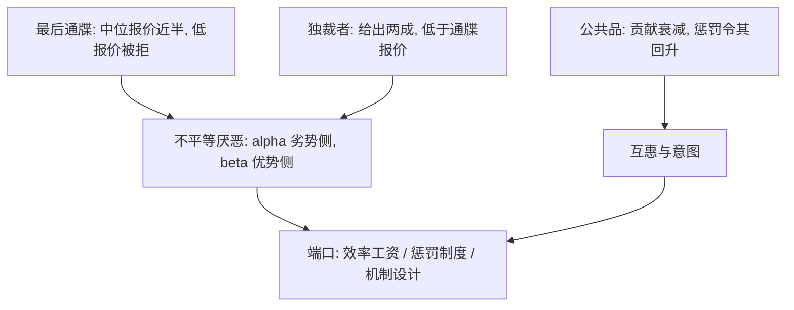
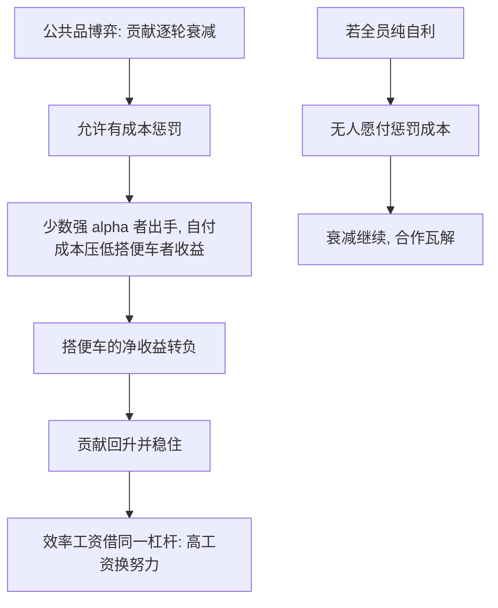

# 社会偏好

拒绝免费的钱不是算错；把「烧掉自己那份也要拒绝不公平」写成效用，公平才从修辞变成参数。

<footer>—— 据 Fehr and Schmidt, Quarterly Journal of Economics, 1999 整理</footer>

[上一课](/econ/bx-intertemporal-anomalies)把时间侧的异常分成函数形状与协议伪影，$\beta$–$\delta$ 只收编跨「现在」的那部分。本课转向第三块行为区域：对他人收益的偏好。[公共品自愿供给失败](/econ/public-goods-free-rider)已在主干钉了集体行动的缺口；[合同与机制收束](/econ/ct-map)把「行为」列为未绘区域——那里的激励假设只对自家口袋敏感，而实验室里的人会拒绝有利可图的分配。本课把三个稳定的拒答整理成可估计的偏好函数。后课默认已经读完本课。

## 问题

单调自利的预测在三处落空。最后通牒博弈：提议者中位报价接近一半，低报价以可观概率被拒——拒绝者烧掉自己的正收益。独裁者博弈（取消拒绝权）：平均给出约两成禀赋，明显低于最后通牒的报价——说明最后通牒里的慷慨一半是防拒策略，另一半才是偏好本身。公共品博弈：初期贡献约一半禀赋，重复几轮衰减到接近零；一旦允许有成本的惩罚，贡献回升并稳住。缺口于是很具体：一个效用函数要同时钉住「愿付钱买公平」「慷慨有策略面具」「惩罚维持合作」三件事，且参数能从博弈的边际条件里辨识出来。

最后通牒博弈就是「一次性报价、不许还价」的分钱谈判：提议者报一个分法，回应者只能接受或拒绝，拒绝则两人都拿零。它像陌生人之间的一锤子买卖——正因为关系一次性，回应者的拒绝烧的是自己的真金白银，没法用「以后还要打交道」来解释。

## 方法

Fehr–Schmidt 不平等厌恶：$U_i=x_i-\alpha_i\max(x_j-x_i,0)-\beta_i\max(x_i-x_j,0)$，劣势缺口按 $\alpha_i$ 计罚，优势缺口按 $\beta_i$ 计罚。参数从博弈数据反解：接受与拒绝的阈值钉 $\alpha$，优势侧的让渡（独裁者给出）钉 $\beta$，惩罚的强度钉 $\alpha$。校准口径：约六成被试 $\beta\gt0$、中位 $\beta$ 在 $0.3$ 上下，$\alpha$ 的分布右偏——多数人有限公平，少数强劣势厌恶者承担全部「拒绝」与「惩罚」。第二族是互惠：同样压低的报价，随机抽到的更容易被接受，故意压出的更容易被拒——结果主义的 $\alpha$、$\beta$ 钉不住这一条，要把意图与对意图的信念请进效用。两族分工：结果公平管分配，互惠管过程。

把中位 $\beta\approx0.3$ 换成数字读：你比对方多分 100 元时，这份优势缺口在你的效用里记约 30 元的愧疚；若 $\beta\ge1$，你宁可烧掉自己那份也不让不平等成立。$\alpha$ 管反方向：别人占你便宜时，$\alpha=0.5$ 意味着对方每多得 100 元，你心里要记罚 50 元——低报价被拒的参数含义正在这一侧。

## 机制

把 $\beta$ 放进机制设计的约束表（收束课的口径），激励相容的支付向量要重算：租金的分配含义通过对手的效用进入你自己的效用。三个端口各有一例。效率工资：高于出清价的工资换努力，礼物交换实验里稳定复现——[效率工资](/econ/efficiency-wage)是主干模型，本课给它的行为地基。惩罚制度：强 $\alpha$ 者以私人成本惩罚不贡献者，把[公共品自愿供给失败](/econ/public-goods-free-rider)的缺口用异质性参数补上，而不是用道德说教补上。跨文化：Henrich 等对 15 个小规模社会的最后通牒测量，报价水平与当地的生产协作度、市场整合度共变——公平不是普适常数，是随协作形态移动的参数。不这么做会错在哪：按纯自利校准的激励会低估「公平溢价」，按学生样本的 $\alpha$、$\beta$ 外推到市场化人群又会高估拒绝率。

Fehr–Schmidt 1999 的校准汇总了实验证据：约六成被试 $\beta\gt0$、中位 $\beta\approx0.3$；$\alpha$ 分布右偏，高 $\alpha$ 者是少数。把「人是公平的」写进设计时，用的应当是这两个分布，不是一个形容词。

## 边界

实验室金额小、被试是学生、双方匿名且关系一次性——三项都会移动参数：现场薪酬数据支持方向，但识别更弱；匿名性撤掉后（熟人、重复相处），慷慨与互惠混入声誉投资，本课不拆。意图的度量依赖二阶信念，测不准是常态。Henrich 的跨样本是观察性关联，不是随机分配的规范，读的时候不当作因果。本课只做正参数化，不做福利判断——公平是否「应当」进入政策判据，是本课程收束课的题。后课默认：谈社会偏好指 $\alpha$、$\beta$ 加意图维度；引用任何公平数字，必须同时说明样本与情境。

初学者容易把「实验室里有人拒绝低报价」读成「人都讲公平」。实际参数分布右偏：多数人温和、少数人强硬，合作是靠这批少数强劣势厌恶者自掏腰包的惩罚撑住的。把中位数当成全体去设计机制，会算错谁能被指望惩罚谁。

## 小结

- 三处落空：通牒拒答、独裁者面具、公共品衰减，单调自利全部预测失败。
- 不平等厌恶用 $\alpha$、$\beta$ 两个参数钉接受与拒绝：中位 $\beta\approx0.3$，$\alpha$ 分布右偏。
- 意图与互惠解释结果主义钉不住的部分：同样低报价，随机与故意待遇不同。
- 惩罚制度靠少数强劣势厌恶者维持公共品贡献。
- 公平参数随市场整合与协作形态移动，不是普适常数。
- 出处：Fehr and Schmidt, *QJE* 1999；Henrich et al., *American Economic Review* 2001。
