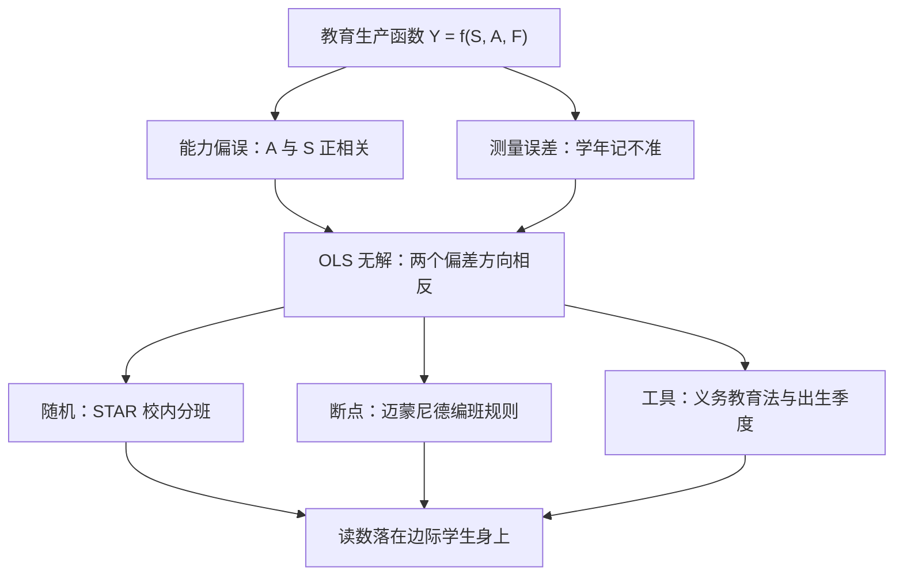
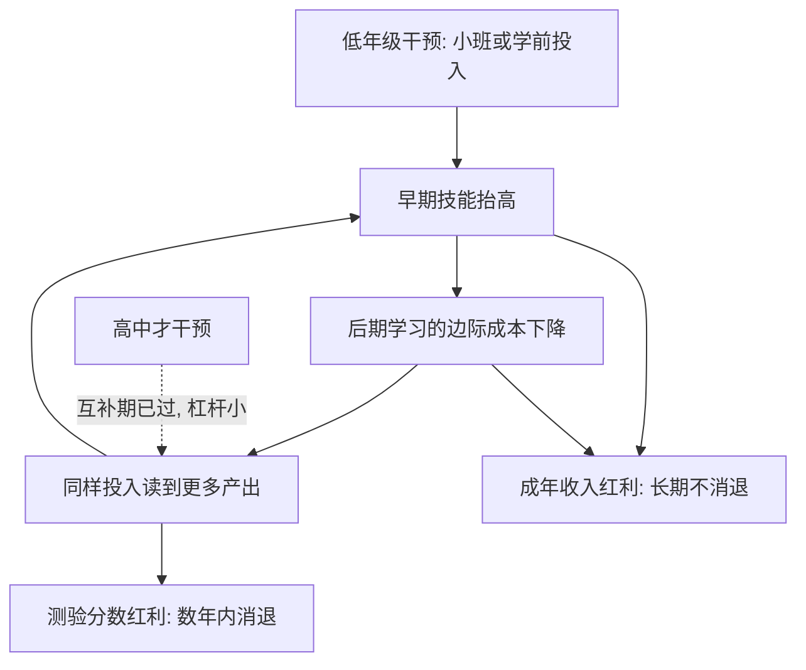

# 教育中的因果问题

教育评估最诚实的一句话是：它不是给学校打分，而是在问——如果这个孩子没进这间教室，他会成为什么样的人。

<footer>—— 据 Becker, Human Capital, 1964；Card, Econometrica 2001 整理</footer>

[上一课](/econ/if-map)把国际金融收束：价格侧溢价走阔最早报警，数量侧钉危机时间线，推拉分解各配工具，缩减恐慌四层俱全。国际金融单元到此收束，本课是「因果方法的学科应用」的第一课：把工具带进学科现场，第一站是教育——准实验证据最密、也最容易被误读的领域。后课默认已经读完本课。

## 问题

把教育写成生产函数：$Y = f(S, A, F)$，产出 $Y$ 是测验分数或工资，投入是学校 $S$、能力 $A$、家庭 $F$。麻烦在 $A$ 不可观测，且与 $S$ 正相关——会为孩子多买一年书的家庭，孩子往往本来就更占优。[遗漏变量](/econ/ovb-measurement-error)由此把 OLS 推高；而学年的测量误差又把估计拉低，两个偏差方向相反（Griliches 1977），工资对学年的回归于是什么也回答不了。缺口因此不在换一个更聪明的回归，而在把 $S$ 的变异从家庭选择里剥离出来。底下还压着一层标签之争：即便拿到干净的因果效应，也分不清它来自[人力资本](/econ/human-capital-becker)的积累还是[信号](/econ/signaling-spence-labor)——这是私人回报与社会回报的分界，估计量不能替你回答。

遗漏变量偏误（OVB）说白了就是「替人记功」：你关心的学校投入 $S$ 和没写进方程的家庭能力 $A$ 一起变动，回归把两者的共同作用全记到 $S$ 头上。所以「多读一年书工资高 X%」里混着多少出身因素，方程自己是分不清的——得靠设计，不靠聪明。

## 方法

三个设计各剥离一种变异。[RCT 的设计与分析](/econ/pe-rct-design-analysis)在 Project STAR 里是范本：田纳西州从 1985 年起把幼儿园到三年级的学生在**校内**随机分进 13–17 人的小班与 22–25 人的常规班，小班把早期测验分数抬高约 0.15–0.25 个标准差，按设计报 ITT。[断点回归的加深](/econ/pe-rdd-deep)用「迈蒙尼德规则」：以色列规定年级人数不超过 40 编一个班，41 人编两个班——人数越过 40，班均人数近乎折半（Angrist–Lavy 1999）。[工具变量](/econ/iv-weak-instruments)用义务教育法与出生季度：入学年龄与法定离校年龄相互作用，年末出生者被迫多读数月书；但第一阶段弱（$F$ 只有 5 上下），弱工具的偏误要先按口径处理（Angrist–Krueger 1991；Bound–Jaeger–Baker 1995）。

第一阶段 $F$ 统计量是工具的「体检指标」：它量的是工具与内生变量的关系够不够硬，经验法则要求远大于 10。出生季度工具的 $F$ 只有 5 上下，意思是信号弱到接近噪声——弱工具会把工具估计拉回 OLS 的偏误附近，所以这一族读数必须先过弱工具口径再看大小。

STAR 的随机化在「校内」而非「校间」：79 所学校各自同时开小班与常规班。校间随机会被学校层面的巨大异质污染，校内随机让每所学校自带对照——这是教育 RCT 设计契约里最常被抄错的一行。

## 机制

设计兑现之后，机制回答「效应长在谁身上」。义务教育工具估出的回报并不低于 OLS（Card 2001 的综述）：若高能力者边际回报更高，工具估计本应更小，所以解释只能是依从者恰好是被法律约束的边际学生，他们的回报不低于平均——约束在信息与信贷，不在能力。这与技能形成的动态互补一致：早期技能降低后期学习的边际成本，skill begets skill（Cunha–Heckman 2007），同样的干预，年级越低杠杆越大。STAR 的后续顺这条线走：小班的分数红利在几年内消退，成年收入的红利却不消退（Chetty 等 2011 用税表追踪）——分数是代理变量，收入才是产出，代理会衰减而效应不衰减。不这么做会错在哪：拿高中的小班效应外推到幼儿园、拿分数效应直接当收入效应，杠杆与代理两层同时断。

skill begets skill 可以想成滚雪球：起步的雪球每大一圈，后面粘雪的速度就快一分。Cunha–Heckman 的意思是教育投入不是各年级可替换的积木，而是复利——同一样一笔钱，投在滚动的早期比投在停滞的晚期产出更大。

## 边界

读数的口径是 LATE：STAR 是「被分进小班」的学生，义务教育工具是「被法律多留校」的学生，外推要过[外部有效性](/econ/pe-external-validity)的四道断点。分数之外还有均衡：一代人整体多读一年书，技能供给上移，溢价会按[技能溢价与 Tinbergen 竞赛](/econ/skill-premium-tinbergen)重新定价——个体回报不等于社会回报，信号成分多大，这个差就多大。预算端同理：小班要多雇教师，同样的钱买师资还是买班级规模，是生产函数里的替代弹性问题，不是本课的估计量能替你做的决策。

初学者容易把 LATE 读成「教育的平均回报」。实际上每个设计只报「被改变的那批人」的回报：STAR 报被分进小班的学生，义务教育工具报被法律多留校的学生。换一个工具，读数就换一批人——把某一个 LATE 直接当成全体平均，是最常见的搬运错误。

## 小结

- 教育的因果问题是生产函数问题：能力不可观测且与投入正相关，两个偏差方向相反，回归本身无解。
- 三个设计三种变异：校内随机（STAR）、编班规则的断点（迈蒙尼德）、法律约束的工具（义务教育与出生季度）。
- 工具回报不低于 OLS 说明边际学生受约束更紧；动态互补让早期干预杠杆更大。
- LATE 口径加均衡告诫：个体回报、社会回报与预算内最优组合是三个问题。
- 出处：Angrist and Krueger, QJE 1991；Angrist and Lavy, QJE 1999；Krueger, JEP 1999；Card, Econometrica 2001；Chetty 等, QJE 2011；Cunha and Heckman 2007。
