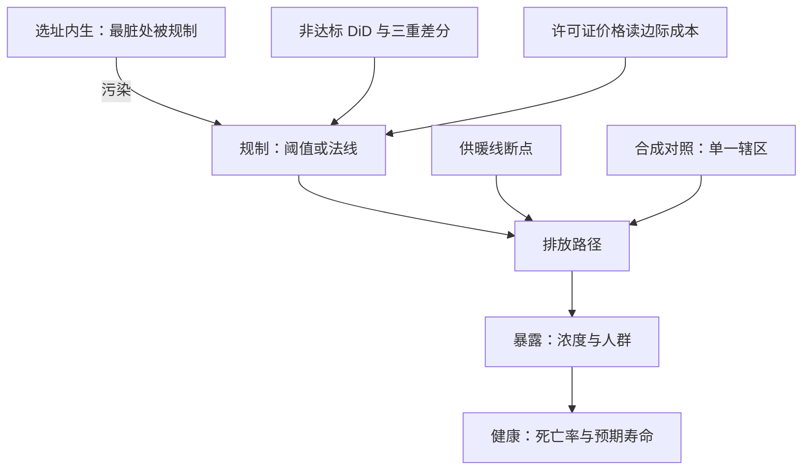
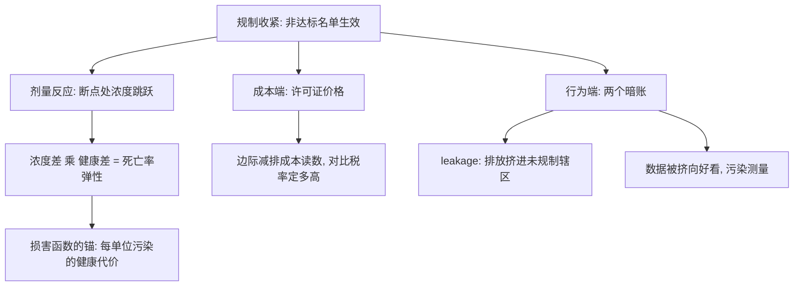

# 环境政策的因果证据

环境政策天然缺一张反事实排放表：监管专挑最脏的地方下手，天真的前后比较只会高估它。

<footer>—— 据 Chay and Greenstone, QJE 2003；Chen, Ebenstein, Greenstone and Li, PNAS 2013 整理</footer>

[上一课](/econ/ca-health-policy-evidence)把健康链条「保险 → 利用 → 健康」的分段评估跑完。本课到环境政策：链条换成「规制 → 排放 → 暴露 → 健康」，且多出两层别的领域没有的困难——排放反事实无人供给，规制恰恰按污染水平选址。工具是现成的：[庇古税与碳定价](/econ/pigouvian-carbon-price)与[总量管制与许可证](/econ/cap-and-trade)给了政策形态，本课给它们的证据形态。

## 问题

环境规制是阈值写出来的：空气质量未达标的县被列为非达标区，承担更严的新源审查；供暖线以北享受冬季燃煤供暖。阈值同时是选择机制——被规制的正是最脏、本来就有最强改善倾向的地方。用规制前后比、或达标-未达标比，都会把[事前趋势](/econ/pe-eventstudy-specification)与选址内生算进政策。缺口因此是双重的：既要「不规制排放会怎么走」的反事实，又要健康端的剂量反应——排放是中间变量，最终的账在死亡率与预期寿命上。

「非达标区」可以读成环保部门的不及格名单：空气质量没达标的县被点名，此后新建排放源要过更严的审查。麻烦正在这儿——名单按污染水平生成，拿名单县和名单外县直接比，比出来的既是政策效应，也混着「谁本来就脏、谁本来就正开始治理」。

## 方法

设计围绕阈值生长。**非达标 designation 的 DiD**：Clean Air Act 的县名单给出处理组，非污染规制渠道的引入可以升级为三重差分——Chay–Greenstone 2003 用 1981–82 衰退造成的 TSP 外生下降对婴儿死亡率读出剂量反应。**规制线的断点**：淮河供暖政策把冬季燃煤供暖画在地理线上，Chen–Ebenstein–Greenstone–Li 2013 在两侧读出颗粒物浓度北高南低的跳跃与预期寿命约五年的差——一条没人选择的政策线，替研究者选好了对照。**单一政策的合成**：一个辖区独自开征碳税时没有两组，[合成对照的深化](/econ/pe-synthetic-control-deep)用未开征税区的加权组合造反事实排放路径。**市场工具读成本**：总量管制下许可证价格本身就是边际减排成本的读数，酸雨计划的排放比 1990 年降半而成本远低于事前预测，事后的成本核算（Carlson 等 2000）把「命令 vs 交易」之争收成一笔账。

合成对照的直觉：B 地开征碳税后，世上没有「另一个 B」可对照，就用若干未征税地区加权拼出一个「合成 B」——比如 30% 的 A 地加 25% 的 C 地……凑到它在政策前的排放走势与真 B 几乎重合。政策之后两条路的分岔，就是政策的读数。

阈值的双刃：它给识别造断点，也给估计造偏倚。非达标区在 designation 前被选中，恰恰因为污染高且已开始治理，事后的改善里有一大块与规制无关——所以认真的研究都在阈值附近做局部比较，而不是拿名单全表比。

## 机制

为什么环境证据对「缝隙」的依赖比劳动、健康更深：环境政策处理的是流量与存量的连续变量，随机化几乎不可能，而物理与法律各供给一批天然断点——法线、阈值、燃料税的价差。机制读数有三层。第一层是剂量反应：断点上的浓度跳跃乘以健康差，给出每单位污染的死亡率弹性，这是损害函数的锚。第二层是成本端：许可证价格与减排技术数据对上，才知道一单位减排的社会成本与收益哪个大——[庇古税与碳定价](/econ/pigouvian-carbon-price)的税率问题从规范口号变成两个可估的量。第三层是行为反应：规制会把排放挤到未规制辖区（leakage），把监测数据挤向好看——空间替代违反[潜在结果](/econ/potential-outcomes)的稳定单元假设，数据操纵则污染测量。不这么做会错在哪：把达标县的清洁化全部记在法规头上，或只看辖区内的排放而看不见挤出的那一块，政策的账两头都错。

统计生命价值（VSL）不是给命标价，是从「愿意花多少钱换一点点死亡风险下降」反推出来的交易率：比如愿付 700 元换百万分之一的死亡风险降低，隐含 VSL 约为 700 万元。它是边际风险的交换比例，不是命的价格标签——初学者最常在这一步读歪，进而否定整个成本收益核算。

## 边界

环境证据的搬运门槛最高：浓度-健康弹性本地化强（人口年龄、基线污染、医疗可及都进入弹性），把一国的剂量反应直接搬进另一国要过[外部有效性](/econ/pe-external-validity)的逐道断点；折现率与生命统计价值（VSL）的取值让成本收益核算的结论对参数敏感，这不是识别能解决的，是[以决策为目标](/econ/pe-decision-target)的福利泛函问题。本课也不重讲[外部性与庇古税](/econ/externality-pigou)与[科斯定理与交易成本](/econ/coase-theorem)的理论分工——那里的增量是：科斯谈判、庇古税率与许可证市场各自的证据形态。

## 小结

- 环境政策的反事实双缺：排放路径与剂量反应，都靠阈值与法线供给变异。
- 四个设计：非达标 DiD 与三重差分、供暖线断点、单一辖区合成对照、许可证价格读成本。
- 阈值既造断点也造选择；leakage 与数据操纵是本领域特有的威胁。
- 弹性本地化与 VSL 取值让外推与核算对参数敏感，识别之外还有福利判断。
- 出处：Chay and Greenstone, QJE 2003；Chen, Ebenstein, Greenstone and Li, PNAS 2013；Carlson 等, AER 2000；Greenstone and Gayer 2009。
