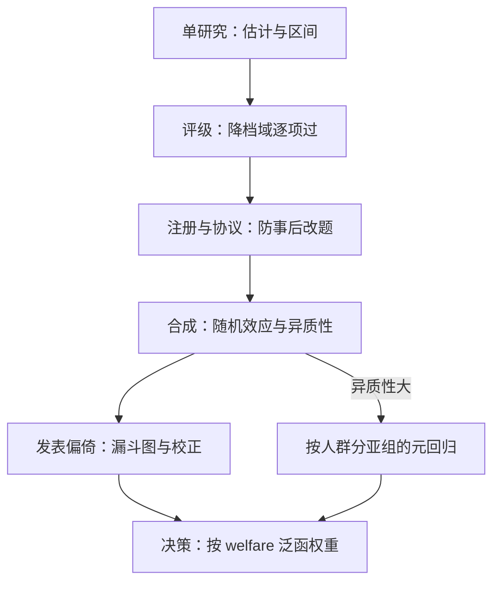
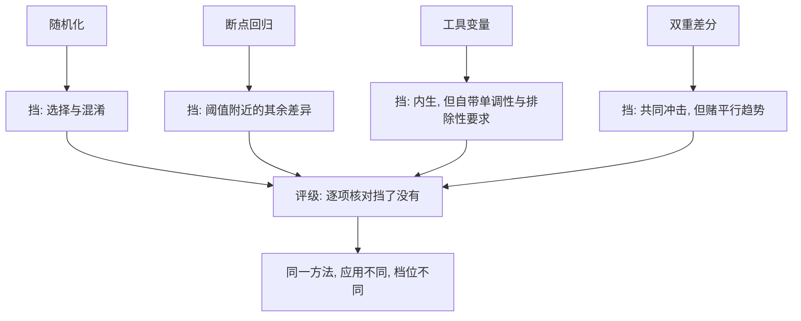

# 证据的分级与综合

证据分级分级的不是方法的名号，而是威胁被处理掉的顺序；金字塔的每一层其实是一张威胁清单。

<footer>—— 据 Guyatt 等, GRADE 系列, BMJ 2008；Cochrane Collaboration 整理</footer>

[上一课](/econ/ca-env-policy-evidence)在环境政策里见识了证据最缺、威胁最多的应用域。四个领域走完，决策者手里是一摞相互冲突的估计：小班、上调、扩保、限排，每个题目下都有几十个读数。缺口从「怎么估」移到「信哪个」：把 RCT 永远排在观察研究之上这种金字塔口诀，既救不了糟糕的实验，也冤枉了干净的自然实验。本课把分级与综合写成程序。

## 问题

单一研究只是证据的原材料。同一政策下的读数散落四周：设计不同、人群不同、时点不同、发表与否不同。直接拿最近一篇或最显著的一篇下结论，会同时吃到三种偏倚：设计偏倚（识别契约有洞）、异质性（效应随人群与场景移动）、发表选择（显著为负或显著为正的估计更容易见刊——[最低工资的元分析](/econ/minimum-wage-debates)已经演示过漏斗图左尾）。缺口是两道工序：给单研究**评级**，把同题研究**合成**——且两道工序都要能审计。

发表偏倚就是「显著的更容易见刊」：十个效应为零的研究各自测不出东西，一个碰巧显著的上刊，读者只看见那一个。漏斗图把各研究的估计值按精度排开，没有偏倚时应呈对称漏斗；缺了一角，就说明有一批研究被藏在了抽屉里。

## 方法

分级用 GRADE 的骨架：起点按设计给档（RCT 高、观察研究低），然后用固定的降档域修正——偏倚风险、不一致性、间接性、不精确性、发表偏倚——干净的[断点回归](/econ/pe-rdd-deep)可以站回高档，有流失的 RCT 必须降档；大效应与剂量反应允许观察证据升档。合成按 [Meta 分析](/econ/pe-meta-analysis)的口径：注册与协议先行，避免只合成看得见的研究；随机效应模型吸收研究间方差；漏斗图不对称性用 Egger 类检验读发表选择。工程侧配三件套：预注册与结果登记（把分析计划钉在见到数据之前）、[多重检验](/econ/multiple-testing-econ)校正（结果表一长，假阳性自动涌现）、[聚类标准误](/econ/clustered-se)对准抽样层级。

Cochrane 的徽标是一道旧伤口：1987 年把早产风险孕妇使用糖皮质激素的八个 RCT 合成，其中七个单独看都不显著，合成却读出新生儿死亡的显著下降——疗法已可用十余年，只欠一次综合。单研究的「不显著」不是「无效」，这是分级与综合的第一课。

## 机制

分级为什么必须按威胁清单而不是按方法名号：一种设计的价值等于它挡住了哪些威胁——随机化挡选择与混淆，断点挡阈值附近的其余差异，[工具变量](/econ/iv-weak-instruments)挡内生但引入单调性与排除性，[双重差分](/econ/difference-in-differences)挡共同冲击但赌平行趋势。评级就是逐项核对挡了没有、挡得干不干净，所以同一个方法在不同应用里评级不同。合成的机制则把矛盾变成信息：点估计的离散若超出抽样误差，随机效应把它记为真实的异质性，[元回归](/econ/pe-meta-analysis)再去找调节变量——设计强度、人群、剂量就是候选调节项。综合的产出不是一个大平均，而是「效应多大、在谁身上、证据还缺哪块」的分布。不这么做会错在哪：把异质性研究硬合成一个点，会同时掩盖赢家与输家；把「证据不足」读成「证据为零」，会把本该等数据的政策推成武断行动。

GRADE 可以想成体检扣分制：RCT 起点分高，但流失严重、结局换了代理、区间太宽，照样逐项扣分；观察研究起点分低，可若效应巨大且呈剂量反应，也能加分站回高档。方法的名号不加分，漏洞才扣分——这正是「分级分的不是名号」的读法。

## 边界

评级再高也不直接等于决策：把证据换算成行动要过[以决策为目标](/econ/pe-decision-target)的泛函——错误的代价不对称时，「证据尚不充分」与「立即行动」之间的阈值由决策问题定，不由证据等级定；试点值多少钱，由[信息价值](/econ/pe-decision-target)的算术给出。GRADE 也不解决证据语料本身的结构性缺口：从未被研究的人群与从未被试的剂量，在金字塔的每一层都缺席，只能靠外推与[结构模型的验证](/econ/se-validation)补位。本课的边界因此是：分级与综合处理已有证据的秩序，不生产缺失的证据。

初学者容易把「证据不足」读成「没有效应」。糖皮质激素的八个 RCT 有七个单独看不显著、合成后显著，就是反例——单研究的「测不出」常常只是样本太小。正确动作是再收数据或等新证据，而不是宣布无效，也不是抢着武断行动。

## 小结

- 分级的对象是威胁清单，不是方法名号；同一设计在不同应用里评级不同。
- 合成先行于阅读：注册、协议、随机效应、漏斗图校正，缺一道工序就引进一种偏倚。
- 异质性是信息不是噪声：元回归找调节变量，硬合成会掩盖赢家与输家。
- 证据等级不替代决策泛函：阈值由错误代价的对称性定，缺口靠外推与结构补位。
- 出处：Guyatt 等, GRADE 系列, BMJ 2008；DerSimonian and Laird, Controlled Clinical Trials 1986；Egger 等, BMJ 1997；Card, Kluve and Weber, JEP 2018。
