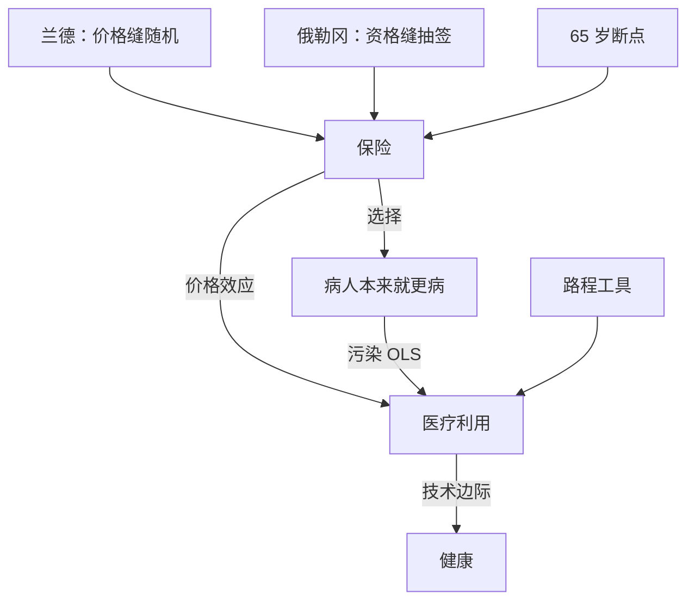
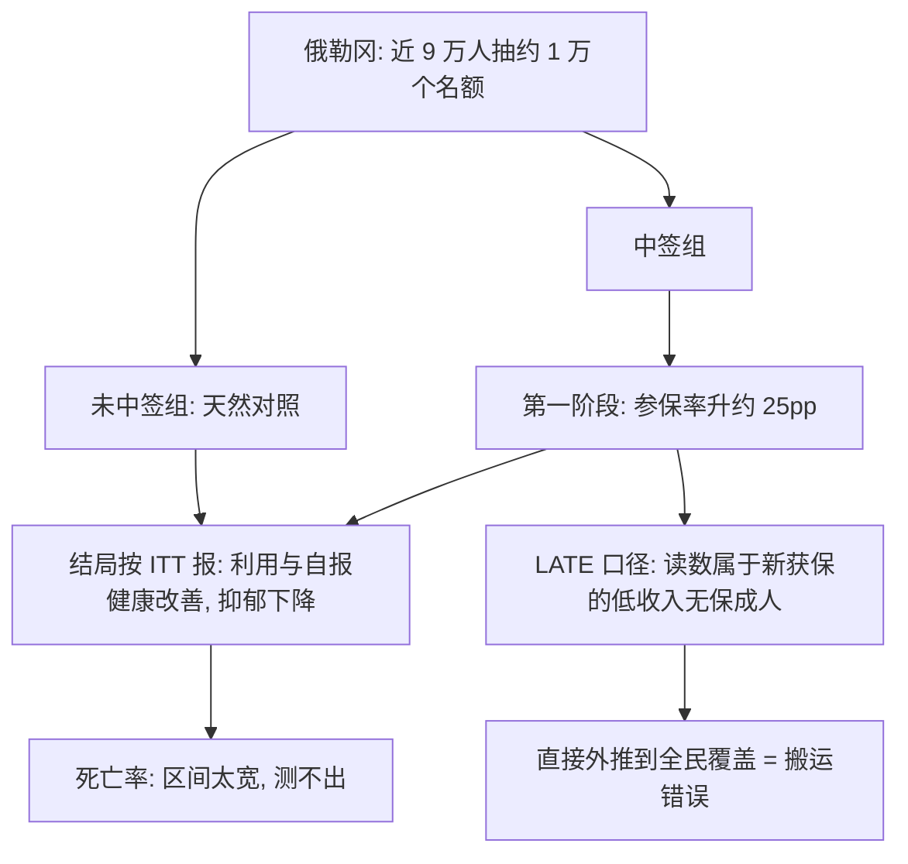

# 健康政策的因果证据

在健康领域，「有效」与「被使用」之间隔着一条支付与选择的缝，因果推断的全部工作都铺在这条缝上。

<footer>—— 据 Newhouse and the Insurance Experiment Group, Free for All?, 1993；Finkelstein 等, QJE 2012 整理</footer>

[上一课](/econ/ca-labor-policy-evidence)在劳动政策里数了法条留下的缝。本课到健康政策：这里的缝开在保险、年龄与地理上，而且健康是极少数拥有两代大型随机实验的社会科学领域。链条「保险 → 医疗利用 → 健康」有三段，每段一个识别陷阱：选择进入保险（[风险选择与 Rothschild–Stiglitz 的深化](/econ/hi-risk-selection)）、价格改变利用量（[保险的需求与道德风险](/econ/hi-demand-moralhazard)）、利用量不等于健康。

## 问题

观察性证据在这里全面失真：买保险的人病得更重，用它估「保险致病的利用量」会把需求与风险混在一起；用参保者与未参保者比健康，估到的又是选择。[道德风险](/econ/hi-demand-moralhazard)课的静态模型给了方向，但政策问的是量：自付比例降低一档，支出与利用量动多少？动的是该动的还是浪费？扩保救不救人？健康政策的因果问题因此拆成三个：保险对利用的效应、利用对健康的效应、以及前者在多大程度上经由后者兑现。

道德风险就是「看病变便宜了，于是多用」——不是骗保，是价格变化后的正常反应。它本身不全是坏事：该看没看的病这回看了。政策要算的是多出来的那部分里，多少买到了有用的医疗，多少只是零价格的浪费，这正是兰德实验要量的事。

## 方法

四条缝各配一个设计。**价格缝，随机**：兰德医保实验（1971–1986）把约两千户家庭分进 0/25/50/95% 共保率四档，免费档的支出比 95% 档高约三成，健康结局对多数人几乎没差——道德风险是真的，但它的福利代价主要落在浪费上。**资格缝，抽签**：俄勒冈 2008 年对 Medicaid 名额抽签，近九万人报名争约一万个名额，抽签即随机化；参保率升约 25 个百分点是第一阶段，结局沿 ITT 报（Finkelstein 等 2012）：医疗利用与自报健康改善，财务压力显著下降，抑郁下降——这些正是[RCT 的设计与分析](/econ/pe-rct-design-analysis)里设计契约的兑现。**年龄缝，断点**：65 岁医保资格线上，覆盖率与利用量跳升、健康只微动（Card–Dobkin–Ma 2008）。**地理缝，工具**：心梗老人的激进治疗效应，用「到最近有导管室的医院的路程」做工具，把 OLS 里病人被送往大医院的选择偏误剥掉（McClellan–McNeil–Newhouse 1994）。

兰德的四档可以想成四组购物车：药价越贵，购物车越空。自付 0% 的免费档比 95% 档多花了约三成医疗费，多数人的健康却没见好——多花的钱大头买了「多看」，没买来「更健康」。这就是道德风险的量：存在，但福利代价主要在浪费端。

兰德实验的口径常被报反：免费档支出高约三成，是相对 95% 共保档；「健康没差」说的是平均，最穷最病的一组（高血压、视力、牙科）确有改善。平均效应掩盖分层效应，这是把 RCT 读成一句话的代价。

## 机制

为什么健康领域的证据这样长在缝隙上：没有人能随机分配疾病，但制度在「谁被覆盖、以什么价格、从哪一岁开始」上反复重切人群，每次重切都是一次准实验。机制的两头都要记账：一头是道德风险与保险价值的权衡——[俄勒冈的案例](/econ/pe-case-map)里，「有保险」到「健康」的链条被分段评估，财务与抑郁的改善先兑现，死亡率的效应测不出（置信区间宽，样本撑不起）；另一头是 LATE 的口径：俄勒冈估的是「新获保的低收入无保成人」的效应，把它外推到全民覆盖，就犯了[外部有效性](/econ/pe-external-validity)课警告的搬运错误。不这么做会错在哪：用参保者-未参保者之差，估到的是选择不是因果；用利用率当健康结果，会把「多看病」读成「更健康」。

抽签为什么等于随机化：名额远少于报名人数（约一万个名额、近九万人报名），谁中签像抛硬币，两组人连「想不想参保」的劲头都来自同一个池子。于是「中签」成了纯净的分配器——比较中签与未中签，就在比较运气，而不是比较健康。

## 边界

死亡率为结局的实验天然缺功效：效应小、时滞长，需要数十万人年的样本，所以两代实验都只够对中等强度的中间结局下结论；利用量与健康的距离，正是药品定价与价值评估课要接的问题。供给侧反应也要进账：扩保抬需求，若供给不弹性，排队与等待会把账面覆盖变成账面等待。本课不重讲保险结构——筛选与[道德风险](/econ/hi-demand-moralhazard)的理论在健康与保险课里已经拆过；这里的增量是：那些理论参数，是靠哪些缝隙被量出来的。

这一步如果只读需求端会错在哪：扩保等于往医疗系统里一次性放进几十万新顾客，若医生和床位不跟着涨，账面上「人人在保」，现实中是排队变长——覆盖是名义的，等待是真实的。读任何扩保评估，都要同时盯需求与供给两本账。

## 小结

- 健康政策的因果链条三段：保险 → 利用 → 健康，每段一个识别陷阱。
- 四条缝四个设计：价格（兰德随机）、资格（俄勒冈抽签）、年龄（65 岁断点）、地理（路程工具）。
- 道德风险为真但主要在浪费端；平均效应之外要读分层效应。
- LATE 口径限定外推：新获保者的效应不等于全民覆盖的效应；死亡率结局缺功效。
- 出处：Newhouse 等, Free for All?, 1993；Finkelstein 等, QJE 2012；Taubman 等, Science 2014；Card, Dobkin and Ma 2008；McClellan, McNeil and Newhouse, JAMA 1994。
