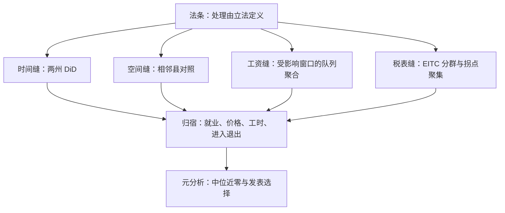
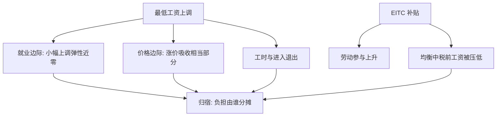

# 劳动政策的因果证据

劳动政策的证据史是一部设计史：同一条法条，对照组每换一次，结论就重排一次。

<footer>—— 据 Card and Krueger, AER 1994；Card, Kluve and Weber, JEP 2018 整理</footer>

[上一课](/econ/ca-education-causal)把教育的三个设计——校内随机、编班断点、法律工具——跑了一遍。本课搬到劳动政策：最低工资、所得税抵免、失业保险与贸易冲击。这里的处理是州与州立法写出来的，天然供给[双重差分](/econ/difference-in-differences)的对照；缺口从「有没有变异」移到「对照够不够近、读数是谁的效应」。

## 问题

教科书预测干脆利落：下限之上就业收缩、补贴之下劳动供给上升、福利之下失业拉长。数据不配合：[最低工资两代文献](/econ/minimum-wage-debates)里就业弹性接近零，[买方垄断与工资压低](/econ/monopsony-wages)解释了为什么。缺口不是再找一个显著系数，而是：同一条法条，用全国青少年当基线是一个结论，用相邻县当对照是另一个；州间共同趋势、空间溢出、与政策选址的相关，任何一条断掉，平行趋势就只剩假设。劳动政策的因果问题因此精确为：这次上调、对这批人、在这个劳动市场里的净效应是多少——以及它凭什么代表下一次。

平行趋势就是「假如没政策，两条线本会平行走」的假设：处理州与对照州政策前的走势一致，才敢把政策后的差读成效应。初学者容易以为「水平长得像」就够了——要的是政策前多个时期的变动方向一致，不是某一年的数值接近。

## 方法

设计谱系按对照的收窄方向排。两州两组是起点：1992 年 4 月新泽西把最低工资从 4.25 提到 5.05 美元，Card–Krueger 用宾州快餐店做对照。相邻县设计把对照换到同一劳动市场的另一侧，洗掉区域趋势（Dube–Lester–Reich 2010）。Cengiz–Dube–Lindner–Zipperer 2019 再进一步：收 1979–2016 年间一百多次州级上调，把「恰好落在新下限之上工资窗口里的岗位」当受影响组，按队列加权显式聚合组-时间效应——这正是[交错 DiD 的最新修正](/econ/pe-staggered-did-revisions)落地的样子。税式支出有自己的准实验：EITC 扩张按子女数分群，单身母亲受惠、无子女者不受，分群差中差读供给反应（Eissa–Liebman 1996）；拐点聚集（Saez 2010）把报税表在抵免拐点处的密集当弹性读数。失业保险的证据落在两条边上：耗尽日前离职率的陡升，与期限对福利水平的弹性 0.5–1.0（Krueger–Meyer 2002 的综述）。贸易冲击则示范份额-移动设计：用基期就业份额乘以国家层面的进口冲击造出地区暴露（[China shock](/econ/china-shock)）。

Card–Krueger 的读数：1992 年 2 月到 11 月，新泽西样本店的全职等效岗位从 20.44 升到 21.03，宾州从 23.33 降到 21.17，差中差约 +2.8。效应是「没有证据表明下降」，不是「证明了上升」——置信区间宽，这句话在之后三十年里被反复读错。

## 机制

谱系为什么这样长：处理由法条定义，法条在时间、州界、工资分布下截、税表、领取期限上留下多条不连续的缝，每条缝是一处可剥离的变异，设计就是把哪条缝当反事实的宣言。机制的轴在归宿：最低工资的负担不只在就业，还在价格与进入退出（Harasztosi–Lindner 2019 匈牙利大上调里相当部分由涨价吸收）；EITC 抬了劳动参与，也在均衡里压低了税前工资——补贴名义给工人，雇主分走一块，这是[税收归宿](/econ/tax-incidence)的算术在劳动政策上的重演；法定福利若能全额落到工资上，甚至可能是近乎免费的覆盖扩张（Summers 1989）。不这么做会错在哪：只盯就业一个边际，会漏掉价格、工时与进入退出的全部再分配；只报一次上调，会把买方垄断区间里安全的小调当成普适常数。

归宿可以想成在劳资之间加一块挡板：挡板挡住的负担自己会找出口。匈牙利那次大上调里，相当一部分成本被企业用涨价转给了消费者，而不是全数变成裁员；EITC 名义补贴工人，均衡里雇主也分走一块——所以只盯就业一个数字，读不到再分配的全貌。

## 边界

外推的红线[最低工资课](/econ/minimum-wage-debates)已经划过：越线的大上调、长期弹性、空间异质。元分析的收口在 Card–Kluve–Weber 2018：中位就业效应近似零，但漏斗图左尾有选择性——显著为负的估计更容易发表；所以「文献证明没有影响」与「文献证明有影响」都不对，文献证明的是设计质量决定读数。证据还随宏观位置移动：紧缩期与扩张期的同幅上调，就业后果不同。读完本课的默认口径：劳动政策的任何数字先问三个坐标——处理的法条维度、对照的构造、归宿落在哪个边际。

常见误区：把元分析读成「文献证明了没有影响」。实际的中位读数近似零，但漏斗图左尾有选择性——显著为负的估计更容易发表。文献真正证明的是设计质量决定结论：买方垄断区间里安全的小幅上调，与越线的大上调，从来不是同一个实验。

## 小结

- 劳动政策天然多缝：州法、工资下截、税表拐点、领取期限，每条缝对应一个设计。
- 对照地理与队列越近，平行趋势越可信：两州 → 相邻县 → 队列聚合。
- 归宿是机制的轴：就业、价格、工时与进入退出一起动，补贴的负担会被均衡分摊。
- 元分析给出中位近零但有发表选择；证据的边界是设计，不是口号。
- 出处：Card and Krueger, AER 1994；Dube–Lester–Reich, REStat 2010；Cengiz 等, QJE 2019；Eissa and Liebman, QJE 1996；Saez, AEJ: Policy 2010；Krueger and Meyer, JEP 2002；Card, Kluve and Weber, JEP 2018。
