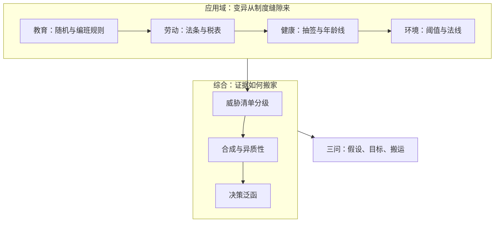
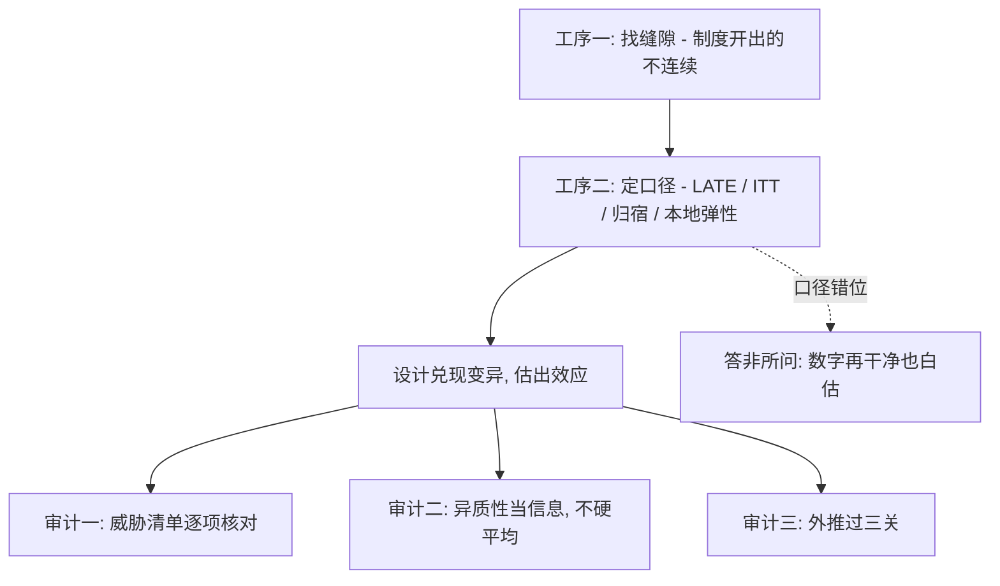

# 因果应用收束

换到哪个学科都一样：先问反事实从哪里来，再问读数为谁而估，最后问证据怎么搬家。

<footer>—— 据 Card, Econometrica 2001；Abadie, Diamond and Hainmueller, JASA 2010；Finkelstein 等, QJE 2012 整理</footer>

[上一课](/econ/ca-evidence-hierarchy)把散落的估计收进分级与合成的程序。本课收束全课程：把四个应用域放回工具箱各走一遍，再按读序重排六课。本课程到此收束。

## 问题

收束靠回放。四个域的起点都是同一种缺口：生产函数里能力与投入纠缠（教育）、教科书预测与数据脱节（劳动）、链条「保险 → 利用 → 健康」三段各有一个混淆源（健康）、排放反事实与剂量反应双缺（环境）。每个域都用自己的制度缝隙补上变异：教育有校内随机与编班规则，劳动有法条与税表拐点，健康有抽签与年龄线，环境有阈值与供暖法线。应用的推进从来不靠新估计量，靠的是把可行缝隙找全、把威胁清单核对完。

反事实就是「同一批人如果没遇上政策会怎样」的那条看不见的线——一个县不可能同时过两种命运，所以这条线永远观察不到。应用研究的全部手艺，就是用制度留下的缝隙造对照，把这条假想的线用真实数据拼出来。

## 方法

按读序重排六课：

- [教育中的因果问题](/econ/ca-education-causal)：三个偏差与三个设计；工具回报不低于 OLS 的解释与动态互补。
- [劳动政策的因果证据](/econ/ca-labor-policy-evidence)：法条的四条缝；归宿是机制的轴；元分析的中位与发表选择。
- [健康政策的因果证据](/econ/ca-health-policy-evidence)：价格、资格、年龄、地理四条缝；道德风险的量与 LATE 的外推限。
- [环境政策的因果证据](/econ/ca-env-policy-evidence)：阈值双刃；合成对照与许可证价格；leakage 与数据操纵。
- [证据的分级与综合](/econ/ca-evidence-hierarchy)：GRADE 的威胁清单；注册、随机效应、漏斗图。
- 本课：把三条主线收拢。

四域的证据密度并不均匀：健康拥有兰德与俄勒冈两代大型随机实验，环境几乎全靠阈值与法线——这不是方法偏好，是政策把不连续的缝开在哪个变量上。应用者的第一项作业永远是盘点缝隙，而不是挑选估计量。

## 机制

六课收成三条主线。**变异从制度缝隙来**：[潜在结果](/econ/potential-outcomes)框架下，估计量的原料是可剥离的变异，应用域的工作是把各自制度里的缝隙找全——校内随机、州法、抽签、法线，每条缝隙写着自己的适用范围。**读数为谁而估**：同一设计在不同域产出不同的目标参数——教育的 LATE 落在受法律约束的边际学生，劳动的净效应带着归宿，健康的 ITT 与 TOT 分账，环境的弹性只对本地人群成立；参数口径错了，再干净的估计也是答非所问。**证据是组合物**：单研究的内部有效只是入场券，跨域搬运要过威胁清单、异质性与外推三关——分级与综合是应用域共用的最后一道工序。不这么做会错在哪：把课程读成四个应用题集，会漏掉真正的公共资产——缝隙盘点、口径声明与证据合成的三套程序，它们在哪个域都一样。

口径错位是什么样：把教育工具的 LATE——被法律多留校的边际学生——当成全体青年的教育回报，就像用「被迫戒糖的病人」对糖的反应去预测所有人的甜食需求。数字再精确，答的也是另一个问题；所以收束课把「读数为谁而估」单列为一条主线。

## 边界

收束不是领域的边界：从不存在的规则外推（没征收过的碳税、没实施过的全民覆盖）是结构估计的事，[结构模型的验证](/econ/se-validation)给过它的验证观；高维协变量与异质效应的自动化，[机器学习与因果](/econ/ml-causal-econ)与 [Double ML 的深入](/econ/pm-dml-deep)接着做；测量端的文本与行政数据是另一门课的输入。本课程不越界去写它们。读完本课程，默认的口径沿用政策评估课末的三问：假设写了没有、目标对准了没有、证据搬不搬得动——应用域只是把这三问，落到了各自的制度缝隙上。

三问是整套课程的出厂检查单：假设写了没有（可审计）、目标对准了没有（口径）、证据搬不搬得动（外推）。任何一份评估报告先过这三问再谈结论——省掉这道工序，后面每一步数字的精度都只是装饰。

## 小结

- 四个应用域一条公理：变异从制度缝隙来，估计量只是把缝隙兑现。
- 读数为谁而估：LATE、ITT、归宿与本地弹性，口径先于数字。
- 证据是组合物：威胁清单分级、注册与合成、异质性当信息。
- 跨域搬运的审计口径是三问：假设、目标、搬运。
- 出处：Card, Econometrica 2001；Finkelstein 等, QJE 2012；Chen, Ebenstein, Greenstone and Li, PNAS 2013；Guyatt 等, GRADE 系列, BMJ 2008。
