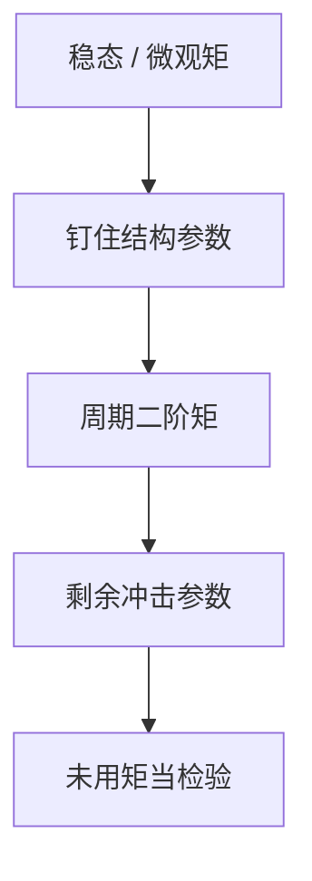

# 校准与矩匹配

先用长期或微观矩钉住能钉住的参数，再用模型周期矩当检验，而不是一次极大似然吃掉全部。

<footer>—— Kydland and Prescott, Time to Build and Aggregate Fluctuations, Econometrica 1982；Hansen and Heckman 对校准的批评；Smets and Wouters 作为对照的似然传统</footer>

[上一课](/econ/projection-methods)使非线性模型可算。可算不等于参数已知。本课缺口是**校准**：哪些参数从稳态或微观取，哪些留给周期矩去对。不重写投影的基，不把贝叶斯估计提前做完。

## 问题

Kydland–Prescott 1982：资本份额、折旧、贴现从长期平均与稳态关系取；技术冲击的自回归与方差去对产出、工时、投资的二阶矩。模型是实验室，矩是实验报告，不是「所有参数都自由估」。Hansen–Heckman 指出：校准回避了识别与标准误。缺口是把这种分工写清楚，而不是宣布校准过时或神圣。

矩匹配可以正式化成间接推断或 SMM（McFadden、Smith、Gourieroux–Monfort–Renault）。本课先讲宏观校准的实践结构，后课才把似然接上。

## 方法

稳态矩：$\beta$ 对实际利率，$ \alpha$ 对资本份额，$\delta$ 对投资/资本。微观：Frisch 弹性、风险厌恶、调整成本有时从微观研究取先验，而不是从宏观 IRF 估。剩下的冲击参数去对 HP 滤波后的标准差与同期相关——下一课才讲滤波本身，本课只说「周期矩」是目标。过度识别：矩多于剩余参数时，加权距离给出一个评分；权重矩阵选不好，匹配会偏。

代表性 RBC 常过度承诺劳动波动；后来 NK 用粘性与需求冲击补矩——那是模型扩充，不是把校准改成「随便加冲击直到拟合」。

## 机制

机制是参数分工。长期增长与分配的参数若用周期噪声去估，会与增长事实打架。反过来，用稳态钉死的参数若其实在周期里 identifiably 活动（例如调整成本），校准会把识别推给冲击，看起来拟合很好，结构是错的。Lucas 批判：校准若依赖政策不变的矩，换政策后矩会变，实验室的反事实要靠结构，不靠额外自由参数。

Smets–Wouters 把许多名义与实际摩擦同时放进似然，是另一端：少依赖「先钉死再检验」，多依赖先验与全部样本路径。两课相邻，不是互相取消。

Kydland and Prescott, *Econometrica* 50(6), 1982。Prescott 的「Theory Ahead of Business Cycle Measurement」把校准写成方法论宣言。

## 边界

本课不把 HP 滤波的 $\lambda$ 当校准对象来辩。不估计贝叶斯后验。也不做量化栏的资产定价矩（股权溢价已在主干）：这里的矩是宏观总量的周期矩。过度拟合冲击过程可以复制任意谱，校准纪律是限制冲击种类。

后课默认：校准 = 稳态/微观钉结构 + 周期矩对冲击（或少数弹性）。下一课：同一套线性 DSGE，用贝叶斯吃时间序列。

## 小结

- 校准分工：长期/微观钉结构，周期矩检验或对冲击。
- 矩匹配可升格为 SMM；标准误与识别仍要面对。
- 与似然传统对照，不互相抹掉。
- 出处：Kydland and Prescott, *Econometrica* 1982。
