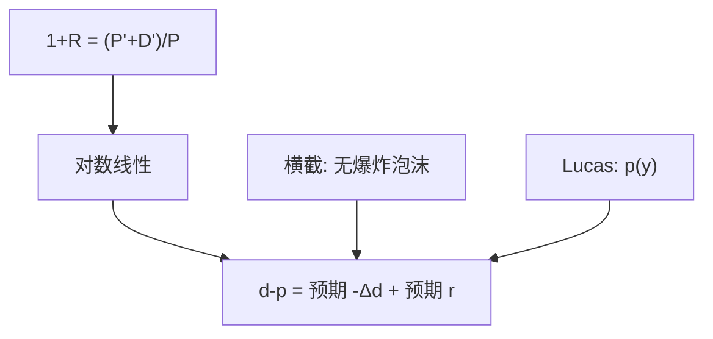

# Campbell–Shiller 分解

股利–价格比高，不是因为预期股利要涨，就是因为预期回报要高，或者泡沫项在爆炸；对数线性把它收成会计。

<footer>—— Campbell and Shiller, The Dividend-Price Ratio and Expectations of Future Dividends and Discount Factors, Review of Financial Studies, 1988</footer>

[上一课](/econ/lucas-tree)给出 $p=p(y)$ 的均衡函数。本课缺口是**不指定 $u$**：从回报的定义出发，对数线性化后，价格相对股利的位置必须被未来股利增长或未来回报（或泡沫）解释。这是会计，不是又一个欧拉。不重解 Bellman。

## 问题

净回报 $1+R_{t+1}=(P_{t+1}+D_{t+1})/P_t$。取对数、在稳态附近线性化，迭代并加横截（泡沫项趋于零），得到 Campbell–Shiller 近似：

$$
d_t-p_t \approx \mathrm{const}+\mathrm{E}_t\sum_{j=0}^\infty\rho^j\bigl(-\Delta d_{t+1+j}+r_{t+1+j}\bigr).
$$

股利–价格比高，对应预期股利增长低，或预期回报高。Lucas 树里两样都可以随 $y$ 变；会计不挑哪一样为主。缺口是把「价格相对股利」从均衡函数翻译成可操作的预期之和，以便下一课谈可预测性、再下一课谈过度波动。

Campbell and Shiller, *RFS* 1(3), 1988。$\rho$ 是稳态 $P/(P+D)$ 附近的线性化常数，接近 1。近似误差在波动不大时是二阶。

## 方法

会计步骤：定义、取对数、线性化、向前迭代、用横截丢掉 $p_{t+\infty}$。没有用到无套利以外的东西——甚至无套利也不必需，只要回报按这个定义记账。SDF 进入的是：$\mathrm{E}_t r_{t+1}$ 由 $\mathrm{E}_t[m_{t+1}(1+R_{t+1})]=1$ 约束，于是「预期回报」不是自由的。本课先把恒等式钉住，欧拉下一课再请回来谈可预测性意味着什么。

理性泡沫课已经允许横截失败。本课默认横截成立，把分解读成基本面会计。泡沫若在，会多一项，过度波动课会再碰到。

## 机制

机制是现值的对数版本。高价格相对股利，必须「有来处」：要么后面股利更快长上来（分子），要么后面折现更低（分母，即预期回报低）。交换经济里果实 Markov，$d-p$ 是 $y$ 的函数，分解必须被该函数的条件期望满足——这是对 $p(y)$ 的检验式会计，不是新均衡。

与 [SDF](/econ/stochastic-discount-factor) 的接法：把 $r$ 换成风险调整后的意外，分解仍成立，只是「预期回报」含溢价。不要把分解写成 CAPM 的 beta 展开——那是对预期回报的特化，见 [capm-theory](/econ/capm-theory)，本课不特化。

向量自回归把 $\Delta d$ 与 $r$ 的预期写成可估计的线性投影。那是测量。本课只保留恒等式。投影是否等于理性条件期望，是联合假说。

## 边界

不要在本课报告股利–价格比对回报的回归斜率。下一课现值恒等式与可预测性才问：若股利增长几乎不可预测，则 $d-p$ 必须预测回报——这是会计推论，不是异象猎取。也不要把对数线性当成精确的无套利约束；精确版本用总额而非对数，Cogley–Sargent 等讨论过近似质量。

后课默认：在横截下，$d-p$ 是预期股利增长与预期回报的折现差。Lucas 树的 $p(y)$ 必须服从这套会计。

## 小结

- 对数线性现值：股利–价格比编码未来 $\Delta d$ 与 $r$ 的预期。
- 是回报定义加横截，不是新的偏好。
- 泡沫项被横截关掉；行为课序另开那条缝。
- 出处：Campbell and Shiller, *RFS* 1988。
