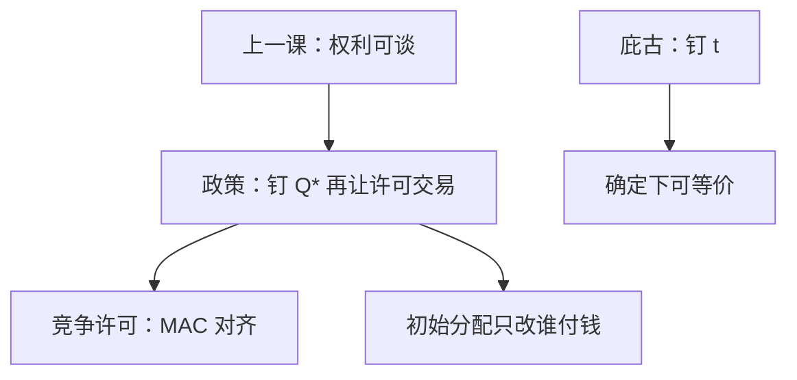

# 总量管制与许可证

先把允许的排放钉成总量，再把许可证交给市场去交易；竞争许可市场把减污做到等边际，初始分配只改谁付钱。

<footer>—— 据 Dales, Pollution, Property and Prices, 1968；Montgomery, Markets in Licenses and Efficient Pollution Control Programs, Journal of Economic Theory, 1972 整理</footer>

[上一课](/econ/coase-theorem)（科斯定理与交易成本）。零成本谈判下，排放权的初始归属只改分配，不改有效 $q^*$。本课不重写相互性与摩擦那一半。缺口是政策工具：计划者若不能一对一谈判，也不想猜准[庇古](/econ/externality-pigou)税率，能否发一笔可交易许可，让市场去找同一点？Dales 提出把环境当成可分割产权；Montgomery 证明竞争许可市场达到成本有效。

## 问题

庇古税钉价格 $t=\mathrm{MD}(q^*)$，数量内生。科斯说权利可交易。总量管制选 $Q^*$（希望 $Q^*=Q_{\mathrm{社会最优}}$），发许可 $\sum e_i\le Q^*$，允许转卖。竞争下许可价格 $p_{\ell}$ 使各厂减污的边际成本对齐到 $p_{\ell}$，总减污成本最小——不管许可最初发给谁（科斯在政策上的版本）。缺口不是再画 $\mathrm{MD}$，而是：**数量工具与价格工具何时等价，初始分配改什么、不改什么。**

厂商成本异质时，命令式「每家减同样百分比」不是成本有效。许可交易正是为了让减污发生在 MAC 低的厂。税也能对齐 MAC（大家都面对同一 $t$）；差别在不确定与政治：税把价格钉死、排放浮动；封顶把数量钉死、许可价浮动。

### 可交易许可不是庇古税换了单位

确定性、完全信息、竞争下，选 $Q^*$ 使 $p_{\ell}=\mathrm{MD}(Q^*)$，与选 $t=\mathrm{MD}$ 同一配置。等价在 Weitzman 的斜率比较下破裂：MAC 不确定时，数量与价格的相对优劣取决于 $\mathrm{MD}$ 与 MAC 谁更陡。本课先钉确定基准，不确定放边界。

Montgomery 1972：许可在空间上若要对应扩散，许可证应分地点或用转换系数，否则交易会把污染赶到敏感区。教具先当均匀混合污染物，一单位许可一单位排放。

## 方法

对象：竞争厂商、许可可分可转卖、无市场势力。成本有效：$\min\sum C_i(e_i)$ s.t. $\sum e_i\le Q^*$。许可市场的 $p_{\ell}$ 是该约束的乘数。初始分配 $e_i^0$ 只改谁向谁买许可，不改 $e_i^*$（科斯）。计划者仍要选对 $Q^*$；选错总量，交易只能在错误的帽子里做成本有效，不能把帽子本身纠正到社会最优。

与命令控制对照：同样 $Q^*$，不许交易则 MAC 不对齐，同样环境目标更贵。税：计划者要猜 $t$；许可：猜 $Q$。信息负担从税率挪到总量，不是消失。拍卖发放把租金收进预算；免费发放只改分配，竞争下不改 $e_i^*$。

人数很多时，科斯谈判组不起来，许可市场用价格代替双边讨价还价——这是把权利标准化之后的匿名交易，不是全人口联盟。

## 机制

对齐 MAC 的机制与要素市场同一：共同 $p_{\ell}$ 让每家的减污一阶条件相同。初始分配无关效率的机制就是科斯：许可是禀赋，交易补全这维商品。税与数量在确定下等价的机制是：一条向下的 $\mathrm{MD}$ 与一条向上的 MAC，交点既可用纵轴的税、也可用横轴的帽去钉。

计划者仍须知道有效点才能选对帽——与庇古要知道 $\mathrm{MD}(q^*)$ 是对称的信息。许可的政治优点往往是：把 $Q^*$ 当成环境目标更可沟通，再让市场找谁减。

Weitzman：MAC 随机时，税锁定边际激励、排放浮动；帽锁定排放、许可价浮动。$\mathrm{MD}$ 很陡（阈值损害）时数量工具更安全；MAC 很陡时价格工具少付「选错帽」的成本。本课确定基准上二者等价，不确定时要另写损失函数，不要口头说「许可永远优于税」。

许可市场若被少数厂操纵，$p_{\ell}$ 不再等于影子成本，成本有效失败。这与产品市场势力是同一缺口，不是科斯零成本假设的一部分。

## 边界

银行把单期帽拉成跨期路径，仍靠竞争许可对齐跨期 MAC。

热点、跨界输送，要分区许可或交换比率，Montgomery 的空间版本。动态银行（banking）把帽跨期，本课单期。免费发放与拍卖只改分配与公共收入，不改竞争下的 $e_i^*$——除非市场势力或流动性约束让有人买不起许可。下一课[公共物品](/econ/public-goods)把非排他推到极端：许可假定排放可测、可排除未持证者；纯公共品连「不付费者不享用」都做不到。

后课默认：可交易许可在竞争下成本有效，初始分配只改分配；与庇古税在确定世界等价，帽选错则有效点一起错。

本课不把许可市场写成一对一科斯谈判。

## 小结

- 总量钉住环境目标，交易把减污分给 MAC 低的厂。
- 竞争许可是标准化的科斯权利，不是一对一谈判。
- 确定下与庇古税等价；不确定下价格对数量要另比斜率。
- 下一课：不能排除的公共品，连许可都组不起来。
- 出处：Dales, 1968；Montgomery, *JET*, 1972。
