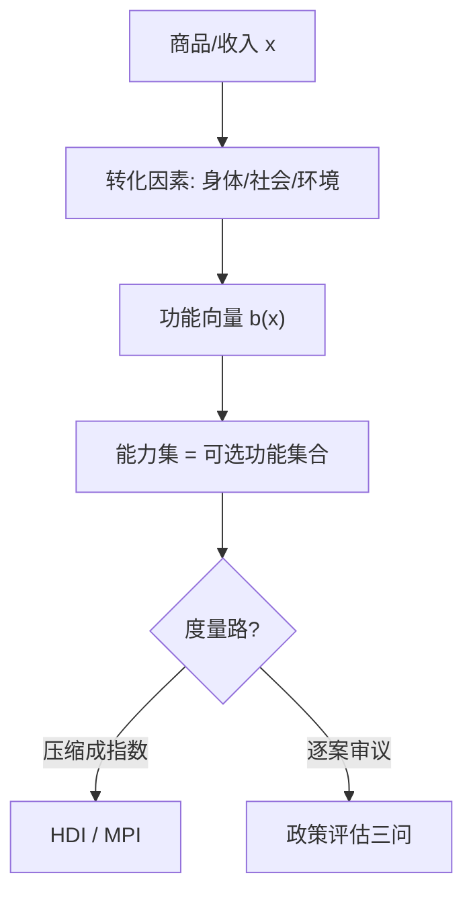
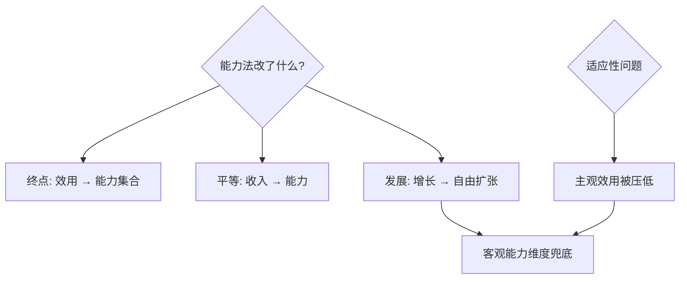

# capability-approach

问「有多少钱」不如问「能做成什么事」：发展是把人能过的真实生活集合撑大，收入只是撑大它的手段之一。

<footer>—— 据 Sen《Commodities and Capabilities》(1985)；《Development as Freedom》(1999)；Nussbaum 能力清单</footer>

[Gini 系数分解](/econ/gini-decomposition)把收入不平等拆细，本课挑战的是「收入」这个测量原点本身。缺口是**可行能力方法**：福祉的度量对象应是人可实现的「功能」（doings and beings）集合，而非商品束。它改写了人类发展指数与多维贫困指数的地基。本课不进 Nussbaum 的哲学清单之争。

## 问题

两个人收入相同：一位健康、有学上、说话有人听；一位慢性病、失学、无处发声。收入维度上平等，生活上天壤之别。缺口：**转化的异质性**——同样的商品投入，因身体、社会规范、公共品差异，转化成的生活质量不同。福利经济学以效用为终点、以收入为代理，两者都会漏掉这层转化。

术语翻译：功能（functioning）= 已实现的生活状态，如「营养良好」「能读写」；能力（capability）= 可实现的功能集合，即「真实机会」——吃素不是能力受限，吃不起肉才是。福祉按能力评估，按功能实现与否落笔。

数字实例：同样月入 3000 元，孕妇对营养与医疗的转化需求更高；轮椅使用者在无坡道城市里「 mobility 」这一功能实际为零——收入相同，能力悬殊。HDI 用「人均 GNI + 教育 + 寿命」三轴逼近能力，MPI 直接数剥夺维度。

## 方法

操作化两路。**指数路**：UNDP 的 HDI（寿命/教育/收入几何平均）与 OPHI 的 MPI（10 个二值剥夺指标、按维度计数识别贫困者）——把「能力集合」压缩成可跨年跨国的标量。**评估路**：政策评估时对每个候选维度回答三问——这算一种重要的功能吗、缺失是选择还是约束、干预能否拓宽集合。方法上承认不完备：Sen 拒绝给唯一清单，留出公共理性审议空间。

直觉类比：收入像食材预算，功能像做出来的菜，能力像「这套厨房里你能做的所有菜」——同样的预算，有人厨房有灶、有人只有微波炉；发展政策的目标不是只发食材，是把厨房（教育、健康、基础设施、权利）改造好。

## 机制

能力法改写福利经济学的三处地基。**评估对象**：从效用（心理满足，可被适应扭曲）移到能力集合（客观机会）——「贫者安贫」不再自动等于福祉；**平等目标**：从收入平等或效用平等移到能力平等——女性教育回报、残疾人无障碍都是其自然推论；**发展定义**：增长是手段，能力扩张是目的，GDP 之外需自建仪表盘。机制上它承认度量损失换来解释力：单一指数必然武断，但方向正确的粗测量胜过精确的错误测量。

常见误区：把能力法读成「反增长」——Sen 明确增长是能力扩张的重要引擎，反对的是把增长当唯一目标；另一误区是「清单一定要全」——MPI 的 10 个指标远非完备，它是诊断起点不是人生清单。

## 边界

三大批评与回应：**文化帝国主义**（清单谁来定？）——回应是公共理性过程而非哲学独断；**度量武断**（维度权重怎么定？）——MPI 用等权起步再 robustness 检验；**信息要求高**（细化到个人能力需大量调查）——面板与人口普查部分弥补。适用性：发展中世界扶贫与人类发展报告是主场，发达社会的适用需换维度（时间贫困、数字接入）。与收入度量的分工不是替代：收入回答「手段分配」，能力回答「生活结果」，政策审计两者都要。

直觉类比：收入基尼像只看油箱油量，能力法是看整辆车——轮胎、引擎、路权；有人油满而车开不动（残疾人在城市里），有人油少但路平车好（北欧福利国家），单看油箱会误诊。

## 小结

- 福祉的度量对象是能力集合（真实机会），收入只是转化输入之一。
- HDI/MPI 是其操作化；转化异质性是收入法漏掉的核。
- 承认度量武断，用公共理性与 robustness 换方向正确。
- 出处：Sen《Commodities and Capabilities》1985；《Development as Freedom》1999；Alkire–Foster 2011；UNDP HDI 技术注。
