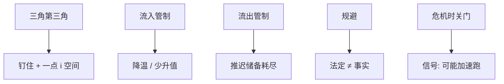

# 资本管制

三角的第三角：用管制换取钉住加一点货币空间；宏观审慎时代把它从禁忌改写成工具，但规避、配置扭曲与信号成本没有消失。

<footer>—— 据 Magud, Reinhart and Rogoff 管制效力综述；Ostry 等 IMF 审慎框架；Klein 墙与门</footer>

[上一课](/econ/crisis-generations)把危机分代。本课缺口是政策：资本管制。主权财富基金下一课换官方的资产侧；本课钉管制在三角、危机与宏观审慎里的位置，不重写[不可能三角](/econ/impossible-trinity)全文。

## 问题

开放资本时，钉住吃掉货币独立。管制提高套利成本，使 $i$ 可以暂时离开 $i^*+\mathbb{E}\Delta e$。流入管制（准备金、税、审批）针对过热与货币升值；流出管制针对储备漏出与停止。缺口是效力：规避（假贸易、内部定价、衍生品）使法定管制不等于事实封闭。Klein：墙上的砖（长期封闭）与门（危机时开关）效果不同；门的信号可以加速流出。

智利 URR、马来西亚 1998、冰岛危机后、近年新兴宏观审慎，是经验菜单。本课机制，不评分某国「成功」。

## 方法

把管制写成 $\tau$ 进资本账户，类似贸易冰山。第一代：降低漏出速度，推迟 $T$，不改信贷规则则仍破。第二代：提高攻击成本，可移出灰色区。第三代：紧急闸减少火线出售的跨境腿。代价：配置（Lucas 的 $K$ 更不流）、规避成本、治理寻租。IMF 后 2008 的制度观点：流入管制可当审慎，不是绝对禁忌，但仍次于国内审慎若后者可用。

与贸易协定：货物 GATT 没有同等的资本账户多边约束（IMF 第八条管经常兑换）。资本开放是单边 / 双边选择，政治经济不同。

## 机制

机制是楔子。楔子创造空间也创造寻租。宏观审慎（LTV、外汇贷款限制）可以是「谁借」的管制，比全面外汇管制更准，仍是资本账户的亲戚。储备干预是价格与数量的另一只手：管制与干预常一起用（怕浮动的完整工具箱）。

与 FH / Lucas：长期墙降低跨境净流，可以抬高 FH 的 $\beta$、加重 Lucas 缺失。短期门改变危机动力学，不改变稳态 $A$。

Magud–Reinhart–Rogoff：流入管制对组成（从短债转向更长）比对总量更有证据；对汇率与利率的效果较弱、较短。效力陈述必须说对象。

## 边界

本课不提供如何设计规避的任何说明。不把管制写成免费的第三顶点——三角仍在，只是「开放」变成有弹性。下一课主权财富基金：管制与储备的镜像是官方把顺差变成海外资产组合。不要用管制课重写贸易关税；对象是资产流。

后课默认：管制是三角第三角与危机闸，效力被规避打折；门与墙不同。审慎可以替代部分全面管制。信贷规则不改，第一代 $T$ 只是推迟。SWF 下一课。

## 小结

- 管制用楔子换货币空间，法定开放度 ≠ 事实。
- 流入：组成往往比总量更听使唤；流出闸有信号风险。
- 对三代危机分别是推迟、加成本、紧急闸。
- 宏观审慎是更定向的亲戚，不是取消三角。
- 出处：Magud, Reinhart and Rogoff；Klein；Ostry 等 IMF 研究。
