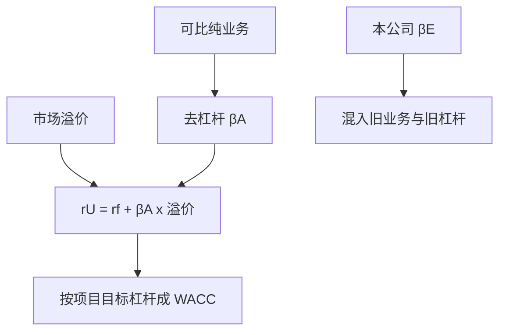

# CAPM 用于项目贴现

    
项目的资本成本取决于项目的风险，不是取决于公司碰巧怎样融资、也不是取决于公司股票过去的 beta。

    <footer>—— 据 Sharpe, Journal of Finance 1964；Brealey, Myers and Allen, Principles of Corporate Finance；Tirole, The Theory of Corporate Finance, 第 3 章 整理</footer>

[上一课](/econ/wacc-cost-of-capital)把 WACC 的代数写清，但 $r_E$ 与 $r_U$ 仍是输入。本课缺口是用 [CAPM 作为均衡陈述](/econ/capm-theory) 去填**项目**的要求回报：可比纯业务的资产 beta，而不是本公司股权 beta 一刀切。不重推切点组合，不把横截面异象与限价簿因子工程写进本栏。

## 问题

CAPM 说 $\mathrm{E}[R_i]-r_f=\beta_i(\mathrm{E}[R_m]-r_f)$。公司金融进阶要的不是再证明市场组合有效，而是：贴现项目时，$i$ 是项目，不是本公司股票。多元化的股东按不可分散风险要补偿；项目对市场的 beta 决定 $r_U$，再按目标杠杆lever 成 $r_E$ 或直接进 WACC。用本公司历史股权 beta，等于假设新项目与现有资产同一风险、且杠杆恰好等于过去回归窗口里的杠杆。

缺口因此是拆两层：经营风险（资产 beta）对财务风险（杠杆把 $\beta_E$ 放大）。Tirole 把投资决策写成「NPV 在股东目标下用机会成本」；机会成本由项目风险定。Brealey–Myers 的纯业务可比（pure play）是操作：找业务相近、交易的企业，去杠杆得到 $\beta_A$，再按项目目标杠杆杠杆回去。

Hamada 公式（在债务 beta 为零的近似下）：$\beta_E=\beta_A\bigl(1+(1-\tau_c)D/E\bigr)$。债务有风险时 $\beta_D\gt 0$，去杠杆要同时拆 $\beta_E$ 与 $\beta_D$。不要把权益 beta 直接当项目成本。

## 方法

步骤：（1）选可比公司或分部，估计股权 beta；（2）用市值 $D$、$E$ 与债务 beta（投资级可近似为零）得到资产 beta $\beta_A=(E/V)\beta_E+(D/V)\beta_D$；（3）项目若风险与可比同类，用 $\beta_A$ 得 $r_U=r_f+\beta_A\times$ 溢价；（4）若用 WACC，按**项目**目标 $D/V$ 杠杆，不要按母公司。项目比公司更险（绿野、新兴市场需求），$\beta_A$ 应更高，即使母公司是公用事业。

公司 WACC 一刀切的后果：安全项目被过高的门槛拒绝，危险项目被过低的门槛接受——内部资本市场把风险项目当「便宜增长」。这与总部配额一样，是代理，不是 CAPM。

市场溢价用历史还是隐含，是输入争议，本课不裁判；对象是**相对**风险 $\beta_A$。国家风险、项目特有的政治风险，若不能被股东分散，下一课之后的国家风险溢价再加；能分散的特有风险不进 CAPM 门槛。Tirole：可分散风险可以通过保险或股东组合处理，不应靠提高折现率假装已经处理——现金流里扣期望损失更干净。

## 机制

机制是股东的边际定价，不是经理的感受波动。项目特有风险进入折现率，只当它进入 $\mathrm{Cov}(\cdot,R_m)$ 或破坏税盾、诱发财务困境（那些走 APV 副作用或进 FCF，不走 beta）。经理厌恶自己的职业风险，会把特有波动写成「高门槛」；那是[代理](/econ/agency-free-cash-flow)与风险厌恶经理，不是 CAPM。

与 MM 的衔接：贴现用 $r_U$ 或 WACC，对应无杠杆或杠杆后的要求回报；不要用 $r_E$ 去折未杠杆 FCF。项目融资若改变公司杠杆，WACC 的权重是项目的，APV 更干净。本课只钉：风险来自项目对市场的暴露。

### 公司 beta 不是项目 beta

并购一个低 beta 部门、再用母公司高 WACC 去折，会人为制造 NPV。反向：高 beta 项目挂在低 WACC 公司下，会通过。资本预算的代理成本常常藏在错误的折现率里，而不是 IRR 表上。

底线：CAPM 在本栏是项目机会成本的一张线性表。实证拒绝 CAPM 横截面，不取消「用可比资产风险、而不是用本公司历史股票」这一句操作纪律。

## 边界

不要在本课重做 Sharpe–Lintner 的均衡推导，也不要把 Fama–French 因子当成已经进了公司 WACC——多因子是量化栏与资产定价续，本课停在单因子机会成本。项目与市场相关性低，不是「折现率用无风险」：若仍有不可分散的风险暴露，beta 可以小但不是自动为零；真正的特有灾难应进现金流情景。

后课默认：项目 $r_U$ 来自纯业务 $\beta_A$；杠杆按项目目标。公司 WACC 一刀切会选错风险项目。下一课：杠杆路径随时间变时，WACC 不够，改 APV。

不要把限价簿上的高频 beta、微观结构噪声写成项目成本。日频估计的公司 beta 不是资本预算对象。

## 小结

- 项目资本成本由项目 $\beta_A$ 决定，不是由本公司股票的历史 beta 决定。
- 纯业务去杠杆，再按项目目标杠杆；特有风险优先进现金流，不进门槛。
- 公司 WACC 一刀切会拒绝安全项目、放行危险项目。
- 出处：Sharpe 1964；Hamada；Brealey, Myers and Allen；Tirole, *Theory of Corporate Finance*。
