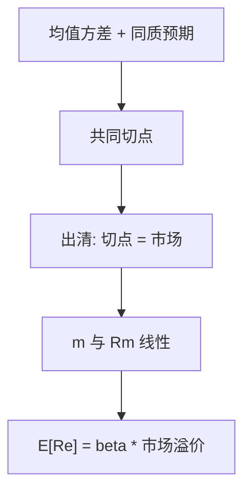

# CAPM 作为均衡陈述

若投资者按均值与方差持有组合，市场出清时，切点组合即市场组合；期望超额收益与对市场的 beta 成正比。

<footer>—— Sharpe, Capital Asset Prices, Journal of Finance 1964；Lintner, Review of Economics and Statistics 1965；Mossin, Econometrica 1966</footer>

[上一课](/econ/icapm-merton)（Merton ICAPM）。[随机折现因子](/econ/stochastic-discount-factor)。一般定价核只约束 $0=\mathrm{E}[m R^e]$，没有说出 $m$ 是哪一个随机变量。本课缺口是均衡：在均值–方差与同质预期下，$m$ 与市场回报线性，CAPM 作为**均衡陈述**出现。横截面检验、异象、因子工程不在本栏，见量化栏 [CAPM 与市场因子](/quant/capm)。

## 问题

SDF 课已经允许任意（正的）$m$。要得到「只有市场 beta 被定价」，必须说明为什么其他风险都不进入 $m$。Sharpe（1964）、Lintner（1965）、Mossin（1966）的共同设定是：投资者只关心组合的均值与方差，信念相同，市场无摩擦，可按无风险利率借贷（或可卖空）。于是每人持有同一风险切点与无风险资产的混合。出清要求切点就是价值加权的市场组合。个股对市场的回归系数 $\beta_i$ 于是成为唯一的风险度量。

缺口不是「回归 $R_i$ 对 $R_m$ 的 $R^2$」，那是相关结构。缺口是均衡映射：从偏好与出清到 $m$，再从 $m$ 到期望收益。实证是否拒绝这条映射，本课不审。

Black（1972）去掉无风险资产，切点换成零 beta 组合；线性关系仍在，截距不再是 $r_f$。均衡陈述变了截距，没有变成多因子模型。

## 方法

均值–方差使有效前沿是一条双曲线，有无风险资产时有效集是从 $r_f$ 出发的切线。同质预期使切点对所有人相同。加总：市场组合 $R_m$ 落在切点上，因而是均值–方差有效的。对任意资产 $i$，有效性等价于

$$
\mathrm{E}[R_i]-r_f = \beta_i\bigl(\mathrm{E}[R_m]-r_f\bigr),\qquad \beta_i=\frac{\mathrm{Cov}(R_i,R_m)}{\mathrm{Var}(R_m)}.
$$

用 SDF 语言：这等于限制 $m=a-b R_m$（$a,b$ 由无风险与市场溢价定）。与市场负相关的收益在 $m$ 高时较高，溢价为负——保险；$\beta\gt 0$ 的资产在市场差时也差，必须提供正溢价。特异方差被分散，不进入 $m$，故不进入期望收益。

[MM](/econ/modigliani-miller) 的 $r_A$ 在此可以读成资产对市场的 $\beta_A$ 所要求的回报；杠杆改变的是股权 $\beta_E$，不改变 $\beta_A$。这是无摩擦切片与 CAPM 的交汇，仍不是实证。

## 机制

机制是加总后的有效性，不是「市场指数碰巧解释收益」。每个人把特异风险散掉，剩下的共同风险必须有人持有——持有它的人是全体，权重是市值。因此被定价的协方差是对**市场组合**的协方差，不是对任意一个宏观变量的协方差。消费欧拉给出的 $m$ 可以与 $R_m$ 不等价：那是另一套均衡（CCAPM），本课不加进去。

Roll（1977）的批评属于均衡陈述的边界：真正的市场组合不可观测，用某个股票指数代替，检验的是该指数是否有效，不是「CAPM 作为理论」被终审。这句话本身仍是理论，不是回归表；回归表在量化栏。

### 本栏停在定理，实证换栏

均值方差加出清给出 $m$ 对 $R_m$ 线性，这是一般均衡的推论。把 $R_m$ 换成某个可交易指数、做时间序列 $\alpha$ 与 Fama–MacBeth，是另一套对象：可交易因子模型。失败方式（斜率太平、残差按特征排列）属于后者。Fama–French 的规模与价值是在市场因子之后的增量，不是把 Sharpe–Lintner 改写成三因子定理。链接足够：[CAPM 与市场因子](/quant/capm)。本课不排序组合、不写 GRS。

与 MM 的交汇已经在方法里：$r_A$ 由资产 beta 决定，切片改变股权 beta。这仍是无摩擦世界的会计，不是资本结构实证。

## 边界

本课不写 Fama–MacBeth、GRS、规模与价值残差。那些是对这条均衡映射的检验与修补，对象是可交易因子，见 [/quant/capm](/quant/capm)。也不要把 CAPM 写成 EMH：有效是相对信息集，CAPM 是对 $m$ 的形状限制；可以有效而 $m$ 不是市场线性，也可以 $m$ 碰巧近似线性而信息公开得慢。

下一课离开单期截面，把同一套折现用到不同到期的无违约债券：[期限结构预期假说](/econ/eh-term-structure)。

不要在本课引用三因子作为 CAPM 的「修正定理」。多因子可以是 $m$ 的更富投影，但不是 1964/65 年的均衡结论。有支付服务的银行存款会破坏「人人持有市场」；那是银行摩擦，不是把 CAPM 从主干删掉。

横截面、GRS、低 beta 异象，全部见 [/quant/capm](/quant/capm)。本课不重跑。

Roll：理论市场不可观测。指数检验是「该指数是否有效」，不是终审 CAPM。

下一课沿时间把短利率连成期限结构，不再沿截面加因子。

## 小结

- 均值–方差均衡 ⇒ 市场组合有效 ⇒ 期望超额收益与 $\beta$ 成正比。
- 等价于 $m$ 与 $R_m$ 线性；特异风险不进入 $m$。
- 本栏只陈述均衡；横截面实证在量化栏 CAPM。
- 出处：Sharpe, *Journal of Finance* 1964；Lintner, *REStat* 1965；Mossin, *Econometrica* 1966。
