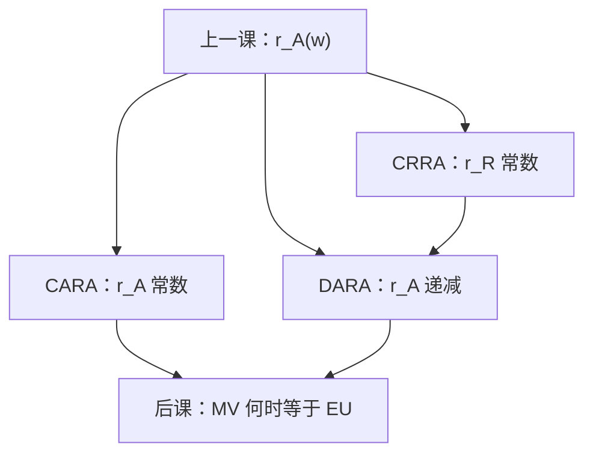

# CARA / CRRA / DARA

    
绝对风险厌恶随财富不变、相对风险厌恶随财富不变、绝对风险厌恶随财富下降，是三条不同的形状约束，不是三种「更厌恶」。

    <footer>—— 据 Arrow, Essays in the Theory of Risk-Bearing, 1971；Pratt, Econometrica, 1964 整理</footer>

[上一课](/econ/risk-aversion)定义了 $r_A(w)=-u''(w)/u'(w)$ 与 $r_R(w)=w r_A(w)$，并给出 Pratt 的全局比较。本课不重证溢价近似，也不把凹性再推一遍。缺口是：后课保险、资产需求、宏观欧拉经常要选定一条具体的 $r_A$ 形状——常绝对、常相对、递减绝对——否则加总与封闭解没有语言。

## 问题

$r_A$ 是 $w$ 的函数。上一课只比较「处处更大」，没有钉它如何随财富变。若每次换一个题目就换一条 $u$，后课无法写「安全资产是劣等还是正常」，也无法写宏观常用的幂效用。缺口是三条可操作的约束：

CARA：$r_A(w)=\alpha\gt 0$ 常数，解为 $u(w)=-e^{-\alpha w}$（仿射意义下）。财富的绝对风险承担不随 $w$ 变。

CRRA：$r_R(w)=\gamma\gt 0$ 常数，解为幂（或对数）效用。相对风险承担占财富的比例不随 $w$ 变。

DARA：$r_A'(w)\lt 0$。绝对风险资产成为正常品：更富则多持绝对数量的风险。IARA 则相反。

Arrow 把 DARA 当作合理的工作假设；CARA、CRRA 是为了可加总、可解而出价的参数化，不是经验定律。

### 常绝对不是常相对

CARA 的 $r_R(w)=\alpha w$ 随财富上升，人把风险当越来越重的相对负担。CRRA 的 $r_A(w)=\gamma/w$ 恰是 DARA。二者只在刀刃上重合，不要把「常系数」读成同一条 $u$。二次效用给出 IARA 且有餍足，上一课已排除出主干；本课不把它当 CARA 的近似。

财富平移下，CARA 的风险承担不变，故有背景风险时绝对风险资产需求仍可分离。CRRA 没有这种平移不变，只有缩放不变。

## 方法

给定两次可微、严格递增凹的 $u$，直接读 $r_A$、$r_R$ 是否常数或是否单调。常系数是微分方程：$-u''/u'=\alpha$ 或 $-w u''/u'=\gamma$，通解只差仿射。这用的正是上一课钉死的基数性。

保险接口：CARA 加正态风险时，最优保险或资产需求对财富的导数为零。CRRA 下需求与财富成比例。DARA 下公平保险仍全额投保（那是凹性，上一课已有），加载保险的自留额随财富下降——更富的人买更全的保险，同时持有更多绝对风险资产，二者不矛盾：保险针对某一可保风险，DARA 针对总财富上的绝对风险承担。

本课不估计 $\gamma$。宏观若写 CRRA，是在选加总方便的一条，不是本课的计量结论。也不把 $\alpha$、$\gamma$ 写成限价簿上的风险限额。

## 机制

形状约束的机制是财富如何进入风险承担。CARA：指数效用把财富提出期望，剩下的只是风险的矩，故绝对需求对 $w$ 无弹性。CRRA：幂效用在财富与风险按同一比例缩放时不变，故组合权重可以与 $w$ 无关。DARA：更富则同一绝对噪声的局部溢价下降，风险资产的收入效应为正。

与 Pratt 比较的分工：Pratt 比较两个人；本课约束同一个人沿财富轴的移动。$r_A^1\ge r_A^2$ 处处成立，与二人是否 DARA，是正交的两刀。

对数是 $\gamma=1$ 的 CRRA。$\gamma\to 0$ 趋向风险中性，不是趋向 CARA。引用时不要把「相对风险厌恶等于 1」写成绝对风险厌恶的单位。

## 边界

DARA 不蕴含 CRRA，只蕴含 $r_A$ 下降；相对风险厌恶仍可升可降（Drèze–Modigliani、Arrow 的 IRRA/DRRA 另议）。本课主干只用到 DARA 与两条常系数。

多期、习惯、递归效用会让有效 $r_A$ 不再等于期内伯努利的 $-u''/u'$。本课只在静态财富上定义形状。模糊没有 $r_A$ 可算。二次效用的 IARA 下一课会作为均值方差的刀刃再出现一次，本课不预支。

也不要把 CRRA 的 $\gamma$ 直接叫跨期替代弹性：那是宏观把同一幂函数兼用在时间与风险上的额外假设，本课只谈风险形状。

后课默认：需要函数形式时，CARA / CRRA 指上述微分方程的解；定性比较默认 DARA。

## 小结

- $r_A$ 常数是 CARA，$r_R$ 常数是 CRRA，$r_A$ 下降是 DARA；三者不是同一约束。
- CRRA 蕴含 DARA；CARA 的相对厌恶随财富上升。
- 形状管的是同一个人随财富如何承担风险，不是 Pratt 的人际比较。
- 下一课问均值方差何时能代替整条 $u$。
- 出处：Arrow, *Essays in the Theory of Risk-Bearing*, 1971；Pratt, *Econometrica*, 1964。
