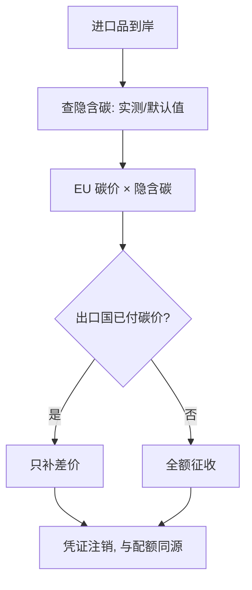
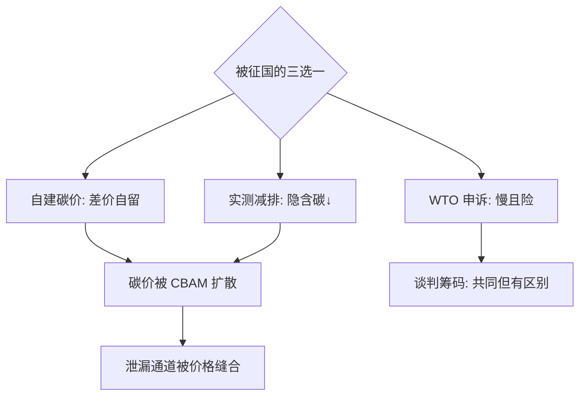

# 碳边境调节机制

境内碳价齐了，进口的碳却免费——边境调节把漏出去的口子缝上：你按我们的价付碳，或者别来卖。

<footer>—— 据 EU CBAM 条例 (2023)；Weitzman 碳价-数量之争的贸易延伸；Copeland–Taylor 污染避难所模型</footer>

[Bagehot 最后贷款人](/econ/bagehot-lender)讲规则先行，本课是环境政策里的同一课。境内碳税/碳市场给本地企业戴上碳紧箍，进口品却绕行——**碳泄漏**。缺口是**碳边境调节机制（CBAM）**：对进口品按其隐含碳征等价费用。本课不做 WTO 合规细节，聚焦经济逻辑。

## 问题

单边碳价的两个漏洞：生产外迁（泄漏）与竞争力流失（同一钢厂，境内付碳价、境外免付）。泄漏率文献估计因部门而异——水泥、钢铁、铝等贸易暴露密集部门可达 5–25%。缺口：把碳价延伸到边境，按进口品生产过程的隐含排放收费，使境内与进口在同一碳价下竞争。

术语翻译：隐含碳（embedded/emissions）= 生产一吨钢/铝/水泥全过程排放的 CO2 当量；泄漏（carbon leakage）= 碳政策导致的生产与排放向无碳价地区转移；CBAM = Carbon Border Adjustment Mechanism，欧盟 2023 起过渡、2026 起正式征收。

数字实例：欧盟碳价 80 欧元/吨，进口钢隐含碳 2 吨/吨钢，则 CBAM 费 = 160 欧元/吨钢；若出口国已有碳价 30 欧元，只补差价 100 欧元——「已付不重复征」是机制的核心杠杆，倒逼出口国自己建碳价。

## 方法

征收逻辑四步：定义覆盖行业（钢、铝、水泥、化肥、电、氢）；核算进口品隐含碳（默认值 or 出口商实测申报）；按「欧盟碳价 × 隐含碳 − 已付碳价」征收对应凭证；凭证与境内碳市场配额联动，价格同源。设计的三个自由度——覆盖范围、默认值宽严、抵扣规则——每一处都是贸易谈判的战场。

直觉类比：CBAM 像景区「自带酒水开瓶费」——景区内饮料贵（境内碳价），游客从外带便宜酒（无碳价进口品）；开瓶费按差价收，要么别自带，要么在自家也按景区价买（出口国建碳价）。

## 机制

效率机制：CBAM 把碳价的空间覆盖从「辖区」扩展到「消费足迹」，泄漏通道被堵——不是靠禁止，是靠价格抹平。策略互动机制更有意思：被征国有三个选项——自建碳价（差价归自己财政）、实测减碳（降隐含碳）、WTO 申诉（周期长胜率低）。第一项「差价抵扣」事实上把 CBAM 变成了碳价扩散的强制器，这也是它比制裁性关税更可辩护的原因。分配机制：默认值偏向进口大国供应商，实测门槛抬高小出口商成本，发展中国家在谈判中要求「共同但有区别」的抵扣。

常见误区：把 CBAM 当保护主义关税——关税按「产品来源国」歧视，CBAM 按「产品碳含量」中性，且对出口国已付碳价抵扣；另一误区是「CBAM 能救境内高碳产业」——它只堵贸易泄漏，境内自身的碳成本负担一分未减，长势仍取决于转型速度。

## 边界

覆盖面只能渐进：下游制成品（汽车含钢）的隐含碳核算复杂，首期只覆盖原材料级。核算真实性是阿喀琉斯之踵——出口商自报、第三方核验的成本与造假空间并存，默认值从严则惩罚数据弱的小国。WTO 兼容性靠「非歧视 + 抵扣设计」勉强站住，但 G20 之外的政治反弹真实存在（「气候帝国主义」叙事）。适用边界：碳价差大、贸易暴露高、排放可核算的部门先行；服务贸易与消费端排放（ Scope 3）远超当前机制。与[土地价值税](/econ/land-value-tax)同课异构：都是把「未被定价的外部性/租金」收回来，一个收空间红利，一个收碳红利。

直觉类比：单边碳价像小区自己垃圾分类，垃圾车却把所有小区的混运——分类努力白费；CBAM 是物业规定「外来垃圾也按我们标准分类收费」，邻居要么跟着分类（建碳价），要么交处理费。

## 小结

- CBAM 按隐含碳征收、已付碳价抵扣，堵泄漏而非设关税。
- 差价抵扣让 CBAM 成为碳价扩散的强制器。
- 阿喀琉斯之踵是核算真实性；覆盖面与 WTO 兼容是长期谈判场。
- 出处：EU CBAM Regulation (EU) 2023/956；Copeland–Taylor《Trade and the Environment》；Böhringer et al. 2022 评估。
