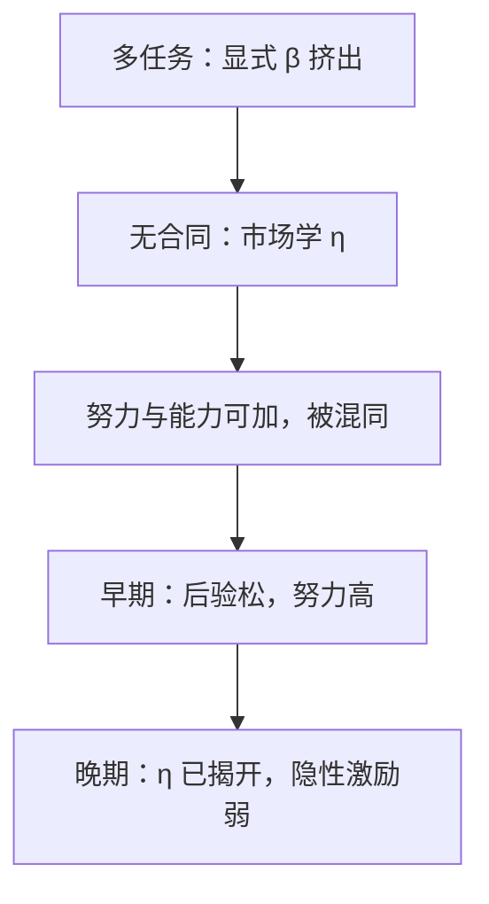

# 职业关注

即使当期没有激励合同，市场也会从产出推断能力并支付工资；经理用努力冒充天赋，均衡里努力仍被拆穿，但年轻时仍会多干。

<footer>—— Holmström, Managerial Incentive Problems: A Dynamic Perspective, Review of Economic Studies, 1999（原稿 1982）</footer>

[上一课](/econ/multitask-holmstrom)在**显式**合同里钉挤出：对易测任务付 $\beta$，难测任务被抽走。缺口是许多努力根本不写进合同——职业早期的名声、经理被经理人市场定价。没有 $\beta$，只有「别人怎么更新我的能力」。Holmström 1999 把隐性激励写成学习。本课钉职业关注，不重写多任务的向量 FOC，也不把专用性投资提前。

## 问题

产出 $y_t=\eta+a_t+\varepsilon_t$，$\eta$ 是未知能力，先验正态，噪声正态。市场观察 $y$，不观察 $a$，竞争工资等于 $\mathbb{E}[\eta\mid$历史$]$（风险中性教具）。经理选 $a_t$，成本 $c(a)$，只关心当期与未来工资流（贴现）。

市场在均衡里猜到 $a_t^*$，从 $y$ 里把它减掉再更新 $\eta$。经理仍有激励多干：若实际 $a>a^*$，$y$ 偏高，后验 $\eta$ 被抬高，未来工资上涨。一阶条件：努力的边际成本等于「污染」后验的边际收益。学习越往前，对 $\eta$ 越确定，隐性激励越弱——职业早期努力高，晚期低。

### 不是多任务的 $\beta$，也不是斯宾塞文凭

多任务是委托人**选择**信号权重。职业关注里没有委托人设 $\beta$，权重由贝叶斯学习钉死。斯宾塞信号是类型选择有成本的教育；这里类型 $\eta$ 不选，选的是与 $\eta$ 可加、从而被误读的努力。Fama「市场纪律」给出方向；Holmström 给出努力随生涯衰减的方程。

均衡努力被市场完全预期，所以平均而言 $\eta$ 的推断无偏——「装天才」在均衡里不成功。努力仍然正，因为偏离均衡会被当成天才或蠢才。这与信号分离不同：能力是连续后验，不是两个离散类型的教育门槛。

## 方法

对象：正态–正态学习、可加努力、无长期合同（每期按后验付现货工资）。先写卡尔曼更新：后验方差递减。再写经理的欧拉： $c'(a_t)$ 等于工资对 $y_t$ 的敏感度（后验权重）乘贴现因子。比较：若能写显式 $\beta$，显性与隐性可以叠加或替代；本课先关显性，看名声单独能买多少努力。

后验方差是隐性激励的状态变量：方差大，意外值钱；方差收口，努力的边际收益掉。这把「年轻加班、临退卸责」写成学习，不必另设偏好。

风险厌恶、职业保险、经理与股东的风险分担，会让现货工资波动成为成本；本课风险中性只钉学习激励。显性奖金若与名声同时对 $y$ 付酬，两层激励相加，风险也相加；最优常常是压低显式 $\beta$，把一部分交给职业关注——尤其在早期窗口还宽时。

## 机制

可加结构使努力与天赋在 $y$ 里不可分。市场用均衡努力去污，剩下的当 $\eta$。经理的私人问题是：多干一点，制造一次正的「意外」，把后验当能力卖掉。意外只在市场尚未锁死 $\eta$ 时值钱，故期限结构向下倾斜。这解释「不靠奖金也加班」与「临近退休卸责」，不必另设偏好变化。

与充足统计对照：市场工资已经是 $y$ 的函数，再签一份对 $y$ 的显式合同，可能重复定价同一噪声，也可能在风险厌恶下过度保险或过度激励。多任务课的警告仍在：若 $y$ 只覆盖易测维，职业关注会把努力赶到那一维——隐性激励同样会挤出。

### 市场越有效，隐性激励可以越弱

若 $\eta$ 很快被学清（信号极准），晚期 $a$ 掉得更快。若永远学不清，隐性激励持续。这与「信息越多越好」在显式合同里的单调性不同：更好的测量加快揭开，缩短职业关注的窗口。

Holmström 原文还谈团队与相对绩效：共同冲击应滤掉，否则名声被行业噪声污染。滤完之后，激励强度仍由「还剩多少未知能力」决定，不是由似然比单独开出 $\beta$。

## 边界

长期合同若能承诺，显性激励可以补晚期；承诺失败则职业关注是仅有的钉子。多任务、短视市场、操纵可观测指标（盈余管理）会扭曲「用努力冒充 $\eta$」。也不要把职业关注写成宏观人力资本或限价簿做市商名声。

经理若能操纵 $y$（盈余、报表），职业关注会反过来奖励操纵——市场分不清 $\eta$、努力与粉饰。显式合同用充足统计滤噪声；名声市场若滤不掉粉饰，隐性激励可以有害。下一课的套牢则连「换市场再定价」这条路都没有。

后课默认：无显式合同时，学习能力提供随生涯衰减的隐性激励；均衡里努力被预期，但仍有。下一课把关系从市场名声换成双边专用性投资与套牢。

## 小结

- 多任务靠合同里的 $\beta$；职业关注靠市场对能力的更新。
- 努力与 $\eta$ 可加，被用来冒充天赋；均衡去污，窗口在早期。
- 测量变准会缩短隐性激励，不必提高努力。
- 挤出对隐性激励同样适用，若信号只覆盖一维。
- 出处：Holmström, *RES*, 1999（1982 稿）。
