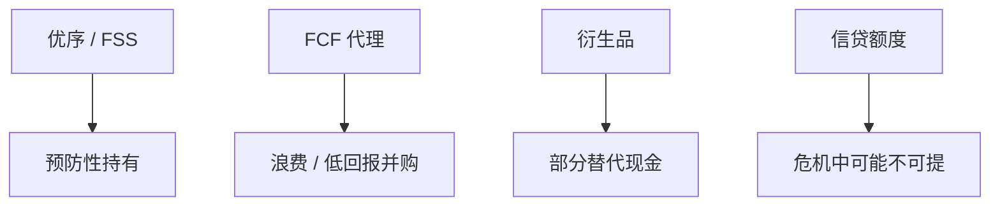

# 现金持有

    
现金是对冲与优序的存量替代：预防性余额避免昂贵的外部融资，也是 Jensen 的弹药；最优持有在流动性收益与代理成本之间。

    <footer>—— Opler, Pinkowitz, Stulz and Williamson, Journal of Financial Economics 1999；Almeida, Campello and Weisbach, Journal of Finance 2004；Keynes 的预防性动机在企业侧的改写</footer>

[上一课](/econ/corporate-hedging-rationale)给出衍生品对冲。本课缺口是更简单的工具：持有现金与等价物。Opler 等把决定因素写成规模、机会、现金流风险、融资约束。Almeida–Campello–Weisbach：约束企业的现金对现金流敏感。不重做 FSS 的状态挪移公式，不把超额现金的治理写成并购全文。

## 问题

营运资本课的经营现金是生产技术；本课是超额流动性。优序：囤现金以免将来走柠檬市场。FSS：现金是未对冲风险的缓冲。Jensen：成熟企业现金是浪费。三种理论对同一科目符号不同。缺口是按融资约束与投资机会分类，而不是「现金为王」一句。动态权衡：现金是负债，降杠杆，可以是带内的被动积累（盈利未派息），也可以是主动预防。

现金–现金流敏感性：约束企业在现金流入时多存，非约束企业不存。Almeida 等把它当融资约束度量，识别争议留给最后一课。

## 方法

权衡：流动性收益（避免发行成本、积压、展期失败）对税（利息在公司税与个人税下可能不利）、代理、以及机会成本（现金赚 $r_f$ 而非 $r_U$）。与对冲替代：衍生品把特定风险挪开，现金对冲不可交易的综合缺口。信贷额度是或有现金，银行关系课已说明额度在危机中可能不可提——承诺现金仍有价值。

资本预算：项目若消耗预防性现金，要按机会成本计，不是零。国家风险下，可兑换现金与被困现金不同，$\lambda$ 再出现。

派息与回购是把现金吐出的治理；激进主义常要求这一点。双层与家族可能把现金留在控制人可及之处。

## 机制

机制是外部融资的状态依存成本。高成本状态（危机、低 M/B、评级悬崖）的影子价格高，事前持有现金是买保险。MM 无关性在有发行成本时失败，现金结构有关。被动积累：动态权衡带内利润变成现金，看起来像优序，其实是调整成本。

与 LBO：PE 故意把现金掏空加杠杆，反 Jensen；成长 VC 企业现金是跑道，不是 FCF。样本继续决定理论。

### 不要把现金 beta 当成安全资产课

公司现金不是宏观安全资产便利收益的对象。本课是企业流动性管理。量化栏与宏观课序已有安全资产；此处不重写。

Opler, Pinkowitz, Stulz, Williamson, *JFE* 1999。Keynes 预防性动机是家庭货币需求；企业版换成投资与发行成本。

## 边界

不要把本课写成现金管理运营。下一课 ESG：目标函数若含非股东利益相关者，现金与对冲的「最优」会改——可能是约束或偏好。家族金字塔则改变现金在集团内的位置（隧道）。

后课默认：现金是预防性保险加代理弹药；约束企业敏感性高。对冲与额度是替代，危机中不完全替代。项目使用现金有机会成本。

## 小结

- 预防性现金避免昂贵外部融资与投资中断；FCF 企业则是代理成本。
- 对冲、额度、现金部分替代；危机中额度与市值窗口不可靠。
- 被动积累与主动预防观测相似，识别在后。
- 出处：Opler et al., *JFE* 1999；Almeida, Campello and Weisbach, *JF* 2004。
