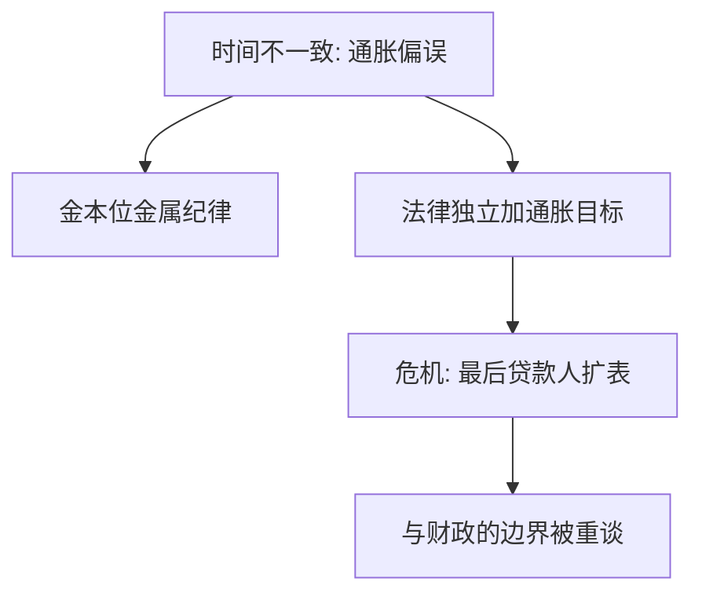

# 央行独立性简史

把利率交给一个难被解雇的机构，是为了堵住「选举前放水、事后通胀」的时间不一致；独立是政治委托，不是技术中性，最后贷款人与财政的边界会在危机里被重新谈判。

<footer>—— Kydland and Prescott, JPE 1977；Barro and Gordon；Rogoff 保守央行；Alesina and Summers, JMCB 1993；Cukierman；Bernanke, The Courage to Act, 2015；Eichengreen</footer>

[上一课](/econ/eurozone-debt-crisis)显示：没有明确的主权最后买家时，同盟内利差可以跳到坏均衡；OMT 一出，边界立刻变成「央行是否在财政化」。本课是经济史对照课的最后一课，也是本批领域课的收束。缺口不是列各国立法年份，而是：独立性怎样从金本位纪律、滞胀教训、2008 扩表、欧债承诺里长出来，又怎样在危机里被压薄。不承诺下一课程；读完本课，默认已能用委托与时间一致读央行，而不是用「独立永远正确」读。

## 问题

Kydland–Prescott / Barro–Gordon：相机抉择下，承诺低通胀不可信，均衡通胀偏高。Rogoff：任命一位更厌恶通胀的保守银行家，降低偏误。金本位曾是金属版承诺，代价是大萧条那种通缩枷锁。1970 年代相机迁就给出滞胀。1980–90 年代新西兰、英国、欧元区把目标与工具写进法律：工具独立（选 $i$）与目标独立（选通胀目标）要分开。缺口是危机后的第三句：QE、购债、监管宏观审慎，使资产负债表重新贴上财政。Alesina–Summers 的跨国相关是描述，不是证明独立足够。

### 独立不是央行永远正确

独立降低通胀偏误，不保证金融稳定，也不保证最后贷款人落在社会最优。任命、目标定义、危机协调仍是政治。把独立读成「不受选举约束所以科学」，会漏掉委托链：议会把目标交给央行，危机时目标可能被改写。欧债课的 OMT 是委托被压到极限的例子：不做则坏均衡，做则被指财政化。

Cukierman 的独立性指数把法律条文量化，与通胀负相关。条文与实际独立可以分开：财政主导下，法律独立会被债务滚续吞掉。

## 方法

对照本课序的危机。(1) 金本位：纪律来自黄金，独立空间小，失败是通缩。(2) 布雷顿：中心承诺兑黄金，外围独立有限。(3) 滞胀：浮动后独立不足，失败是通胀。(4) 东亚：外围央行印不出美元。(5) 2008：中心央行必须扩到影子链，独立变成「能否做非常规」。 (6) 欧债：独立机构是否允许对主权做条件式承诺。工具：通胀目标、泰勒原则、沟通。财政：债务可持续课的 $r$ 有一部分是央行定的；主导权在危机里会翻转。

不要把独立性指数当政策充分统计。目标含糊（「增长与稳定」并列且权重随选举变）等于没有承诺。

## 机制

机制是委托。社会要低通胀，又要危机时的弹性。把日常 $i$ 交给难被解雇的机构，堵住政治周期；把目标写死，堵住 Barro–Gordon 的诱惑。金本位把弹性关死；滞胀证明弹性会被滥用；2008 证明弹性有时必须大到扩表。欧债证明弹性必须写到主权债市场上，否则多重均衡。独立不是「越远越好」，是在偏误与弹性之间选一个可验证的规则。财政主导：债太高时，央行被迫压 $r$，独立名存实亡——主权课的阈值虽然不是定律，主导权转移是真的。

与公共财政漏桶对照：独立降低的是一种政治弹性带来的通胀漏，不降低劳动税的激励漏。两套漏不要混。

Bernanke 的回忆录把 2008 写成在独立框架里做最后贷款人。争议仍在：何处止于 Bagehot、何处开始财政。史课停在机制，不给现任央行打分。

## 边界

本课不预测下一次制度改写，不提供如何交易利率决议的步骤。经济史领域课到此结束，没有下一课。不要把本课读成「应当永远扩表」或「应当回到金本位」——两条都是用一种枷锁替代全部历史。后文（若读者离开本栏）默认：央行是被委托的规则机器；危机改变的是规则的边界，不是经济学不再适用。

## 小结

- 独立用来对付通胀的时间不一致，是委托不是神学。
- 金本位纪律过硬，滞胀证明过软，通胀目标是折中。
- 2008 与欧债把最后贷款人扩到影子链与主权，边界重开。
- 财政主导可以吞掉法律独立；指数不是充分统计。
- 本课是经济史对照的收束，不接下一课。
- 出处：Kydland and Prescott 1977；Barro and Gordon；Rogoff；Alesina and Summers 1993；Cukierman；Bernanke 2015；Eichengreen。
