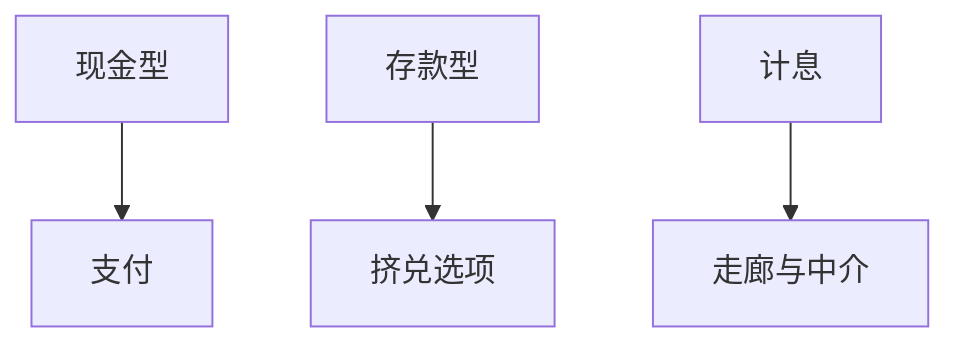

# CBDC

央行数字货币是公共部门的新负债科目：可以像现金，也可以像付息储备的零售版。设计决定它挤的是存款、现金还是 MMF。

<footer>—— 对照 BIS 对 CBDC 的综述；Brunnermeier and Niepelt 对公共货币与私人货币共存的讨论</footer>

[上一课](/econ/repo-mmf)把私人短债生态钉住。缺口是：若央行直接给公众一个数字账户，中介和地板工具怎么改。本课钉 CBDC 的宏观逻辑，美元主导下一课才出国界。不写某试点的 UI。

## 问题

CBDC 可以是现金的替代（匿名、不计息）或存款的替代（账户、或付息）。后者在危机时提供「公共安全账户」，可能加速银行挤兑（DD 加上一个永远不挤的选项）。若计息，它还与准备金、ON RRP 抢利率走廊。缺口是用已有的中介与主导语言选设计，而不是「要不要数字化」的口号。

Andolfatto；Keister and Sanches 讨论 CBDC 与银行信贷。Piazzesi and Schneider 对支付与中介。中国 e-CNY 是零售支付试点，不等于计息 CBDC 宏观。

## 方法

三个旋钮：准入（批发 vs 零售）、报酬（零利率 vs 政策利率附近）、持有上限。宏观映射：零售不计息 ≈ 现金；零售计息 ≈ 把 HANK 里的安全资产供给外生扩大；批发 CBDC ≈ 给非银一个储备账户。与财政主导：付息 CBDC 是更多名义公共债。与影子：若 CBDC 替代 MMF，ON RRP 需求下降。

## 机制

银行负债若被 CBDC 置换，除非央行把资金贷回银行，信贷供给要走新的 $\phi$。批发 CBDC 改变谁能持有央行负债，等于重划「银行」边界。匿名性与 AML 是微观约束，会限制现金型能做多大。

## 边界

本课不预测发行时间表，不把 CBDC 写成已替代美元。下一课国际：美元负债网络比零售 CBDC 更硬。不讨论钱包密码学。

## 小结

- CBDC 的宏观效应取决于它替代现金、存款还是货基。
- 计息零售 CBDC 是新的挤兑与走廊工具。
- 出处：BIS CBDC 综述；Brunnermeier–Niepelt；Keister–Sanches。
