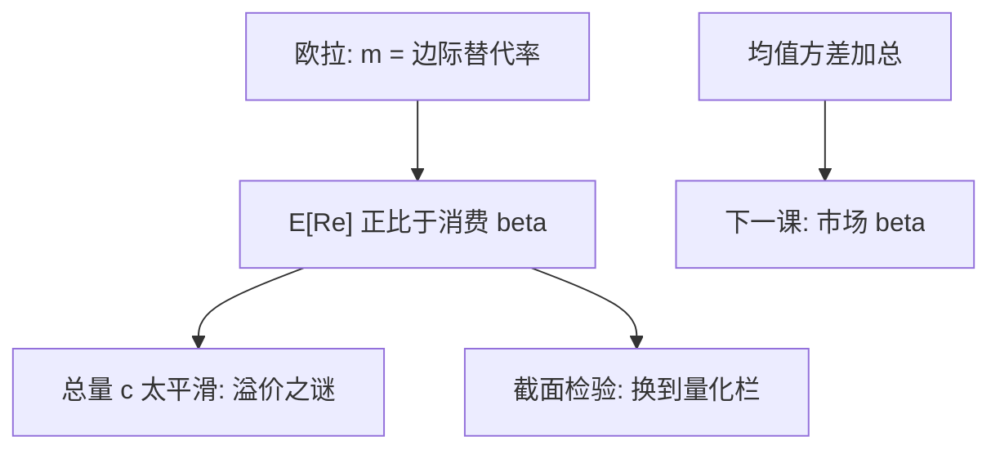

# 消费 CAPM

资产的风险是它对总消费的协方差；市场组合只是在均值–方差加总之后才变成充分统计。

<footer>—— Breeden, An Intertemporal Asset Pricing Model with Stochastic Consumption and Investment Opportunities, Journal of Financial Economics 1979</footer>

[上一课](/econ/rare-disasters)（稀有灾难）。Mehra–Prescott 已经说明：总量 CRRA 核匹配不了股权溢价，除非 $\gamma$ 离谱。本课缺口是把同一消费核写成 **beta 语言**：期望超额与消费 beta 成正比。实证薄弱——斜率平、消费测量噪——留给量化栏，本栏只完成均衡映射。不重做市场 CAPM 的切点加总，那是下一课。

## 问题

SDF 写 $E[R^e]=-\mathrm{Cov}(m,R^e)/E[m]$。若 $m=\beta u'(c_{t+1})/u'(c_t)$，协方差就是对消费（增长）的协方差。Breeden（1979）在连续时间、状态变量影响投资机会的设定下证明：瞬时期望超额与资产对总消费的 beta 成正比，消费是充分统计——不必列出每一个状态变量的 beta。这就是消费 CAPM（CCAPM）。

缺口不是再校准 $\gamma$，而是：市场 CAPM 用 $R_m$ 当 $m$ 的代理，CCAPM 用 $c$ 当 $m$ 的代理。两者何时等价、何时分开，要在定理里钉住。股权溢价之谜已经预告：用 $c$ 当代理，时间序列上很难够抖；截面上消费 beta 是否排得动平均收益，是另一项检验，本课不审表。

消费 beta：$\beta_{i,c}=\mathrm{Cov}(R_i^e,\Delta c)/\mathrm{Var}(\Delta c)$。CCAPM 说 $E[R_i^e]\propto\beta_{i,c}$。市场 beta 用 $R_m$ 替换 $\Delta c$。代理不同，不是同一回归的两个名字。

## 方法

离散时间的一阶：对 CRRA，$m$ 对 $\Delta c$ 单调，线性化后得到消费 beta 形式。Breeden 的连续时间版本更强：即使投资机会随机，只要效用时间可分，瞬时风险溢价仍只进入消费的协方差——状态变量通过改变消费路径进入 $m$，不必在定价方程里单独列。这与 Merton ICAPM 对照：ICAPM 对冲状态变量，CCAPM 说这些对冲已被消费吸收。

与市场 CAPM 的衔接：若存在无风险资产、投资者均值–方差且同质预期，切点即市场，下一课 [CAPM 作为均衡](/econ/capm-theory) 给出 $m$ 对 $R_m$ 线性。若再加总消费恰好与 $R_m$ 完全相关，CCAPM 与 CAPM 在截面上不可分。消费平滑破坏完全相关，两模型分开——谜已经说明平滑很严重。

测量：总量消费是耐用品、服务、流量的混合物，频率低、修正多。即便理论正确，回归里的 $\Delta c$ 也是带误差的代理。这使实证薄弱成为预期，而不是立刻改写定理。

## 机制

机制是跨期边际价值。家庭在消费差的状态里对一单位支付评价更高；与这些状态协方差高的资产必须提供溢价。市场组合是加总财富的代理，消费是加总效用流的代理。财富与消费在确定性格上沿欧拉锁在一起；随机投资机会、劳动收入、住房与耐用品使两者分叉。CCAPM 赌的是：分叉之后仍应看 $c$，因为 $u'(c)$ 才是 $m$。

股权溢价之谜是这一机制在**时间序列均值**上的失败：平均 $\Delta c$ 的波动撑不起平均 $E[R_m]-r_f$。截面失败是另一件事：消费 beta 高的资产是否平均收益更高。两件事都指向同一平滑，检验设计不同。因子工程用可交易组合代替 $\Delta c$，是承认测量与平滑，不是把 Breeden 改写成三因子定理。

### 实证薄弱，换栏不改定理

把消费增长对组合收益做 Fama–MacBeth、报告斜率不显著或符号不稳，是量化栏的对象。本栏读者只携带：均衡若由消费欧拉给出，风险度量是消费 beta。拒绝该映射，可以是测量、可以是习惯与长期风险改写 $m$、可以是市场不完全。不要在本课用几张年度消费回归宣布 CCAPM「死亡」，也不要用它替换下一课的市场 CAPM——那是另一套加总。

横截面与可交易因子：[/quant/capm](/quant/capm)、[/quant/ff3](/quant/ff3)。本课不排序组合、不写 GRS。

Breeden–Litzenberger 用期权恢复状态价格，是完全市场下从价格读 $m$ 的另一条路，不是消费回归。不要在这里展开期权表面。

## 边界

不要把 CCAPM 写成 EMH：有效是信息集，CCAPM 是 $m$ 的形状。也不要把消费 beta 当成「更基本所以一定赢过市场 beta」——基本的是 $m$，消费只是一个候选充分统计，数据上它很噪。下一课用均值–方差加总给出另一个充分统计 $R_m$，同样是均衡陈述，同样把实证换栏。

本课不重写 Mehra–Prescott 的校准表。后课默认：消费欧拉 ⇒ 消费 beta 定价；总量消费平滑使这一映射在数据上弱。市场 CAPM 是切点加总，不是 CCAPM 的修补。APT 与可交易因子是再后一层的投影，仍不是把 Breeden 改写成截面工程。

$c$ 与 $R_m$ 完全相关时两模型不可分。平滑把它们分开，也把溢价之谜留给消费这一边。

耐用品与服务使季度 $\Delta c$ 不是瞬时消费流。测量误差偏向把消费 beta 往零推，实证弱部分是预期。

下一课的市场组合是另一充分统计，不是把消费 beta 改名。

## 小结

- Breeden：瞬时溢价与消费 beta 成正比；状态变量被消费吸收。
- 市场 CAPM 用 $R_m$ 当充分统计，CCAPM 用 $c$；平滑使两者分开。
- 时间序列溢价之谜与截面弱斜率，检验换到量化栏，本栏不重跑。
- 出处：Breeden, *JFE* 1979；对照 Mehra and Prescott 1985；下一课 Sharpe–Lintner。
