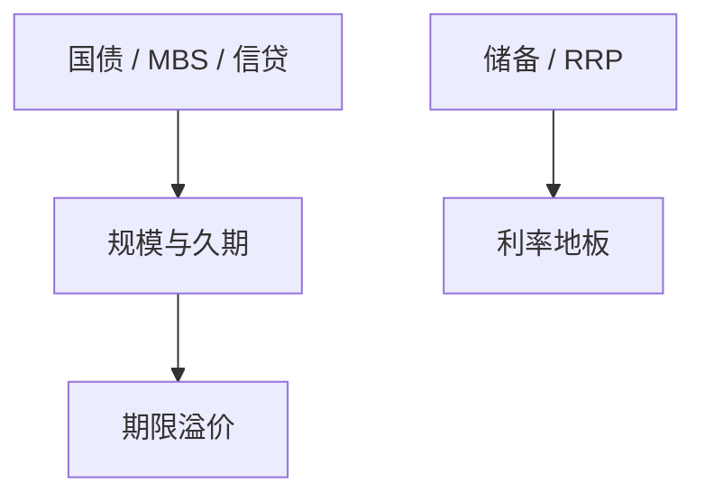

# 央行资产负债表

政策利率撞上零之后，工具变成规模、久期与对手方。资产负债表是非常规货币的会计，不是装饰。

<footer>—— Bernanke, The Federal Reserve and the Financial Crisis；对照 Curdia and Woodford 对 QE 的理论讨论</footer>

[上一课](/econ/shadow-run)把停滚写进回购与 ABCP。缺口是谁在停滚之后持有那些资产：央行扩表。本课钉资产负债表；回购与 MMF 的制度下一课再拆。不重写 Leeper 的主动被动，只补工具。

## 问题

传统工具是短期政策利率。ZLB 或储备充裕之后，利率走廊要靠 IOER/ON RRP 一类地板，数量与久期变成独立维度。QE：买长债压期限溢价；信贷宽松：买或担保私人资产。若只把扩表写成「印钱」，会把储备、财政债和信用风险混成一个 $M$。缺口是分清资产侧（谁的债）和负债侧（储备 vs 现金 vs 逆回购）。

Gertler and Karadi 把央行信贷政策放进中介模型。Krishnamurthy and Vissing-Jorgensen 的 QE 事件研究。Reis 对央行资本与再分配。

## 方法

读一张表：资产（国债、MBS、贷款）、负债（现金、储备、政府存款、ON RRP）、资本。政策实验：扭转操作改久期、QE 改规模、对手方资格改谁能借。退出：缩表与付息储备是同一套走廊的另一侧。与财政主导：付息储备把货币负债变成类国债，主导问题更贴预算。

## 机制

QE 的组合平衡：长期安全资产被抽走，私人要再平衡到其他久期，压 $r^L$（Vayanos–Vila 的首选生境）。信贷政策直接替换中介的 $\phi$。负债侧付息使「数量」不再一对一决定隔夜利率。

## 边界

本课不评估某一次 QE 的乘数点估计。下一课把负债侧的 ON RRP 与 MMF、回购连成同一套短债生态。不把 CBDC 当已落地的负债科目。

## 小结

- 扩表要分资产侧信用/久期与负债侧地板工具。
- QE 走组合平衡与中介约束，不是单纯 $M$。
- 出处：Bernanke 危机讲义；KVJ 事件研究；Gertler–Karadi。
