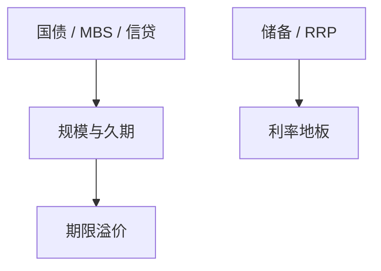

# 央行资产负债表

政策利率撞上零之后，工具变成规模、久期与对手方。资产负债表是非常规货币的会计，不是装饰。

<footer>—— Bernanke, The Federal Reserve and the Financial Crisis；对照 Curdia and Woodford 对 QE 的理论讨论</footer>

[上一课](/econ/shadow-run)把停滚写进回购与 ABCP。缺口是谁在停滚之后持有那些资产：央行扩表。本课钉资产负债表；回购与 MMF 的制度下一课再拆。不重写 Leeper 的主动被动，只补工具。

## 问题

传统工具是短期政策利率。碰到[零下限](/econ/zlb-unconventional)或储备转充裕之后，走廊要靠 IOER/ON RRP 一类地板，数量与久期变成独立维度。QE：买长债压期限溢价；信贷宽松：买或担保私人资产。若只把扩表写成「印钱」，会把储备、财政债和信用风险混成一个 $M$。缺口是分清资产侧（谁的债）和负债侧（储备 vs 现金 vs 逆回购）：每一项都带自己的信用、久期与对手方标签，混在一起读不出政策做了什么。

Gertler and Karadi 把央行信贷政策放进中介模型。Krishnamurthy and Vissing-Jorgensen 的 QE 事件研究。Reis 对央行资本与再分配。

## 方法

读一张表：资产（国债、MBS、贷款）、负债（现金、储备、政府存款、ON RRP）、资本。政策实验各动一边：扭转操作只换资产侧久期、不动规模；QE 换规模为主、久期为辅；对手方资格换的是谁能借到央行的价。退出：缩表与付息储备是同一套走廊的另一侧。与财政主导：付息储备把货币负债变成类国债，主导问题更贴预算（[财政与货币主导](/econ/fiscal-monetary-dominance)）。非常规政策的信号与承诺面见[QE 与前瞻指引](/econ/qe-forward-guidance)，本课只管表。

```mermaid
flowchart TD
  ASSET["国债 / MBS / 信贷"] --> SIZE["规模与久期"]
  LIAB["储备 / RRP"] --> FLOOR["利率地板"]
  SIZE --> TP["期限溢价"]
```

## 机制

QE 的组合平衡：长期安全资产被抽走，私人要再平衡到其他久期，压 $r^L$（Vayanos–Vila 的首选生境）。机制要落在容量上：久期被央行收走后总得有人持有——要么本来愿意承接久期的储蓄者（生境被填补），要么受风险预算约束的套利者。套利者的资产负债表是稀缺品，供给一点一点往里塞，期限溢价就一点一点往下走。KVJ 的事件研究把效应拆开读：MBS 与代理债的利差缩得最多，国债期限溢价次之——买什么比买多少更早显形。信贷政策直接替换中介的 $\phi$：买或担保私人资产，等于替中介扛下风险预算里最贵的那一段，GK 的模型里这正是乘数的来源。负债侧付息使「数量」不再一对一决定隔夜利率：IOR 给准备金一个下限价，ON RRP 把下限延伸到非银现金池，隔夜利率被钉在工具利率附近——操作几何见先修[准备金利息与走廊](/econ/ior-corridor-floor)，这里记住一句：地板系统里立场在利率上，规模是副产品。

退出是同一张表倒着读。缩表不做主动卖出，用上限递增的被动赎回：到期不再全额再投资，上限分月抬到目标位，节奏提前公布让市场定价预期。2017 与 2022 两轮都是这个模板。地板系统决定了缩表的传导点在准备金供给：充足带上隔夜利率贴着 IOR，缩表不动利率；一旦准备金落到需求曲线的陡峭段，价格开始对量敏感——2019 年 9 月的脱锚是最近的例子，下一课展开。所以退出盯两个仪表：准备金离「充足」多远，短端利率贴 IOR 多紧。MBS 的赎回还受利率路径内生驱动（再融资与搬家），央行只能控制上限，控制不了实际速度。

付息本身也是财政事件：资产端票息减 IOR 利息支出，决定央行利润上缴。规模大时利差的凸性暴露也大——利率上行年上缴可以转负，这就是 Reis 讲的央行资本问题。

## 边界

本课不评估某一次 QE 的乘数点估计：事件窗口窄、横截面异质，点估计不是可以搬进 DSGE 的结构参数。下一课把负债侧的 ON RRP 与 MMF、回购连成同一套短债生态。不把 CBDC 当已落地的负债科目。

## 小结

- 扩表要分资产侧信用/久期与负债侧地板工具。
- QE 走组合平衡与中介约束：生境、风险预算、$\phi$，不是单纯 $M$。
- 缩表是被动赎回加递增上限，传导点在准备金供给，不在利率宣言。
- 出处：Bernanke 危机讲义；KVJ 事件研究；Gertler–Karadi。
