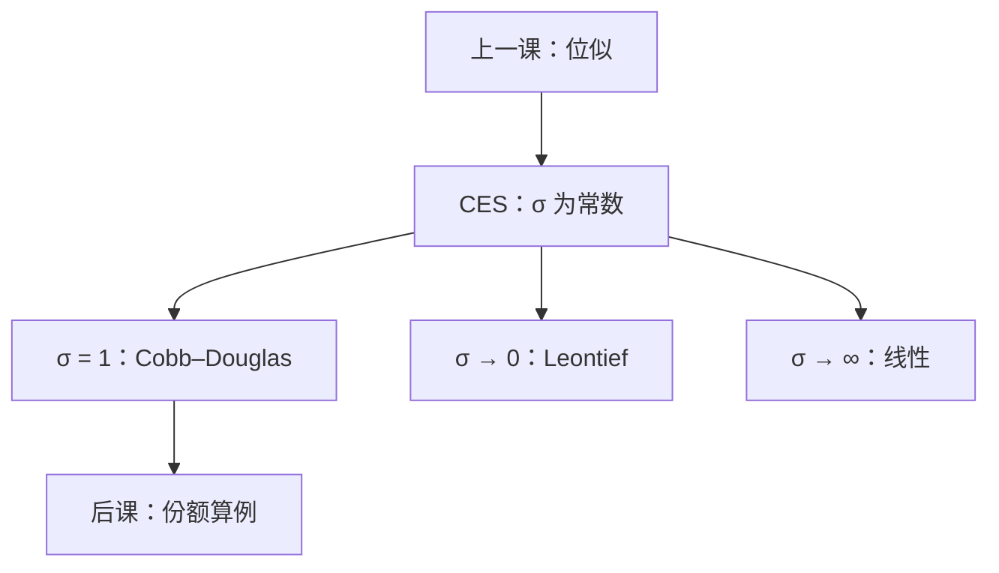

# CES 与 Cobb–Douglas

替代弹性一旦被钉成常数，份额随相对价格怎么走就只剩一个数字；那个数字等于一，就是 Cobb–Douglas。

<footer>—— 据 Varian, Microeconomic Analysis；Mas-Colell, Whinston and Green, Microeconomic Theory 第 3 章整理</footer>

[上一课](/econ/quasilinear-homothetic)给出拟线性与位似两条刀：零收入效应，或需求对财富一次齐次。本课不重写这两种结构，也不把 Debreu 表示再证一遍。缺口是：位似只说扩张路径是射线，没有给出**替代弹性**这个标量。后课算例、份额语言、Dixit–Stiglitz 式加总，都要一条可算的位似族。CES 把 $\sigma$ 钉成常数；$\sigma=1$ 的刀刃就是 Cobb–Douglas。

## 问题

位似保证 $x(p,w)=w\,x(p,1)$，支出份额只靠价格。份额**如何**随 $p_i/p_j$ 变，一般位似仍任意。若每次换题目就换一条无差异曲线的弯曲，后课无法写「替代弹性为常数」的比较静态，也无法认出教科书里那条对数可加的 $u$。缺口不是再声明一次位似，而是引入常替代弹性（CES）

$$
u(x)=\Bigl(\sum_i\alpha_i x_i^{\rho}\Bigr)^{1/\rho},\qquad \sigma=\frac{1}{1-\rho},
$$

$\alpha_i\gt 0$，$\rho\lt 1$，$\rho\neq 0$。$\sigma$ 是任意两商品之间的替代弹性，与点无关——这比「位似」窄得多。本课的任务是读 $\sigma$ 的三个极限，并钉死 $\sigma=1$ 不是另一条效用，而是 CES 的极限。

### 份额恒定不是另一条公理

$\rho\to 0$ 时，$u$ 趋向 Cobb–Douglas $\prod_i x_i^{\alpha_i}$（差单调变换）。此时支出份额 $p_i x_i/w=\alpha_i/\sum\alpha_k$，与相对价格无关。份额恒定是 $\sigma=1$ 的推论，不是与 CES 并列的第三种偏好。上一课已经声明 Cobb–Douglas 位似且非拟线性；本课只补它在 CES 族里的位置。

生产课的 CES（Arrow–Chenery–Minhas–Solow）是同一函数形式换到 $f(z)$。本课对象仍是消费者 $u$，不要把要素替代弹性写成马歇尔需求。

## 方法

给定 CES，内点马歇尔需求由一阶条件直接解。两种商品时

$$
\frac{x_i}{x_j}=\Bigl(\frac{\alpha_i}{\alpha_j}\Bigr)^{\sigma}\Bigl(\frac{p_i}{p_j}\Bigr)^{-\sigma}.
$$

相对需求对相对价格的弹性就是 $-\sigma$。$\sigma\to\infty$（$\rho\to 1$）线性效用，完全替代，角点只买更便宜的。$\sigma\to 0$（$\rho\to-\infty$）Leontief，完全互补，比例锁死。中间任意 $\sigma$ 仍位似：涨 $w$ 只缩放，不改 $x_i/x_j$。

Cobb–Douglas 用对数一阶条件 $x_i=\alpha_i w/p_i$（份额归一后），不必经过 $\rho$ 的极限运算也能算。CES 的价值是把这条需求嵌进同一条 $\sigma$ 轴，而不是再发明一种效用。

拟线性不在这条轴上。CES 的收入效应沿射线，不能把收入赶到计价物。三种形状上一课已经分开；本课见到 Cobb–Douglas 先问 $\sigma=1$，不要问它是不是拟线性。

## 机制

$\sigma$ 管的是沿无差异面滑动的难易。$\sigma$ 大，相对价格一动，数量比猛调，支出份额跟着相对变贵的商品走（份额弹性为 $1-\sigma$）。$\sigma=1$，数量比刚好抵消价格比，份额钉住。$\sigma\lt 1$，数量调不动，份额反而涌向变贵的商品——这是互补的支出面，不是吉芬。

位似保证所有商品收入弹性为 $1$，故 CES 与 Cobb–Douglas 都排除劣等，因而排除吉芬。后课[斯勒茨基](/econ/slutsky-equation)的收入项与 $x$ 成比例，正是因为走在这一族里。一般 $u$ 没有常数 $\sigma$，交叉替代随点变，份额语言失效。

$\alpha_i$ 是份额权重，不是「重要性」的基数度量。序数性上一课已有：单调变换改变 $\rho$ 的写法，但不改变 $\sigma$ 与需求。

## 边界

CES 要求所有成对替代弹性相同。经验上食品与奢侈品的 $\sigma$ 不必相等；那是更一般的位似或非位似。Stone–Geary 把 Cobb–Douglas 平移出原点，恩格尔不过原点，替代弹性也不再全局为 $1$。本课不把拟位似提前写完。

也不要把 CES 写成限价簿上的流动性替代：这里没有报价，只有确定消费束。后课垄断竞争会借用 CES 加总，那是厂商课的 Dixit–Stiglitz，对象从个人 $u$ 换成产品指数，本课不预支。

后课默认：见到 CES，就把它当常 $\sigma$ 的位似；见到 Cobb–Douglas，先当成 $\sigma=1$ 的 CES 特例，份额恒定、收入弹性为 $1$。一般需求理论不默认这条族。

## 小结

- 位似不蕴含常替代弹性；CES 把 $\sigma$ 钉成与点无关的常数。
- $\sigma=1$ 是 Cobb–Douglas：支出份额与相对价格无关。
- $\sigma\to 0$ 互补，$\sigma\to\infty$ 完全替代；三者同一条轴，不是三种偏好。
- CES 排除劣等与吉芬；拟线性是另一把刀。
- 出处：Varian, *Microeconomic Analysis*；Mas-Colell, Whinston and Green 第 3 章。
