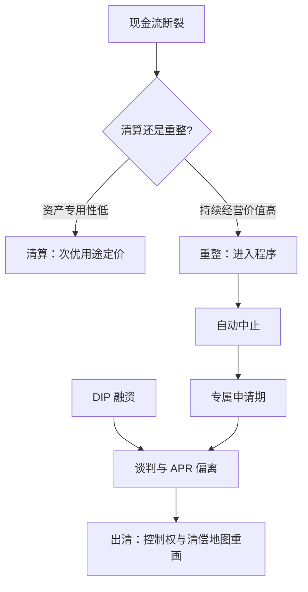

# 破产与重整

破产法不是给失败者的慈善，而是写给所有借款人的保险条款：重整程序怎么写，事前的资本结构就怎么长。

<footer>—— 据 White 1989 与 Djankov 等 2008 整理</footer>

[上一课](/econ/cf-esg-corporate)把目标函数的扩展钉住：长期目标与利益相关者偏好。目标失败、现金流断裂时的制度如何接盘，是公司金融的收尾问题。主干已铺了三块基础：[权衡理论与破产成本](/econ/tradeoff-capital)把破产成本钉为资本结构的权衡项，[债务积压](/econ/debt-overhang)钉了困境下的激励扭曲，[第 11 章破产](/econ/chapter-11)介绍了美国程序的基本构件。本课把它们接成一条机制链：程序为什么这样设计、控制权怎么移转、成本真实落在哪里。

## 问题

困境企业两条出路——清算与重整——对应不同的损失结构。清算把资产交给次优用途，损失集中在专用性资产；重整保住持续经营价值，但要先解三个谈判问题：信息不对称（资产真实价值只有内部人知道）、融资真空（没人愿给困境企业新钱）、控制权悬置（债与股的优先权地图和真实谈判力错位）。程序设计的全部内容，就是回应这三点。分工由此而定：治理管失败之前的激励，破产管失败之后的谈判。

### 三个构件

以 Chapter 11 为解剖样本，三个构件各有靶子。自动中止（automatic stay）冻结个别追偿，保住持续经营价值不因债权人抢夺而耗散——针对谈判的外部性。专属申请期（exclusivity）让管理层在一段窗口内垄断提出方案的权力——用时间换谈判秩序，代价是容忍在位者留任。DIP 融资（debtor-in-possession）给新钱优先地位——针对融资真空。绝对优先规则（APR）规定清偿顺序，实证上大量案件偏离：重整本质是谈判，规则只是谈判的起点而非终点。

## 方法

成本核算要分两层。直接成本（法律、行政费用）按 Altman 1984 的量级只占资产价值的百分之几；间接成本（销售流失、供应商收紧信用、员工离职）更大且更难度量——而最贵的是激励成本：债务积压使股东拒绝正 NPV 项目，价值在进法庭之前就流走了。所以「破产成本有多大」的正确读法是：程序费是小头，事前扭曲是大头，权衡理论里的那个「破产成本」多数时候指的是后者。跨国比较用 Djankov 等 2008 的程序度量：回收率、时间与成本的差异系统性地解释了各国信贷可得性的差异——程序设计通过资本结构起作用，而不只在坏日子起作用。

## 机制

为什么重整需要专属期：信息不对称下即时出售必然按次优用途贱卖，专属期用在位者的提案权换时间；代价是低效管理者可能多留任一程——程序在「卖便宜」与「人留错」之间定价。为什么 APR 会偏离：偏离是支付给「合作」的价款——债权人接受低于面值换速度，股东拿到超出剩余的份额作为不闹事的补偿；规则被再谈判，正说明它是谈判的均衡起点。为什么程序选择本身是信号与事前约束：债务人友好的程序降低事前承诺的可信度，事前债务成本更高、条款更依赖抵押——法律通过事前价格塑造资本结构，本课的结论与第一课的约束度量在这一点上闭合。

直接破产成本常见量级为资产价值的 2%–5%；Bris–Welch–Zhu 2006 用同一批案例对照法庭内外的成本，发现法庭重整并不必然更贵——贵的从来不只是程序费，而是积压、中断与时间。

## 边界

Chapter 11 是美国制度，不可直接外推：欧洲多走行政重整或强制和解，控制权与谈判结构不同，Djankov 的跨国差异正是这么来的。程序结果受信贷周期影响——DIP 资本收缩时重整变难，清算变多。法官裁量使同一法条产出不同均衡，研究要按地区固定效应分层。本课不展开银行作为债权人的特殊谈判与救助决策，那是后续银行课程的领域；[财务困境与重组](/econ/financial-distress-restructuring)与[直接与间接破产成本](/econ/bankruptcy-direct-indirect)已分别铺垫困境早期与成本度量，本课不再重复。

## 小结

- 清算与重整的取舍按资产专用性与持续经营价值划界。
- Chapter 11 三构件各对谈判问题：自动止外溢、专属期换时间、DIP 补融资。
- 直接成本是小头，债务积压式的事前激励扭曲是大头。
- APR 偏离是谈判均衡：规则是起点，不是终点。
- 出处：White 1989；Altman 1984；Myers 1977；Djankov 等 2008；Bris–Welch–Zhu 2006。
